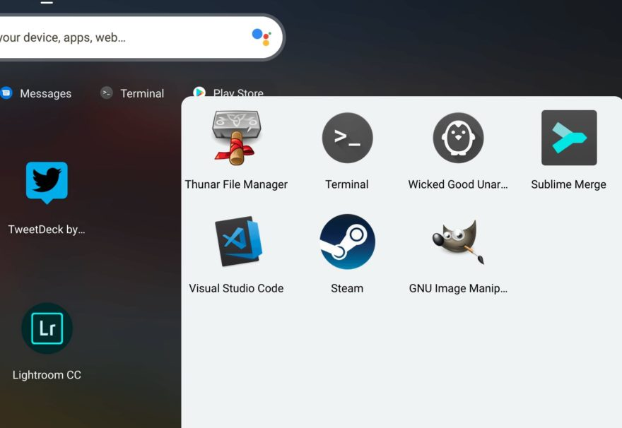
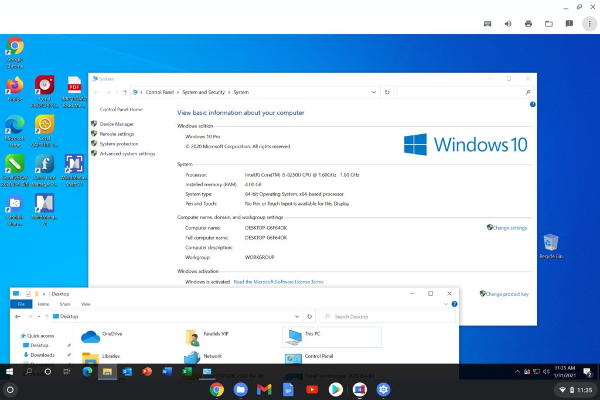
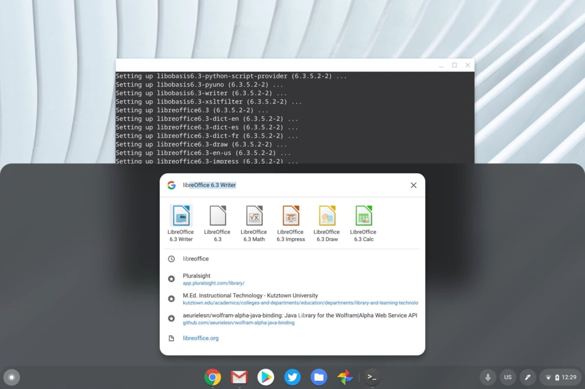
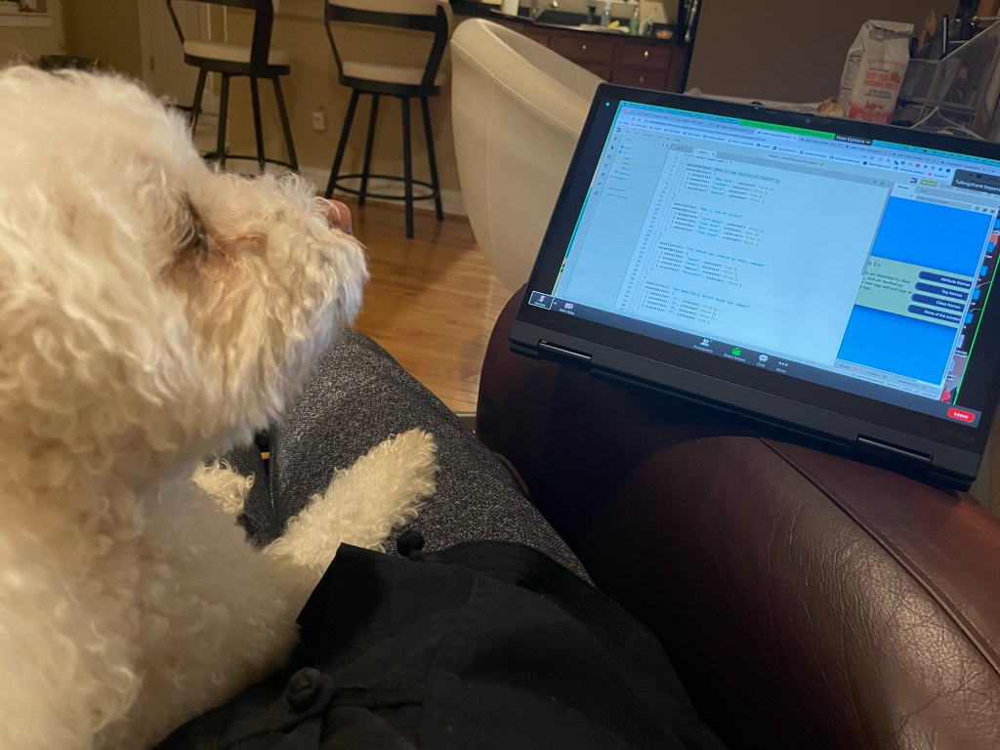
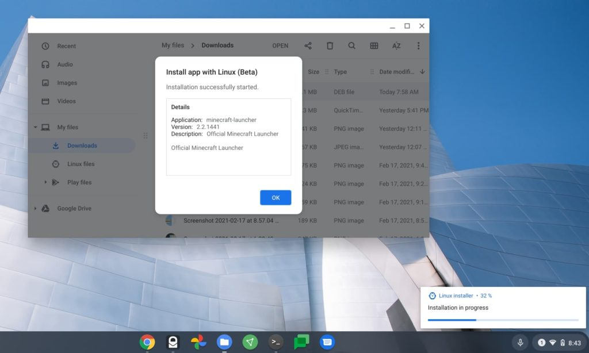

Sigh. Over my morning coffee, I was browsing Chromebook coverage and came across [this article at T3 published yesterday](https://www.t3.com/us/features/what-can-you-do-on-a-chromebook). It's titled "What can you do on a Chromebook?". The subtitle is offers additional detail: "Windows? Word? Zoom? Minecraft? We break down exactly what you can and can't do on a Chromebook."

It's a good read, and I hope the author and/or T3 doesn't take offense to what I'm going to say.

While the article is _mostly_ accurate, it's incomplete. And it definitely does not inform potential Chromebook buyers of exactly what you can and can't do with one.

To make my explanation easier, I'm going to borrow the article sub-headings below and show you what I mean, section by section.

## WHAT APPS CAN CHROMEBOOKS RUN?

This part focuses on Android app support for Chromebooks, which makes complete sense. Outside of web apps and services, Android is a solid alternative for running mobile apps, even offline. That last part isn't mentioned, but it's an important one.

Granted, you'll need connectivity if your Android app relies completely on cloud data or services.

That's generally the same limitation found on all operating systems. However, many people still believe that you can't use a Chromebook if you don't have an internet connection.

That's not the case with Android apps, or even some web apps like Google Docs, unless that external data factor I mentioned is part of the equation.

Not mentioned at all? [Linux apps, which have been available on the Chrome OS Stable Channel since version 69](https://www.aboutchromebooks.com/news/chrome-os-69-stable-release-project-crostini-linux-apps/). That was released back in September of 2018. And, Google announced that all [new Chromebooks going forward from 2019 on would support Linux](https://developers.googleblog.com/2019/05/ChromeOS-io19.html).

That's a big deal. So much so, that I have dozens of articles covering Linux on Chromebooks for nearly three years.

Linux can be scary to mainstream consumers. I get it. But Google's implementation makes it less scary. And it's a configurable feature in Chrome OS. Turn it on and you can try Linux apps.

Don't like it or feeling overwhelmed? Disable it and Chrome OS will wipe Linux from your local storage until you decide to take the plunge at a future date. Or never.

Regardless, this is a feature that has evolved from a little project for developers to a full-featured experience over the past few years. Heck, [it's helping me get through my CS college classes](https://www.aboutchromebooks.com/news/can-you-learn-to-code-in-a-college-computer-science-program-with-a-chromebook/).

## CAN CHROMEBOOKS RUN WINDOWS?

This section is pretty straightforward for the mainstream audience. It explains that unlike other PCs, you can't simply blow away Chrome OS and install Windows. At least not easily: [It is possible](https://mrchromebox.tech/) but I understand why there's no mention of this.

Parallels Desktop for Chrome Enterprise is spotlighted appropriately, so I'm happy to see that people know about it. [I took it for a test drive with Windows 10 in a VM](https://www.aboutchromebooks.com/news/windows-10-on-a-chromebook-a-look-at-parallels-desktop-for-chromebook-enterprise/) on my device and came away impressed.

[Some Chromebooks have the supported Linux kernel to run their own VMs in Chrome OS](https://www.aboutchromebooks.com/news/apparently-you-can-run-windows-10-in-a-linux-vm-on-some-chromebooks-now/); no Parallels needed. And those VMs can run Windows. But again, it's a limited solution for now and not ready for a mainstream audience.

## CAN CHROMEBOOKS RUN WORD AND OTHER MICROSOFT OFFICE APPS?

The basic answer here is pretty straightforward and accurate. Obviously, if you're able to run Windows in a VM on your Chromebook, that answer changes.

And without any mention of Linux support on Chromebooks, there's no mention of [LibreOffice](https://www.libreoffice.org/), which has a high degree of Microsoft compatibility. Other options include Apache OpenOffice, OnlyOffice, and WPS Office to name a few. It takes all of three minutes to install LibreOffice. [Even though the process looks daunting, it's quite simple](https://www.aboutchromebooks.com/news/how-to-install-libreoffice-for-linux-on-a-chromebook-after-downloading-it-as-a-tar-gz-file/).

## CAN CHROMEBOOKS RUN ZOOM OR MICROSOFT TEAMS?

The short answer is yes although the article suggests downloading the Android app versions of these services. I don't do that on my Chromebook, even though I could.

I just use the browser version so the video call is integrated with the rest of my browser tabs. I often have to look at them on a call. Why confuse things with an Android application if you already have an app -- the browser -- that can handle this?

Just last night, I used Zoom in my Chromebook browser to "attend" class. Admittedly, my pal Norm was more into the lecture on React routing than I was but the point remains: You don't need to install apps for most video conference software.

## CAN CHROMEBOOKS PLAY MINECRAFT (and Fortnite)?

I'm combining these two sections as the question and answer is pretty similar. As mentioned in the article, [Microsoft recently limited Minecraft access to education accounts](https://www.aboutchromebooks.com/news/microsoft-brings-minecraft-education-edition-to-chromebooks-for-students/). The Android app version requires an Office 365 education account.

Or, as the article suggests, you can stream Minecraft to a Chromebook with an Nvidia GeForce account. The same goes for Fortnite.

But.... remember Linux? Yeah, there's [a generally available version of Minecraft that works for it](https://www.minecraft.net/en-us/download/alternative/); it comes directly from Microsoft, so it's official. And it couldn't be simpler to install: Just download the software from Microsoft, right-click the downloaded file in your Files app, and choose the Install to Linux option. Easy peasy!

## It's 2021 and Chromebooks are more capable than people give them credit for

So this is my section, to be clear, mainly as a brief summary. There were additional questions answered in the T3 article such as do Chromebooks support Bluetooth and cameras, plus the need (or lack of need) for anti-virus software.

Again, my commentary isn't a personal slight against the T3 article author or T3 itself.

I'm simply making the point that like Rodney Dangerfield (look 'im up, kids!), Chromebooks don't get respect. No, they're not the best device for all computing needs. They excel at web-based activities and have the option of both Android and Linux apps.

If you need a Windows or Mac app, my advice has been and always will be to get a PC or a Mac. Just make sure you're informed on all of your options, including Chromebooks before making that decision.

[They've been around for a decade](https://www.aboutchromebooks.com/news/chrome-os-is-10-years-old-heres-the-first-demo-from-2009/) and have always focused on speed, simplicity, and security. Plus, Chromebooks have continuously improved from a basic browser-only device to something far more capable than many people realize.

Multiple Chrome tabs, a PWA, Google Play Music Android app and Linux humming along.
