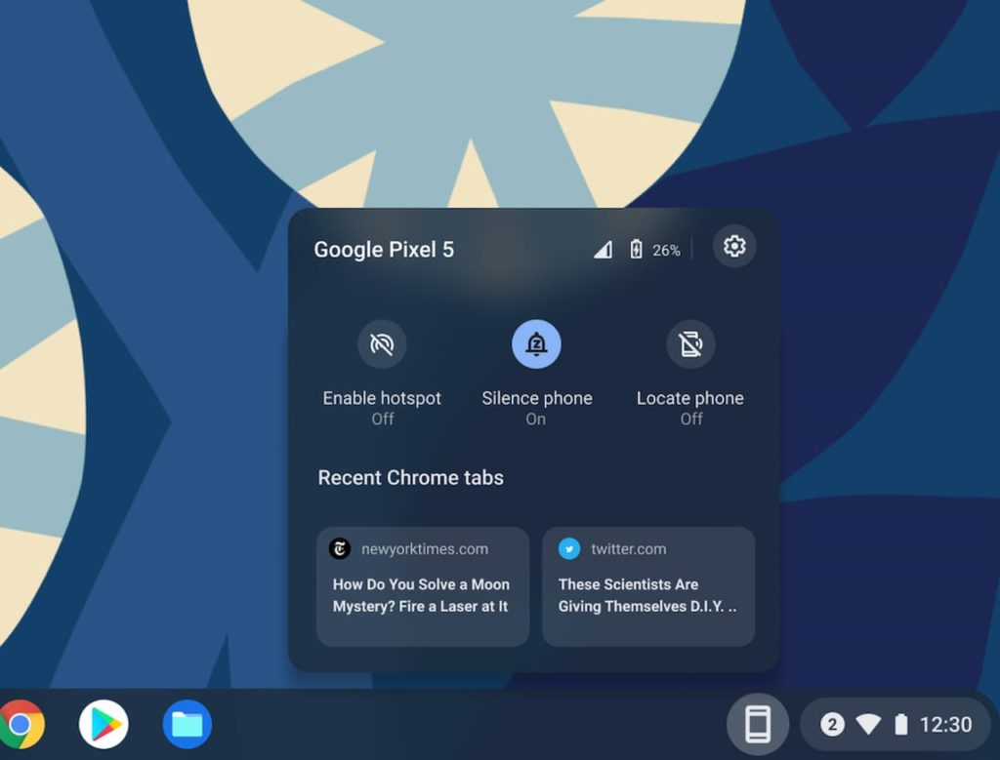
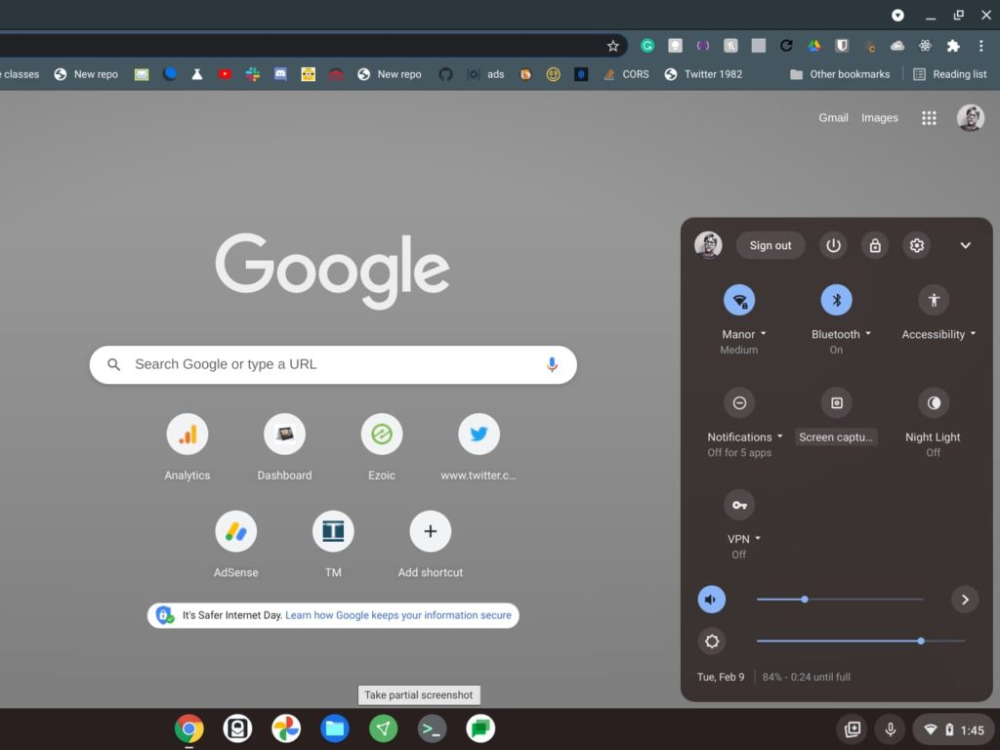
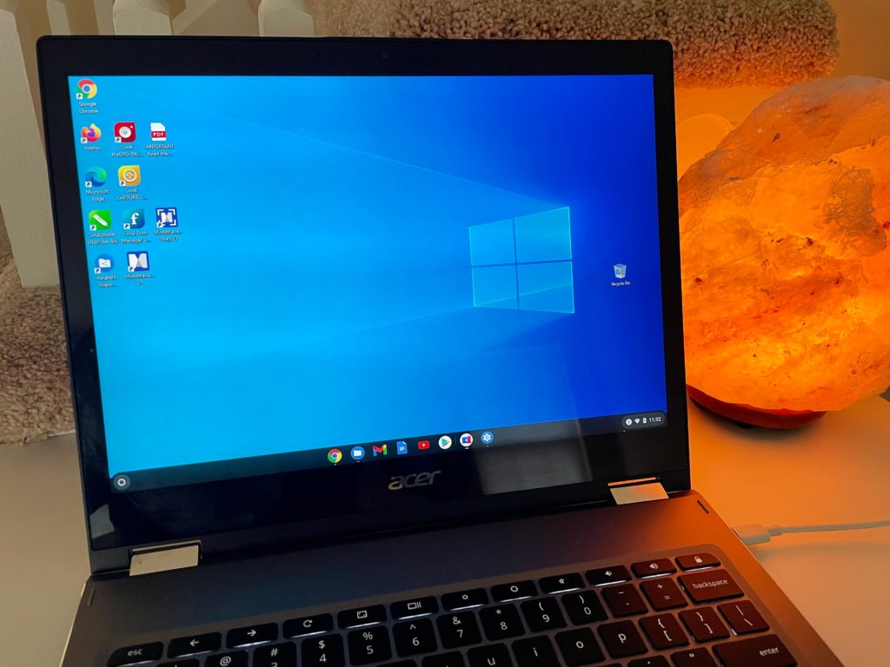

[It's been a decade since the first Chromebooks launched in 2011](https://blog.google/products/chromebooks/chromebook-turns-10/ "https://blog.google/products/chromebooks/chromebook-turns-10/"). Chrome OS is actually a little older, [having celebrated its 10th anniversary late last year](https://www.aboutchromebooks.com/news/chrome-os-is-10-years-old-heres-the-first-demo-from-2009/ "Chrome OS is 10 years old! Here’s the first demo from 2009"). What have we seen with 10 years of Chromebooks? A maturing modern OS, more features, and faster ways to get things done.

I attended a virtual birthday party for Chromebooks today presented by Google. And while there was much coverage about the prior decade, there were also hints of what's to come.

That includes some new features with Chrome OS 89 for the Stable Channel, expected to start rolling out today.

First though, a quick timeline to put things into perspective:

- 2010 The CR-48 pilot program was introduced
- 2011 Samsung and Acer debut the first Chromebooks
- 2012 The then-new Aura UI is introduced
- 2013: Google Chromebook Pixel with a 3:2 launches
- 2014: Chromebooks become the number one education devices in the US
- 2015: Updated Chromebook Pixel, the first laptop with USB-C for video power and data
- 2016: Google Play Store support arrives, bringing Android apps to Chromebooks
- 2017: Google's Titan C security chip added
- 2018: Crostini (Linux), Family Link, purpose-built devices are added
- 2020: More form factors and price points including detachable devices
- 2021: 3x sales growth over the past year

We've gone from repurposed netbooks to enterprise-class laptops in a short time. As I said though, there's more to come.

With Chrome OS 89 landing on the Stable Channel, Google says there will be general availability of the [Phone Hub](https://www.aboutchromebooks.com/news/chrome-os-89-adds-android-phone-hub-to-chromebooks-no-experimental-flag-needed/ "Chrome OS 89 adds Android Phone Hub to Chromebooks, no experimental flag needed"), [Nearby Share](https://www.aboutchromebooks.com/news/nearby-share-an-apple-ios-airdrop-like-wireless-feature-on-chromebooks-chrome-os-86/ "Here’s what Nearby Share, an Apple iOS AirDrop-like wireless file sharing feature, will look like on Chromebooks"), and [WiFi sync](https://www.aboutchromebooks.com/news/chrome-os-may-sync-wi-fi-configurations-between-your-chromebook-and-android-phone/ "Chrome OS may sync Wi-Fi configurations between your Chromebook and Android phone") features. I've covered these prior, so I won't get into details here.

However, the vision for these and future features is for Chromebooks to work better with other devices and help users quickly complete tasks.

To that end, you'll see additional functionality added to Chromebooks.

The clipboard will save the last five copied items in memory; tap Launcher + V to see them. [More Virtual Desks can be added](https://www.aboutchromebooks.com/news/need-more-virtual-desks-on-your-chromebook-you-might-have-8-or-16-in-the-future/ "Need more Virtual Desks on your Chromebook? You might have 8 or 16 in the future.") and desks are persistent after a reboot. Recently used files are available from a helper app near the Quick Settings; Google is calling this "Tote", as in it totes around recently used or important files. And the updated screen capture and screen recording feature is welcome too.

At the event, Google also mentioned that at least 50 new devices will launch in 2021.

Some already have, such as the [Samsung Galaxy Chromebook 2](https://www.aboutchromebooks.com/news/samsung-galaxy-chromebook-2-review-roundup/ "Samsung Galaxy Chromebook 2 review roundup"). Others are incoming soon like the [Asus Chromebook Flip CM3](https://www.aboutchromebooks.com/news/asus-chromebook-flip-cm3-price-vs-lenovo-chromebook-duet/ "Asus Chromebook Flip CM3 reportedly will debut at $369"). And there are plenty in the works, some of which are likely to include LTE radios as feedback suggests that people want mobile broadband built into their device.

I asked if Google was thinking about [getting back into the tablet space](https://www.aboutchromebooks.com/news/made-by-google-exit-tablet-business-pixel-slate-chrome-os-chromebooks/ "No new Google-branded tablets; Pixel Slate is now a collector’s item"), given the recent success of Chrome OS tablets. Basically, I was told that Google's hardware partners are well supported with their tablets and that detachable Chromebooks are gaining steam. So no news there, unfortunately.

Some people also want the ability to run Windows apps from time to time. Businesses can do this with [Parallels Desktop for Chrome Enterprise, which I recently took for a spin](https://www.aboutchromebooks.com/news/windows-10-on-a-chromebook-a-look-at-parallels-desktop-for-chromebook-enterprise/ "Windows 10 on a Chromebook: A look at Parallels Desktop for Chromebook Enterprise"). I asked about a comparable consumer option and was told that Google is also receiving feedback requesting this. There was nothing to announce, however, at this time.

There are still some feature gaps for Chrome OS as a platform, of course. You still [don't have total control over app arrangement in the Chrome OS Launcher](https://www.aboutchromebooks.com/news/after-a-decade-of-chromebooks-its-time-for-chrome-os-to-sort-apps-in-the-launcher/ "After a decade of Chromebooks, it’s time for Chrome OS to sort apps in the Launcher"), for example. Downloaded videos from some services require the Android app for such services and some, such as Netflix, don't support HD downloads as a result. I could go on and on.

However, in a relatively short span of time, compared to other desktop platforms, Chromebooks and Chrome OS have come far. I'm looking forward to the future of Chromebooks and the next 10 years.
