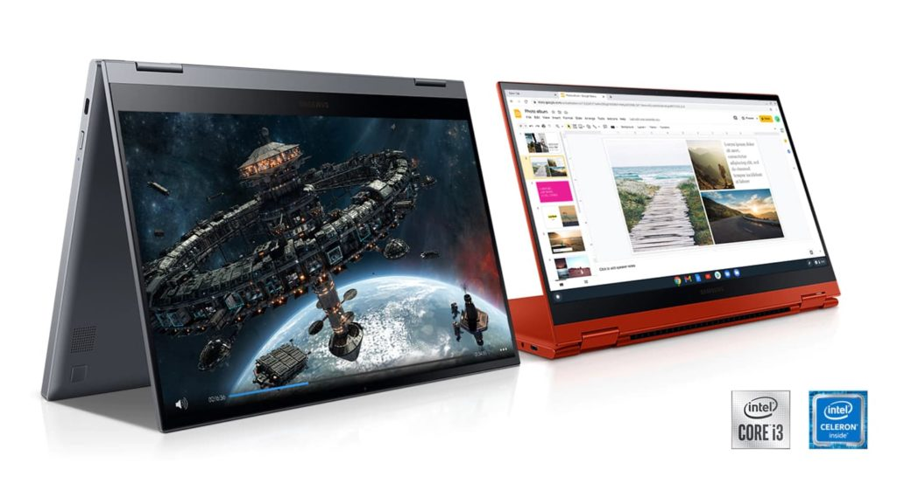
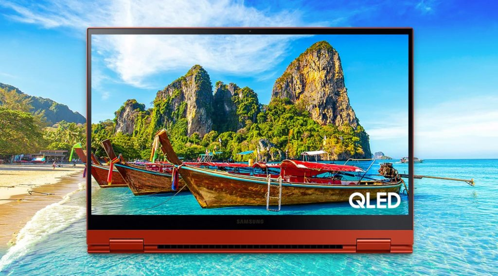

_(Update: This deal is back on. The original model is back up to its full price.)_

I admit I was [a little put off by the Samsung Galaxy Chromebook 2 when it launched in January](https://www.aboutchromebooks.com/news/ces-2021-samsung-galaxy-chromebook-2-price-release-date-specifications/ "CES 2021: Samsung Galaxy Chromebook 2 debuts as a cut-down convertible from $549"). It's less a successor to the original model and more of a cut-down, sort of budget-friendly version. Now, [a current $100 discount on the Samsung Galaxy Chromebook 2](https://www.samsung.com/us/computing/chromebook2/buy/?modelCode=XE530QDA-KA2US) makes it a better value.

That discount is good on either configuration of Samsung's 2021 convertible Chromebook. So you can buy the Intel Celeron model for $450 or the 10th-generation Intel Core i3 configuration for $599.

Personally, either is still priced a little high for my tastes as my usage requires more horsepower. If I'm going to spend $599, for example, I'd take the [Acer Chromebook Spin 713 for $629](https://www.aboutchromebooks.com/news/acer-chromebook-spin-713-review/ "Acer Chromebook Spin 713 review: You can’t get a better Chromebook than this for $629"), or even less when it's on sale.

[Get the Samsung Galaxy Chromebook 2 sale](https://www.bestbuy.com/site/samsung-galaxy-chromebook-2-13-3-qled-touch-screen-intel-core-i3-8gb-memory-128gb-emmc-fiesta-red/6448525.p?skuId=6448525 "Get the Samsung Galaxy Chromebook 2 sale")

Still, I know many folks can appreciate what Samsung does bring to the table here.

There's the 13.3-inch 1080p QLED display that supports 100% DCI-P3 color, for example, which is great for watching supported online content. Samsung has also addressed the heat and battery issues from the original Samsung Galaxy Chromebook with this model: A fan plus a solid run time help mitigate those shortcomings from the Galaxy Chromebook 2's predecessor.

And of course, there's that great build quality with a colored aluminum chassis in your choice of bold Fiesta Red or a muted Mercury Gray.

Keep in mind if you go for the lower-priced model, you're not just dropping down to an Intel Celeron processor. You'll also get half the local storage and memory with capacities of 64 GB and 4 GB respectively. If you want 128 GB of storage and 8 GB of RAM, you'll have to choose the higher-priced, Intel Core i3 configuration.

Here's a rundown of the specs to help you decide if this discounted deal is worth it for you:

<table><tbody><tr><td>CPU</td><td>10th-gen Intel Celeron and Core i3 processors</td></tr><tr><td>GPU</td><td>Intel UHD Graphics</td></tr><tr><td>Display</td><td>13.3-inch QLED 1080p touchscreen, 16:9 aspect ratio, with optional USI stylus support</td></tr><tr><td>Memory</td><td>4 or 8 GB</td></tr><tr><td>Storage</td><td>64 or 128 GB, microSD slot for expansion</td></tr><tr><td>Connectivity</td><td>Wi-Fi 6 (Gig+), 802.11 ax 2x2<em>,</em> Bluetooth 4.0</td></tr><tr><td>Input</td><td>Backlit keyboard, multitouch trackpad, 720p camera</td></tr><tr><td>Ports</td><td>Two USB Type-C, combination microphone/headphone jack</td></tr><tr><td>Battery</td><td>45.5 Whr</td></tr><tr><td>Weight</td><td>2.71 pounds</td></tr><tr><td>Software</td><td>Chrome OS automatic update expiration date: June 2028</td></tr></tbody></table>

[Get the Samsung Galaxy Chromebook 2 sale](https://www.bestbuy.com/site/samsung-galaxy-chromebook-2-13-3-qled-touch-screen-intel-core-i3-8gb-memory-128gb-emmc-fiesta-red/6448525.p?skuId=6448525 "Get the Samsung Galaxy Chromebook 2 sale")

_**Update**: This post was originally published on April 6, 2021 and has been updated to reflect that the expired deal is back on the Samsung Galaxy Chromebook 2._
