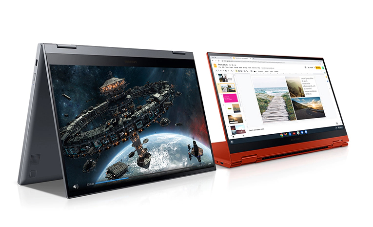
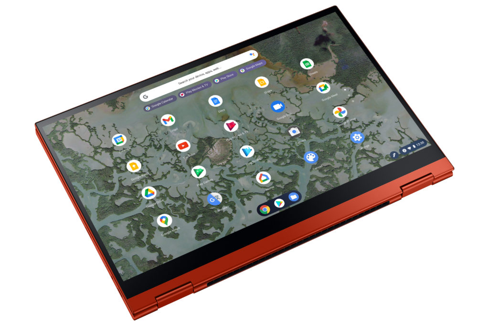

A current $100 discount brings the Core i3 Samsung Galaxy Chromebook 2 down from its $699.99 price right now. I'd even say [this $599.99 Samsung Galaxy Chromebook 2 sale](https://www.samsung.com/us/computing/chromebook2/buy/) is more what the price should be.

This top configuration should handle the bulk of tasks for a large chunk of Chromebook users though. Every day browsing, even with a dozen or more tabs shouldn't be a problem. Users who want to run Android and Linux apps should have a decent experience as well with the 8GB of RAM.

[Get the Samsung Galaxy Chromebook 2 sale price](https://www.samsung.com/us/computing/chromebook2/buy/ "Get the Samsung Galaxy Chromebook 2 sale price")

You're getting a 10th-generation Intel Core i3, 8 GB of memory, and 128 GB of local storage. The 13.3-inch display isn't a 4K OLED panel like the original Galaxy Chromebook but has a 1080p QLED panel with a 16:9 aspect ratio. The battery life of the Galaxy Chromebook 2 is improved over its predecessor as well.

Just keep in mind that this Chromebook has a cooling fan.

The Samsung Galaxy Chromebook 2 doesn't come with a pen but supports a USI stylus. A pair of USB Type C ports, a microSD card slot, integrated webcam, and support for WiFi 6 round out the package. All in all, it's a solid mid-range convertible Chromebook.

When on sale, you can definitely find other similar Chromebooks at the same price, or even lower. In this case, you're paying a bit of a premium for that QLED display and the Samsung design.

This device is also competing against Chromebooks with newer Intel 11th-generation Core processors, so keep that in mind when you're shopping around. From what I've seen so far, just on an 11th gen Pentium, [this year's Intel chips bring a noticeable jump in performance](https://www.aboutchromebooks.com/news/hands-on-lenovo-ideapad-5i-chromebook-first-impressions/).

[Get the Samsung Galaxy Chromebook 2 sale price](https://www.samsung.com/us/computing/chromebook2/buy/ "Get the Samsung Galaxy Chromebook 2 sale price")
