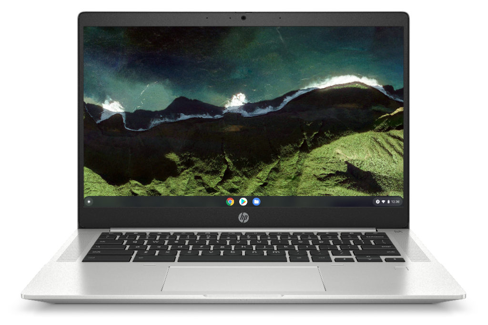
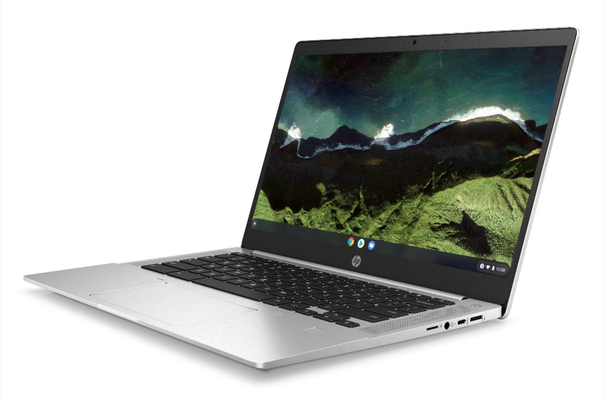

On Tuesday, HP introduced a pair of updated Chromebooks for consumer and enterprise markets. The newest [HP Pro c640 G2 Chromebooks](https://www8.hp.com/us/en/cloud-computing/chrome-enterprise/hp-pro-c640-chromebook.html) are both powered by 11th-gen Intel chips, with the HP Pro c640 G2 Chromebook consumer model starting at $419. The HP Pro c640 G2 Chromebook Enterprise begins at $569. Both versions are available as of today, according to HP.

The two devices are mostly the same hardware, depending on the configuration with the enterprise model including a Chrome Enterprise Upgrade license for device and account management.

You're looking at a 14-inch, 180-degree flat-folding display on these clamshell Chromebooks, ranging from HD to FullHD resolution with touch capabilities optional. Under the hood, you can configure up to an 11th-generation Intel Core i7 processor. Choice of the processor will determine the use of Intel UHD or Intel Iris Xe graphics.

Memory is available in 4, 8, or 16 GB of capacity, while local storage options range from 64 GB of eMMC to 128 or 256 GB of SSD.

HP says to expect up to 12.5 hours from the 58 WHr power pack, which can be recharged from 0 to 90% in 90 minutes with the optional 65W fast charger; the standard charger has a 45W capacity.

Both models have a pair of USB-C ports, a pair of USB-A (3.2) ports, full-sized HDMI 2.0 output, a microphone/headphone combination jack, and a microSD card slot. They also include HP's Privacy Camera shutter to cover the HD webcam.

Backlighting for the keyboard and a fingerprint sensor are available options. WiFi 6 and Bluetooth are standard on both devices, which are also built to pass the rugged MIL-STD 810H spec.

The main takeaway here is the upgrade to the latest Intel processors from [last year's HP Pro c640 Chromebooks](https://www.aboutchromebooks.com/news/hp-pro-c640-chromebook-enterprise-release-date-specifications-now-available/). There's little here in the design or other features that are different.

That's not necessarily a bad thing though. These are slim Chromebooks for their screen size, have plenty of ports and features, and are designed well. Just remember that as you scale up your configuration from the base model, the price will quickly rise.
