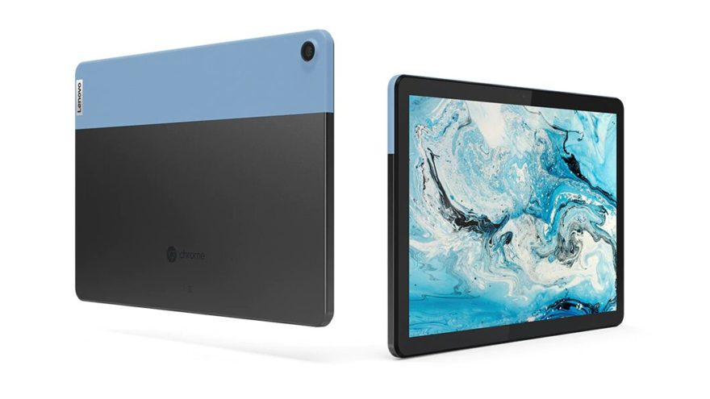

Good news if you’re interested in my pick for [2020 Chromebook of the year](https://www.aboutchromebooks.com/news/my-pick-for-2020-chromebook-of-the-year/), which is actually a Chrome OS tablet. The excellent Lenovo Chromebook Duet is on sale for $259 again at [Best Buy which is a $40 discount on the 128 GB model](https://www.bestbuy.com/site/lenovo-chromebook-duet-10-1-tablet-128gb-with-keyboard-ice-blue-iron-gray/6401727.p?skuId=6401727).

After [reviewing the Lenovo Chromebook Duet back in June](https://www.aboutchromebooks.com/news/lenovo-ideapad-duet-chromebook-review-2020/), I said it would make a fantastic secondary device, although it is possible to make your primary Chromebook as well.

It's great for laptop browsing, running Android apps, and watching online or locally stored media.

Part of the reason for that is because the Octa-core MediaTek processor offers great bang for buck performance, even with 4 GB of memory, which I consider the bare minimum these days. It doesn't hurt that the 10.1-inch display is a high-quality 1920 x 1080 panel with an above-average 400 nits of brightness. And the fact that you get both the Duet cover/stand and detachable keyboard is a plus.

[Get the 128 GB Lenovo Duet Chromebook](https://www.bestbuy.com/site/lenovo-chromebook-duet-10-1-tablet-128gb-with-keyboard-ice-blue-iron-gray/6401727.p?skuId=6401727 "Get the 128 GB Lenovo Duet Chromebook")

If I were planning to make this Chrome OS tablet a daily, all-day device, I'd personally pipe the output to a external monitor though. Staring at a 10.1-inch display for 8 or more hours would cause my four eyes to bug out. External display support is easily achieved with a proper USB-C cable for video out. Just bear in mind that the Duet only supports 1080p at 24fps on a monitor.

This model on sale is the higher configuration of the Lenovo Duet Chromebook, meaning it has one and only one boost over the base model: Double the local storage. The base model comes with 64 GB of storage while this configuration offers 128 GB.

Essentially, with the sale you're getting the higher storage capacity model for the $20 less than the MSRP of the base price.

Here's a rundown of the full specs, which are the exact same [as the model I reviewed](https://www.aboutchromebooks.com/news/lenovo-ideapad-duet-chromebook-review-2020/):

<table><tbody><tr><td>CPU</td><td>Octa-core Mediatek Helio P60T (4xA73 at 2.0GHz)</td></tr><tr><td>GPU</td><td>ARM G72 MP3</td></tr><tr><td>Display</td><td>10.1-inch 1920 x 1200 touchscreen, 400-nits, 70% color gamut</td></tr><tr><td>Memory</td><td>4 GB LPDDR4x</td></tr><tr><td>Storage</td><td>Up to 128 GB eMMC</td></tr><tr><td>Connectivity</td><td>Wi-Fi 5, Bluetooth 4.2</td></tr><tr><td>Input</td><td>Included keyboard with trackpad, optional stylus, 2 MP front camera, 8 MP webcam</td></tr><tr><td>Ports</td><td>One USB Type-C (2.0 + DisplayPort)</td></tr><tr><td>Battery</td><td>7180 mAh, expected run-time of 10 hours for video, 8 hours for web browsing</td></tr><tr><td>Weight</td><td>0.99 pounds without keyboard</td></tr><tr><td>Software</td><td>Chrome OS automatic updates through June 2028</td></tr></tbody></table>

[Get the 128 GB Lenovo Duet Chromebook](https://www.bestbuy.com/site/lenovo-chromebook-duet-10-1-tablet-128gb-with-keyboard-ice-blue-iron-gray/6401727.p?skuId=6401727 "Get the 128 GB Lenovo Duet Chromebook")

_**Update**: This deal was originally published on February 5, 2021 and is now back again._
