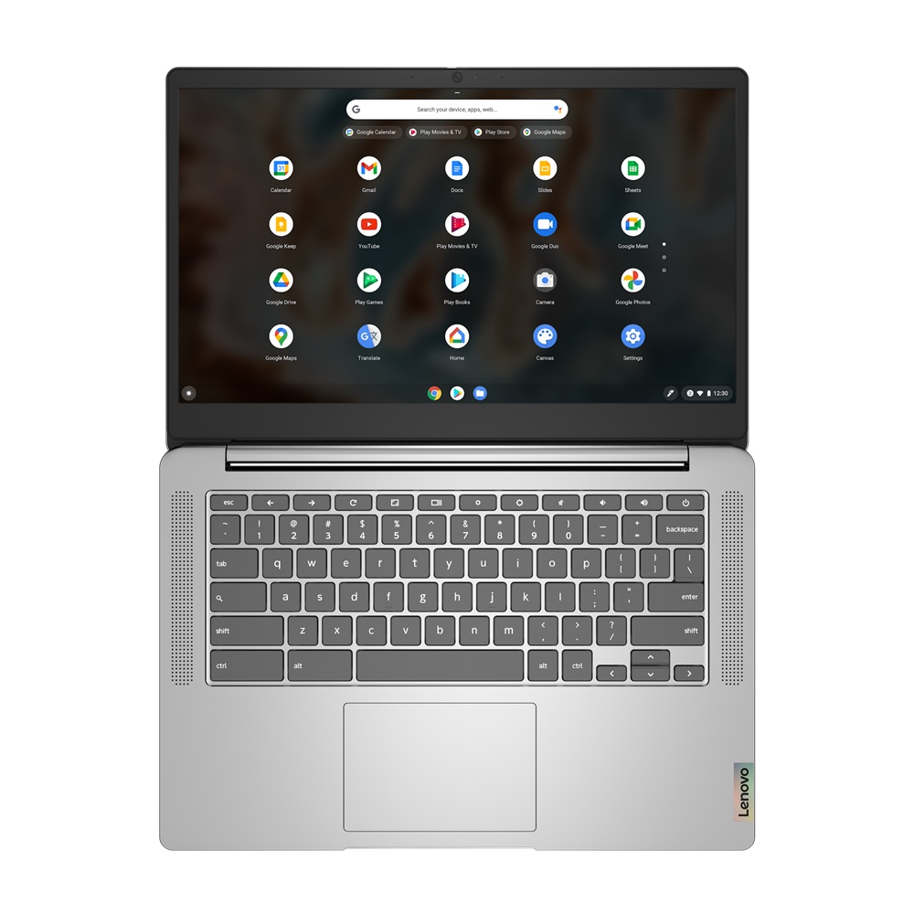
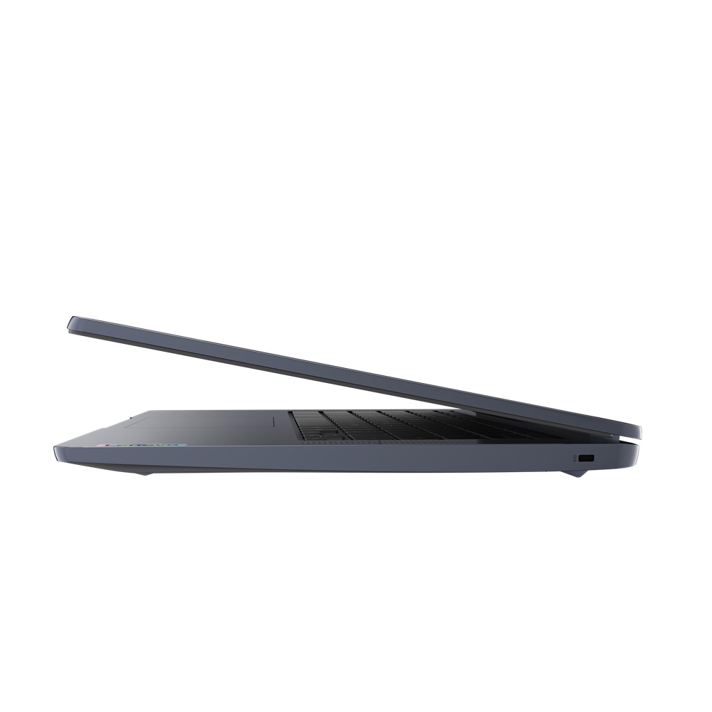
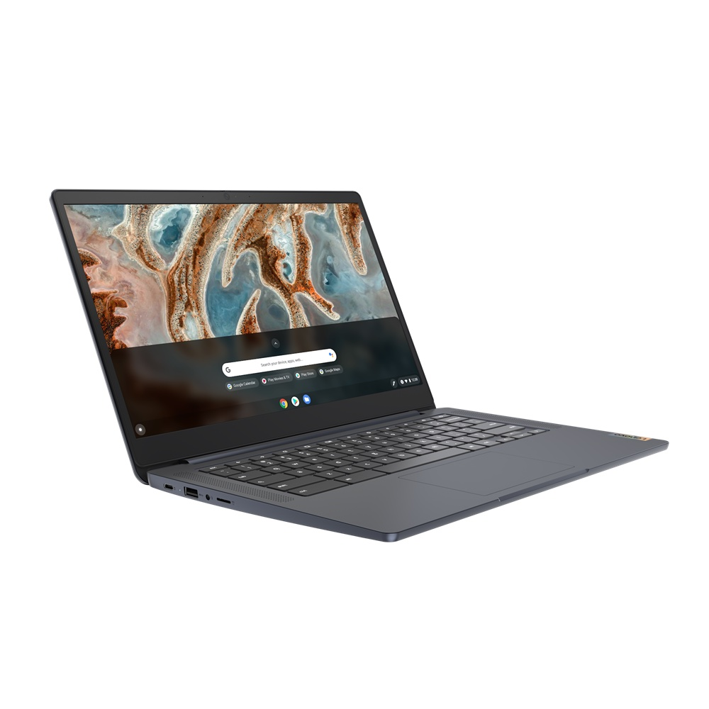

Last year I took the [Lenovo IdeaPad 3 Chromebook](https://www.aboutchromebooks.com/news/250-lenovo-ideapad-3-chromebook-14-hands-on-first-impressions-specifications/) with 720p TN display for a test drive. It definitely gave me the "entry-level" device feeling but that was to be expected based on the specifications and $250 price tag. Now it appears Lenovo is ready to refresh this model. Say hello to the updated Lenovo IdeaPad 3 CB Chromebook that swaps out the Intel Celeron of last year's model with a MediaTek MT8183 chipset and offers 1080p touchscreen options.

I noticed this new model on [Lenovo's PSREF site](https://psref.lenovo.com/Product/IdeaPad/IdeaPad_3_CB_14M836) with an announcement date of April 19, which just happens to be today. The official model name and number is the Lenovo IdeaPad 3 CB 14M836.

There's no pricing information but based on the specs and configurations, I'd guess this will be in the $250 to $350 range. It looks like a wide range of countries will see this device, based on the source site.

Here's a peek at the what this 14-inch Chromebook will look like:

I immediately noticed a lack of USB ports on the right side, which is fairly limiting. Indeed, you only get a pair of ports on the left side.

Lenovo is including the camera privacy shutter for the 720p webcam which I do appreciate. The US models will be available in two color choices: Artic Gray and Abyss Blue.

As far as the rest of the hardware specifications for the US models, they're not vastly different from last year's smaller IdeaPad 3:

<table><tbody><tr><td>CPU</td><td>MediaTek MT8183 octo-core processor (4 x A73 @ 2 GHz / 4 x A53 @ 2 GHz)</td></tr><tr><td>GPU</td><td>ARM Mali G72 GPU</td></tr><tr><td>Display</td><td>14-inch FullHD (1920 x 1080) anti-glare TN panel with up to 220 nits brightness, non-touch, 16:9 aspect ratio OR 14-inch FullHD (1920 x 1080) anti-glare IPS panel with up to 300 nits brightness, touch support, 16:9 aspect ratio </td></tr><tr><td>Memory</td><td>4 GB LPDDR4 1866MHz</td></tr><tr><td>Storage</td><td>32 or 64 GB eMMC 5.1, microSD card slot for storage expansion</td></tr><tr><td>Connectivity</td><td>802.11 ac Wi-Fi (2 x 2), Bluetooth 4.2</td></tr><tr><td>Input</td><td>Non-backlit keyboard, Buttonless Mylar surface multi-touch touchpad, 720p webcam</td></tr><tr><td>Ports</td><td>1 USB Type-C 2.0 (with PD 2.0 and DP 1.1a), 1 USB Type-A 2.0, headphone / microphone combination jack, lock slot, 2 x 2W speakers</td></tr><tr><td>Battery</td><td>42 WHr, expected run time up to 16 hours, 45W USB-C charger</td></tr><tr><td>Weight</td><td>2.87 lbs pounds</td></tr><tr><td>Software</td><td>Chrome OS automatic update expiration: TBD</td></tr></tbody></table>

The USB 2.0 ports are a little disappointing (so is the slower memory compared to last year's model) but that may be due to the MediaTek processor. Speaking of which, that CPU doesn't use much juice, which should help the battery life. And it's peppy enough for typical everyday tasks.

Regardless, if the price comes in where I expect, I could see Lenovo moving a lot of these devices. There's definitely a need for decent entry-level Chromebooks for students and everyday users that just need to get online.
