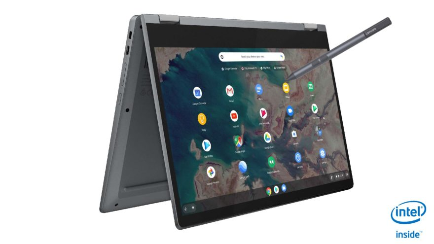
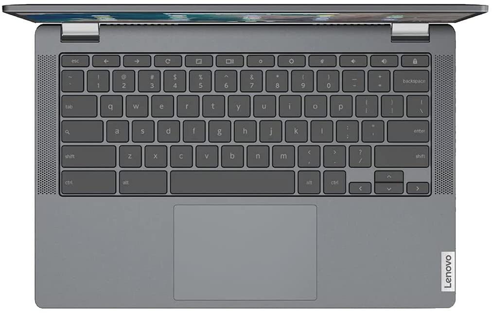

When [choosing my "Chromebook of the year" in 2020](https://www.aboutchromebooks.com/news/my-pick-for-2020-chromebook-of-the-year/), the popular Lenovo Chromebook Flex 5 was strongly in the running. At its $409.99 full price, I felt it was a good value for the cost. And while there's now a [newer model that I recently reviewed](https://www.aboutchromebooks.com/news/lenovo-flex-5i-chromebook-review/), it will set you back $539.99 unless you find a sale. Heck, even finding inventory of the 2021 model is difficult. So today's one-day deal on Amazon for the [2020 Lenovo Chromebook Flex 5 at $299](https://amzn.to/3Bcf5Fe) is worth a look.

Even though this is last year's model, it's very similar to the 2021 version. The 2020 Lenovo Chromebook Flex 5 looks almost identical to this year's version. You get the same great 1080p touchscreen display, the same number of ports (with USB Type-C on both sides), and the same strong but lightweight build material.

The main difference is that the 2020 Lenovo Chromebook Flex 5 uses a 10th-generation Intel Core i3, while the new one bumps you up to a noticeably higher-performing 11th-generation Core i3. That doesn't mean last year's Flex 5 is slow by any means; it's actually a good performer, especially for the price.

Here's a rundown of all the specs for the currently on-sale 2-in-1 Chromebook Flex 5:

<table><tbody><tr><td>CPU</td><td>Dual-core Intel Core i3-10110U Processor (2.1 GHz / 4.1GHz)</td></tr><tr><td>GPU</td><td>Intel Integrated UHD Graphics</td></tr><tr><td>Display</td><td>13.3-inch IPS 1920 x 1080 touchscreen, 16:9 aspect ratio, 250 nits brightness</td></tr><tr><td>Memory</td><td>4 GB DDR4-2600MHz memory</td></tr><tr><td>Storage</td><td>64 GB eMMC 5.1, microSD card slot for expansion</td></tr><tr><td>Connectivity</td><td>WiFi6 (802.11ax, 2x2 MIMO), Bluetooth 5.0</td></tr><tr><td>Input</td><td>Spill-resistant backlit keyboard, USI stylus (optional) support, 720p webcam with physical privacy shutter</td></tr><tr><td>Ports</td><td>1 USB Type-A, 2 USB Type-C, headphone/microphone combo jack</td></tr><tr><td>Battery</td><td>51 WHr, expected run-time up to 10 hours</td></tr><tr><td>Weight</td><td>2.97 pounds</td></tr><tr><td>Software</td><td>Chrome OS automatic updates through 2028</td></tr></tbody></table>

Honestly, I had very few complaints when I used the Flex 5 a year ago.

Sure, I would personally prefer 8 GB of memory, but that's just me. And there is an 8 GB configuration available; it's just not priced nearly this low.

The only caution I could offer is some reader reports of broken hinges over time on their Flex 5. It’s not something I’ve experienced but it is worth a mention.

Simply put, if you’re looking for either an entry-level or even a mid-range Chromebook, I don’t think you can go wrong with [this $299 deal](https://www.amazon.com/gp/product/B086383HC7/ref=as_li_qf_asin_il_tl?ie=UTF8&tag=aboutchromebo-20&creative=9325&linkCode=as2&creativeASIN=B086383HC7&linkId=33dac4a603169c95af2bea396a80d470). Just make sure you do it today if you’re interested because this is a one-day deal.
