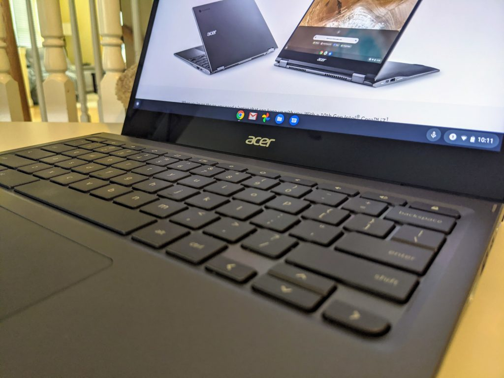

As much as [I raved about the 2020 edition of the Acer Chromebook Spin 713](https://www.aboutchromebooks.com/news/acer-chromebook-spin-713-review/), I know the 2021 iteration is better. That's because Acer didn't change much about an already great Chromebook and simply [upgraded a few internals for this year](https://www.aboutchromebooks.com/news/4-new-acer-chromebooks-11th-gen-intel-chips-and-one-with-thunderbolt-4-0/). You'll pay more for the 2021 model but you get the upgraded 11th-generation Intel processors this time around. And if $699 is too much for the 2021 Acer Chromebook Spin 713, you can [save $80 on it at Best Buy](https://www.bestbuy.com/site/acer-chromebook-spin-713-laptop-13-5-2k-gorilla-glass-intel-evo-core-i5-8gb-ram-256gb-ssd-thunderbolt-4/6458849.p?skuId=6458849) right now.

For $619 on sale, you get a configuration that's quite capable for just about any Chromebook user.

Powering the Chromebook is the 11th-generation Intel Core i5-1135G7 processor with four cores and eight-thread capabilities. There's 8 GB of memory for plenty of open tabs and apps, plus a fast NVMe SSD drive with 256 GB of capacity. And you're getting a pair of Thunderbolt 4 ports. Just two years ago, I would have expected a Chromebook configuration like this to cost around $1,000, although Thunderbolt support wasn't even available back then.

All of the other nice bits from last year's model come along for the ride.

The crisp 13.5-inch, 2256 x 1504 resolution touchscreen is there as is the same 3:2 aspect ratio, for example. You still get a pair of USB Type-C ports, although both are on the left side, a USB Type-A, full-sized HDMI output, and a microSD card slot. The keyboard is backlit and Acer still provides a large trackpad. Plus this is a fully convertible Chromebook, so you can rotate the display 360-degrees and use an optional USI stylus if you want to.

I can't speak to the claimed 10-hour battery life on the 2021 Acer Chromebook Spin 713, simply because I haven't tested one of these yet. That's the same expectation provided for the 2020 model I reviewed. On that device, I never saw less than 8 hours and averaged about 9 hours of run time during my daily tasks.

Frankly, unless you're a heavy-duty user of Linux and developing software, the 2021 Acer Chromebook Spin 713 is more than enough to keep any Chromebook user happy. And even if you are in the former group, this would still do the trick; I simply recommend more RAM for development activities. That's why I bought my older [Acer Chromebook Spin 13 with 16 GB of memory](https://www.aboutchromebooks.com/news/acer-chromebook-spin-13-with-16-gb-ram-should-you-buy-one/) a few years back.

Long story short: This new model hasn't seen many discounts until now. So if this was on your wishlist, you can [cross it off and save yourself $80 in the process](https://www.bestbuy.com/site/acer-chromebook-spin-713-laptop-13-5-2k-gorilla-glass-intel-evo-core-i5-8gb-ram-256gb-ssd-thunderbolt-4/6458849.p?skuId=6458849).
