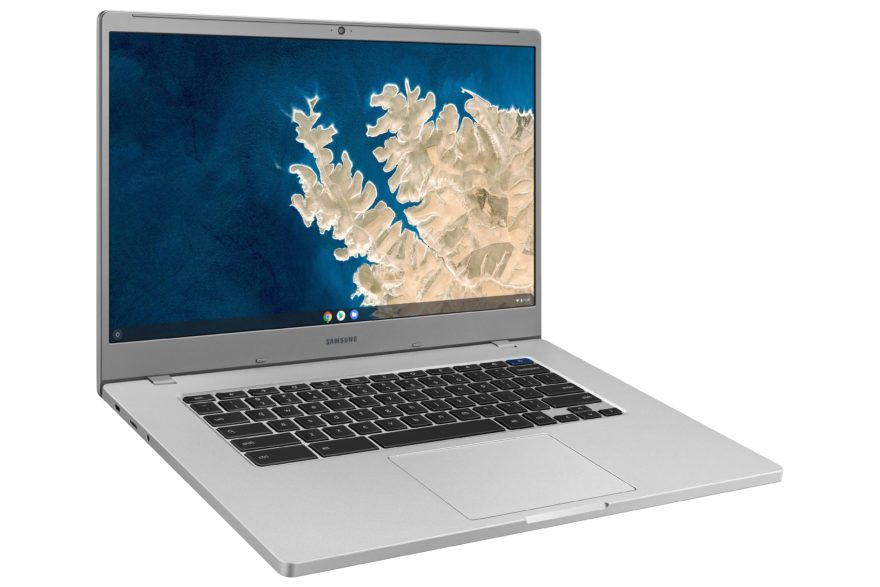
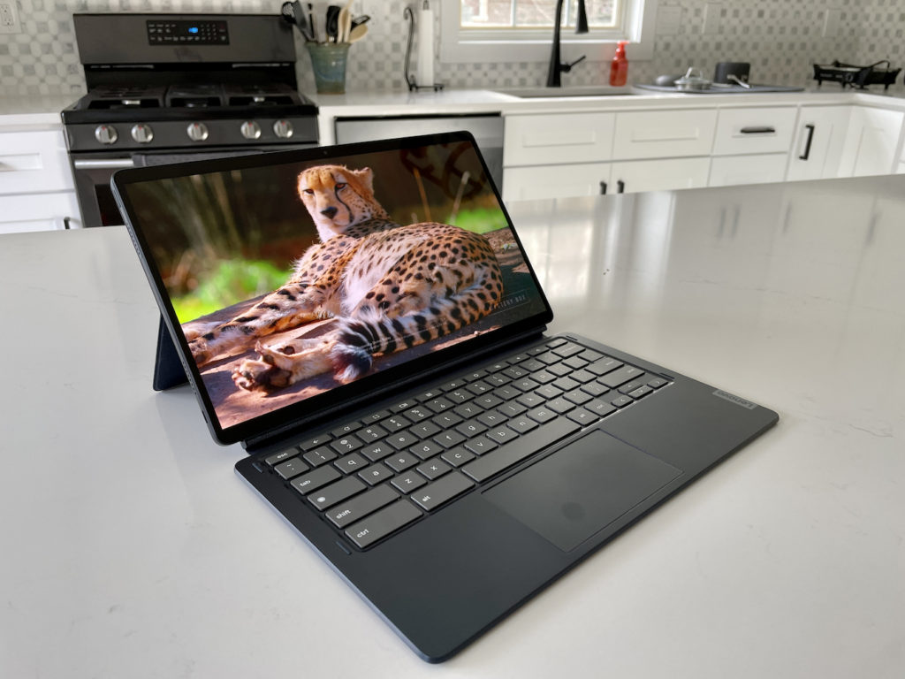
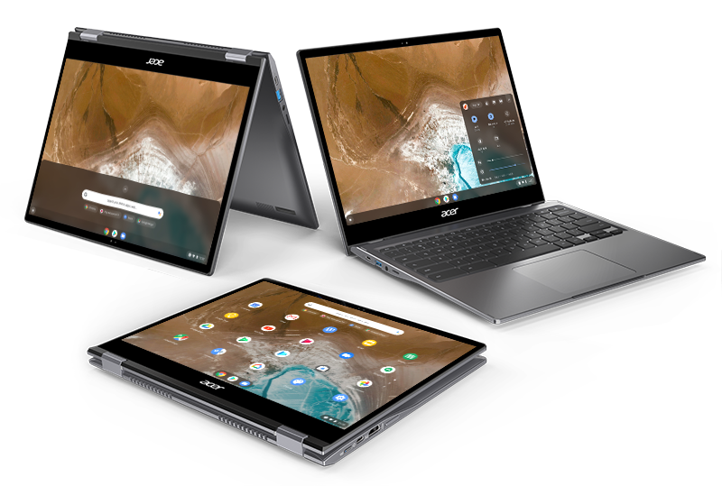

Black Friday is now a season, not a day as we've seen Chromebook Black Friday deals for the past few weeks. Most of them are pretty good, while some are nothing more than [typical anytime discounts](https://www.aboutchromebooks.com/news/the-599-hp-chromebook-x2-11-is-already-discounted-33-down-to-399/). And a few sound like great deals, but I think you can do better. Here are some of the best Chromebook Black Friday deals I've found, along with some alternatives for some of the more questionable ones.

## Budget-based Chromebook Black Friday deals

This section keeps the sale price down to $250or less. That's generally what I consider an entry-level Chromebook for younger students or someone who just needs a basic browser and maybe some light Android app usage.

You could be tempted by the [HP Chromebook 14c, which costs $149](https://www.bestbuy.com/site/hp-14-chromebook-intel-celeron-4gb-memory-64gb-emmc-chalkboard-gray/6477483.p?skuId=6477483), down from its $319 MSRP. And it will do the job with its 14-inch 1080p display, Intel Celeron, 4 GB of memory, and 64 GB of local storage. But that's the Intel Celeron N3350 inside, which is several years old. As a result, Google won't provide software and security updates after June 2024, so you're looking at roughly a 2.5-year supported lifespan.

The same applies to the [$219.99 Asus Chromebook CX1, normally priced at $279.99](https://www.amazon.com/ASUS-Chromebook-Spill-Resistant-Transparent-CX1400CNA-AS44FV/dp/B098KSXTFH?ref_=Oct_DLandingS_D_17c77fb9_89&smid=ATVPDKIKX0DER), which has the same internal hardware as the HP Chromebook 14c. It too will run out of support in June 2024.

Samsung Chromebook 4+

Instead, I'd consider the [$199 Samsung Chromebook 4+, which is discounted by $100](https://www.bestbuy.com/site/samsung-15-6-chromebook-intel-celeron-4gb-memory-32gb-emmc-flash-memory-platinum-titan/6371532.p?skuId=6371532). The 15.6-inch screen is 1080p and you still get the same 4 GB of memory but just 32 GB of local storage. You can always bump up the storage with a microSD card over time. And time is what you get here. This Chromebook has a newer Intel Celeron N4000 processor which gives it a longer support lifespan. Software and security updates from Google arrive through June 2026.

Acer Chromebook Spin 311

If a larger Chromebook isn't your jam and you can live with a lower resolution display, another option might be the Acer Chromebook Spin 311. Normally priced at $289.99, you can [get this small convertible Chromebook for $199.99](https://www.amazon.com/Acer-Chromebook-Convertible-Bluetooth-CP311-2H-C679/dp/B086MBQKH2?ref_=Oct_DLandingS_D_17c77fb9_65&smid=ATVPDKIKX0DER). Although the 11.6-inch display only has a 1366 x 768 screen, it does add touch capabilities. And you can output your Chrome OS display to a larger, higher-resolution monitor. Inside is an even newer Intel Celeron 4020 chip, the same 4 GB of memory and 32 GB of storage as the Samsung. And it will receive software updates through June 2026 like the Samsung above too.

## Tablet option deals

The relatively [new HP Chromebook X2 11 that I just reviewed](https://www.aboutchromebooks.com/news/hp-chromebook-x2-11-review-a-good-value-when-on-sale/) is normally $599.99 and we've seen prior sales dropping the price to $399.99. So [today's Black Friday Chromeboo deal at $399, isn't anything special. That said, the on-sale price makes it a pretty good value and worth the look.](https://www.bestbuy.com/site/hp-11-touch-screen-chromebook-qualcomm-snapdragon-8gb-memory-64gb-emmc-natural-silver-night-teal/6471019.p?skuId=6471019)

I'd probably pass on any Lenovo Chromebook Duet deals as well. Lenovo isn't even discounting last year's Chrome OS tablet, [charging people](https://www.lenovo.com/us/en/p/laptops/lenovo/lenovo-edu-chromebooks/lenovo-chromebook-duet-10/za6f0072us) $319.99 for a device that's often found around $250. You can find the [comparable Asus Chromebook CM3 detachable on sale for $259.99 right now](https://www.amazon.com/ASUS-Chromebook-Detachable-Touchscreen-WUXGA/dp/B094K28536?ref_=Oct_DLandingS_D_17c77fb9_81&smid=ATVPDKIKX0DER), discounted from its too-high $369.99 price tag. And Asus throws in the digital pen for you, so that's included.

Asus Chromebook CM3

Thanks to Brad in the comments, I did miss a great tablet value: [The Lenovo 10e Chromebook Tablet is discounted down to $99](https://www.lenovo.com/us/en/p/laptops/lenovo/lenovo-edu-chromebooks/lenovo-10e-chromebook-tablet/22ed10e10e1?orgRef=https%253A%252F%252Fwww.aboutchromebooks.com%252F&clickid=1ei2QrQfMxyORwp0MdV3iVCmUkG2sPUmNz1y1M0&irgwc=1&PID=10078&acid=ww%3Aaffiliate%3Abv0as6). This 10.1-inch slate is essentially a ruggedized version of the Lenovo Duet Chromebook. So it has the same 1920 x 1200 resolution touchscreen, MediaTek 8183 processor, 4 GB of memory and 32 GB of local storage. Plus it has great battery life which should easily last 10 or more hours. While the rugged tablet is meant for the classroom, it’s an inexpensive but similar device to the much higher priced Duet Chromebook.

Lenovo 10e Chromebook Tablet

If you’re considering this Chrome OS tablet and plan to type a lot, it might be worth spending an extra $30 though: [For $139.99 you get the Lenovo 10e Chromebook tablet and detachable keyboard case](https://www.lenovo.com/us/en/p/laptops/lenovo/lenovo-edu-chromebooks/lenovo-10e-chromebook-tablet/22ed10e10e1?orgRef=https%253A%252F%252Fwww.aboutchromebooks.com%252F&clickid=1ei2QrQfMxyORwp0MdV3iVCmUkG2sPUmNz1y1M0&irgwc=1&PID=10078&acid=ww%3Aaffiliate%3Abv0as6).

There don't seem to be any other Black Friday Chromebook deals on tablets, or at least not any that I've found. And frankly, [even at its full price of $499.99](https://www.bestbuy.com/site/lenovo-ideapad-duet-5-13-3-oled-chromebook-snapdragon-sc7180-qualcomm-adreno-graphics-8gb-memory-128gb-ssd-abyss-blue/6477625.p?skuId=6477625&ref=212&loc=1&extStoreId=525&ref=212&loc=1&gclid=CjwKCAiAqIKNBhAIEiwAu_ZLDnlfjQmzb3f4_BA9k_2YH0HrVDCwyxcSpUvqJ_4U5eZldoarbVySKhoCBwsQAvD_BwE&gclsrc=aw.ds), the Lenovo Duet Chromebook 5 gets you more performance and support longevity, plus [a gorgeous 1080p OLED display that I noted in my review](https://www.aboutchromebooks.com/news/lenovo-duet-5-chromebook-review-a-better-laptop-than-tablet-but-great-for-the-money/).

Lenovo Duet 5 Chromebook

## Black Friday Chromebook deals on the higher end

These devices are better suited to older students, full-time Chromebook users, and people who want a more premium experience.

I see that Google's Chromebook Pixelbook Go lineup is discounted by $100. So the Core i5 model is down to $749. It's a very nice device but launched in 2019, so the internals are a bit older. That means fewer years of support as well as a lack of performance compared to newer devices. And these newer devices cost less. Unless you have to have the Google branding and design, I'd probably pass on any of the Pixelbook Go devices.

Instead, the [Acer Chromebook Spin 713 is a much better bargain at $529](https://www.bestbuy.com/site/acer-chromebook-spin-713-laptop-13-5-2k-gorilla-glass-intel-evo-core-i5-8gb-ram-256gb-ssd-thunderbolt-4/6458849.p?skuId=6458849), which is a $170 discount. Then again, that's the same sale price we often see this 2-in-1 Chromebook enjoy. Still, you're getting a lot for the money: 11th-gen Intel Core i5 processor, 8 GB of memory, 128 GB of fast SSD storage, Thunderbolt ports, and a nice 2256 x 1504 touchscreen display with stylus support.

Acer Chromebook Spin 713

If you want an even higher resolution screen, [the 2020 Samsung](https://www.bestbuy.com/site/samsung-galaxy-13-3-4k-ultra-hd-touch-screen-chromebook-intel-core-i5-8gb-memory-256gb-ssd-fiesta-red/6398115.p?skuId=6398115) Galaxy Chromebook discounted $400 to $599 is another option. [You're getting a 4K OLED display that's one of the best I've ever seen](https://www.aboutchromebooks.com/news/samsung-galaxy-chromebook-hands-on-yes-its-as-nice-as-it-looks/). And there's a digital stylus along with a place to store it inside the Chromebook.

Keep in mind two important things though: Battery life on this Chromebook is about half that of most others at this price. So if you're planning to use this on the go, you might want to steer clear. And it uses a 10th-generation Intel Core i5 chip, so performance won't be on par with the Asus above. Everything else though? It's basically the same inside, along with the benefit of 256 GB of speedy SSD storage.

Samsung Galaxy Chromebook

I'm sure there are deals that I've missed here; I went through the better ones to help simplify your shopping. So you might spot some other discounts that look, or are, worth the money.

Remember to [check how long the device will get software updates](https://support.google.com/chrome/a/answer/6220366?hl=en#zippy=%2Chp%2Csamsung%2Cacer) before you make the purchase though. There's no reason to try and save a few bucks in just before 2022 only to have your Chromebook lose software support by 2024.

_(**Update**: Added the Lenovo 10e Chromebook tablet as that, and several other of these deals are still available)_
