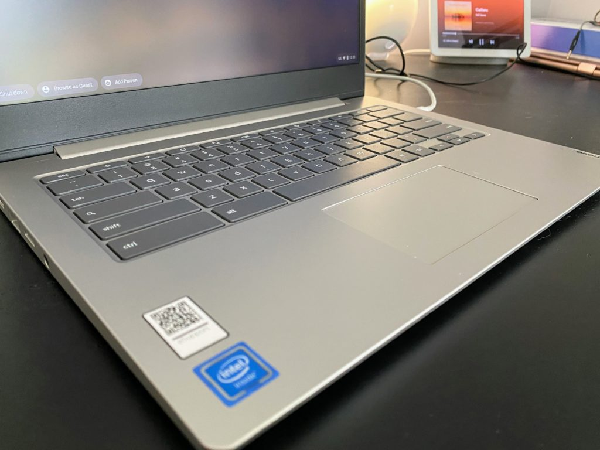
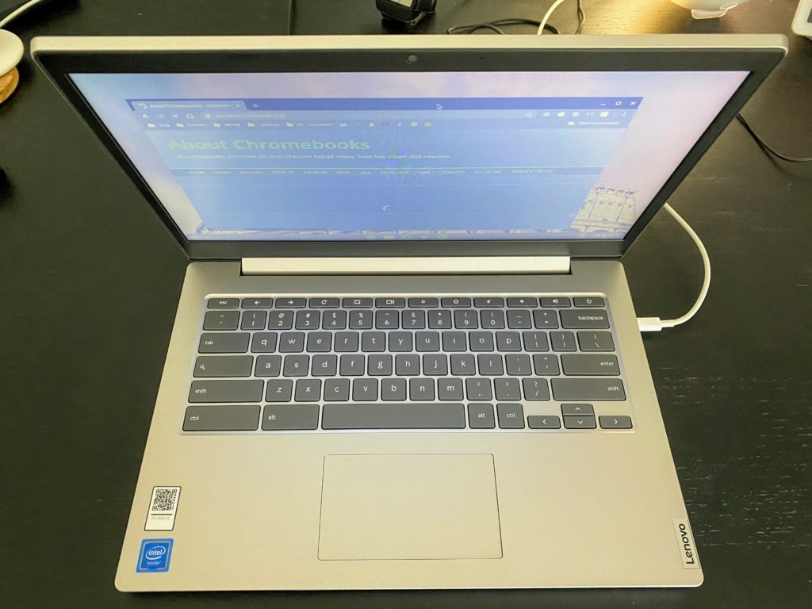
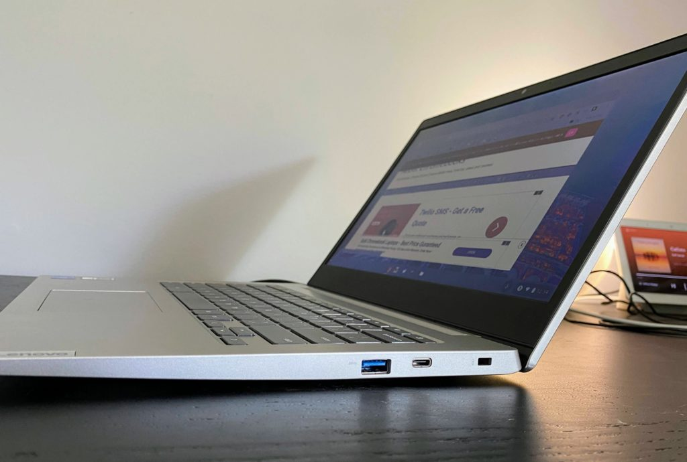

Just as I boxed up the [Lenovo Duet Chromebook after writing my full review of that Chrome OS tablet](https://www.aboutchromebooks.com/news/lenovo-ideapad-duet-chromebook-review-2020/), Lenovo sent over two other Chromebooks for me to look at. I have both the [$409 model of the Lenovo Chromebook Flex 5](https://www.aboutchromebooks.com/news/lenovo-chromebook-flex-5-chromebook-release-date-price-specifications/) as well as the much less expensive $250 Lenovo IdeaPad 3 Chromebook. The latter is available in an even cheaper 11-inch version, but I have the 14-inch model.

Although I'm intrigued by the Flex 5, I'm putting that aside, for now, to focus on the IdeaPad 3 for one main reason: It's less expensive than the Lenovo Duet Chromebook and I suggested in my review of that tablet that people may be more productive with a similarly priced Chromebook. So in a full review, I'll test that theory. For now, here's some information and early thoughts with just a few hours of using the IdeaPad 3.

Clearly, at this price, you're looking at an entry-level Chromebook. Power users need not apply due to the specifications:

<table><tbody><tr><td>CPU</td><td>Dual-core Intel Celeron N4020 Processor (1.1 GHz / 2.8 GHz)</td></tr><tr><td>GPU</td><td>Intel UHD 600 Graphics</td></tr><tr><td>Display</td><td>14-inch HD (1366 x 768) anti-glare TN panel with up to 220 nits brightness, non-touch,16:9 aspect ratio</td></tr><tr><td>Memory</td><td>4 GB LPDDR4 2400MHz</td></tr><tr><td>Storage</td><td>32 GB eMMC 5.1, microSD card slot for storage expansion</td></tr><tr><td>Connectivity</td><td>802.11 ac Wi-Fi (2 x 2), Bluetooth 4.2</td></tr><tr><td>Input</td><td>Non-backlit spill-resistant keyboard, multi-touch Mylar surfaced trackpad, 720p webcam</td></tr><tr><td>Ports</td><td>2 USB Type-C 3.1 (1st generation), 2 USB Type-A 3.1 (1st generation), headphone / microphone combination jack, lock slot, 2 x 2W speakers</td></tr><tr><td>Battery</td><td>42 WHr, expected run time up to 10 hours, 45W USB-C charger</td></tr><tr><td>Weight</td><td>3.09 pounds</td></tr><tr><td>Software</td><td>Chrome OS automatic update expiration: TBD</td></tr></tbody></table>

For a basic browser at home or for students, there's enough under the hood here to get you online for the $250 price of admission.

In terms of build quality and materials, they're about what you'd expect at this price. Maybe a bit better, even though the chassis is all ABS plastic. There isn't too much flex, even when I applied pressure to the corners, for example. The design is clean and the display hinge is stronger than I expected: This Chromebook isn't a true convertible, but the screen can be folded back 180-degrees.

The trackpad isn't glass but it works well. And since this is a 14-inch Chromebook, the keyboard is generously full-sized. There isn't a ton of key travel on the island-style keyboard, which is surprising since the device is 18 millimeters thick. It gets the job done based on my early typing experiences so far.

The screen is what you'd expect here: 768p resolution, not terribly bright, and relatively poor viewing angles due to the TN panel used. Color saturation looks acceptable but you'll want to view this screen straight on for the best viewing experience.

I wish the bezels around the screen were thinner, which could make the entire device have a smaller footprint. It's nearly the size of a 15.6-inch laptop that I have and that one has a full numeric keypad. Oh, and if having a touchscreen is on your requirements list, you're out of luck here. You'll be using an optional mouse or the trackpad to get around the web and Android apps.

While Lenovo isn't using the most current USB technology here, I do like having both a Type-A and Type-C on each side of the IdeaPad Chromebook 3. You'll need one of those USB Type-C ports to charge the device and having a choice of using the left or right one is appreciated. I don't, however, appreciate the rather large traditional-looking power brick but that's probably nitpicking at this price point.

In terms of benchmarks, the Lenovo IdeaPad Chromebook 3 results show a noticeable jump as compared to the Lenovo Duet Chromebook, which uses an ARM processor. Indeed, the Celeron-powered device with the same 4 GB of memory bested the Duet in all four tests. All tests were run upon fresh bootup and in Guest Mode:

<table><tbody><tr><td><strong>Test</strong></td><td><strong>IdeaPad 3</strong></td><td><strong>Duet Chromebook</strong></td></tr><tr><td>Octane 2.0</td><td><strong>16965</strong></td><td>9797</td></tr><tr><td>Speedometer 2.0</td><td><strong>52.2</strong></td><td>46.07</td></tr><tr><td>Basemark 3.0</td><td><strong>343.69</strong></td><td>228.68</td></tr><tr><td>JetStream 2.0</td><td><strong>55.21</strong></td><td>31.991</td></tr></tbody></table>

Note: Higher numbers are better and bolded

Keep in mind that benchmarks are synthetic tests mean to provide a general indication of performance.

I **don't** feel that the Duet is roughly 70% as fast due to the Octane score, for example. Instead, the Duet feels a smidge slower for many tasks. And because the two devices use a different type of chip architecture, there's another variable involved there that may be impacting the results for the Duet.

Regardless of performance and a lower resolution display, the benefits here are a device with a large screen and keyboard that can handle web apps and online productivity tasks.

As I said before, I'm sure some folks could use the Lenovo Chromebook Duet with included detachable keyboard for all-day productivity, especially when connected to an external display. But I still think most people are better served by a true Chromebook, not a tablet, for extended productivity.

We'll see! I'll use the Lenovo IdeaPad 3 Chromebook 14 for my typical daily web and Android app usage, save for [coding in Linux](https://www.aboutchromebooks.com/news/can-you-learn-to-code-in-a-college-computer-science-program-with-a-chromebook/), although I will install and test Linux, and report back with a full review. As always, questions are welcome in the comments below and I'll try to address them in the review.

First impressions though? It's a comfortable to use, capable-enough device at the entry-level price of $250. If you need more performance or features, you'll have to step up by about another $100 to $150... maybe to that [$409 Lenovo Flex 5 Chromebook](https://www.aboutchromebooks.com/news/lenovo-chromebook-flex-5-chromebook-release-date-price-specifications/).
