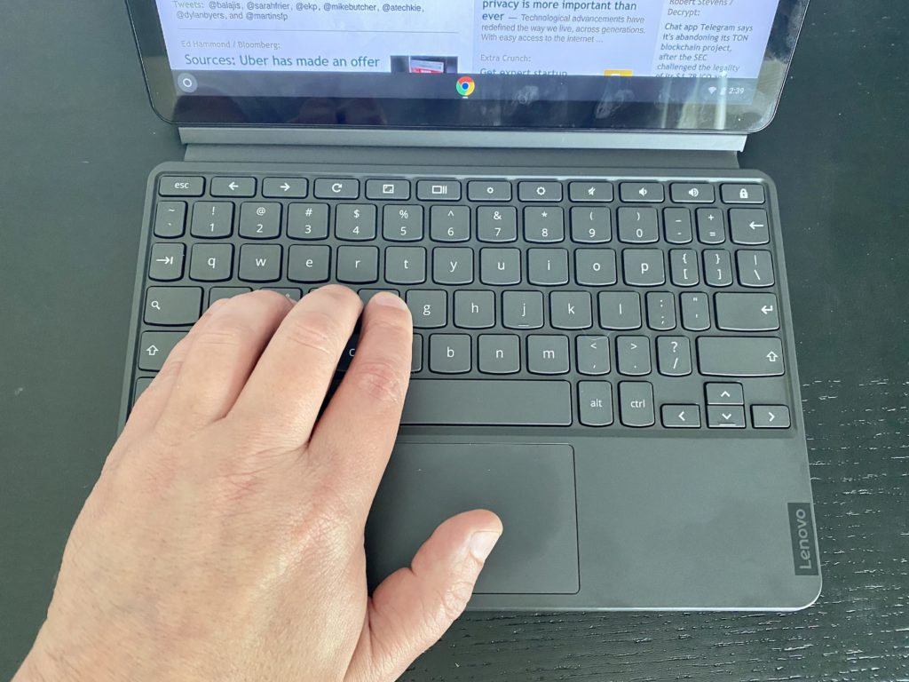

Late last week, I attended a private briefing regarding the Lenovo Duet Chromebook. My review unit arrived that same day: I have the [$299 model which is priced $20 higher than the base model](https://www.lenovo.com/us/en/coming-soon/Lenovo-CT-X636/p/ZZICZCTCT1X) and doubles the amount of local storage from 64 GB to 128 GB.

As of Monday this week, [you can officially purchase your own Lenovo Duet Chromebook](https://www.bestbuy.com/site/lenovo-duet-chromebook-10-1-tablet-128gb-with-keyboard-ice-blue-iron-gray/6401727.p?skuId=6401727), which comes with the keyboard and fabric back cover, which is also a kickstand. And as of Monday, reviews were allowed to go live.

Regular readers know I don't like to review a device over just two or three days solely to meet an artificial deadline. I ran into this [same situation with the Pixelbook Go, only getting the device shortly before the review embargo](https://www.aboutchromebooks.com/news/pixelbook-go-review-a-premium-price-validated-by-a-premium-device/).

Having said that, I can share some first impressions on the Lenovo Duet Chromebook from using it over the past few days. Expect a full review when I'm satisfied that I've tested it enough in the coming days. Also: If there are specific things you'd like to see tested, let me know in the comments and I'll do my best to address them.

## Build quality and display are excellent

The first Chrome OS tablet, the Acer Chromebook Tab 10, was very plasticy and felt like a low end device. That's not the case with the Lenovo Duet Chromebook: This is a well-designed and built piece of hardware, complete with an aluminum frame.

The form-factor and build reminds me of my iPad Pro 11, with similar materials and nicely rounded corners. Put another way, some tablets look cheaply made. This isn't one of them. It's the kind of device that looks more expensive than it costs.

The 1920 x 1200 display is also a standout so far. It's sharp, although a little blueish, and plenty bright enough, topping out at 400 nits on the spec sheet. I'm perfectly fine using this device with brightness between 40 and 60 percent in most cases.

## The full package is chunkier than I expected

The Lenovo Duet Chromebook is 7.35 millimeters (0.29-inches) thick by itself and easy to tote around. Once you add the keyboard and the fabric backed kickstand though, you're up to 18.2 millimeters thick (0.71-inches). That's pretty thick and more than I anticipated. Indeed, it's slightly thicker than the Google Pixel Slate with its keyboard:

Lenovo Duet Chromebook (left) and Google Pixel Slate (right)

You could reduce the thickness by not attaching the magnetic fiber backing but then the physical keyboard becomes useless. Why? Because the kickstand needed to hold up the display when using the keyboard built in to the tablet; it's part of the fabric attachment. So you're really looking at just a thin tablet alone without a keyboard or the full, thick package.

You also go from a 0.99 pound tablet to a 2.03 pound device with the keyboard and kickstand part. It feels dense in the latter case because that roughly two pounds isn't spread out over a wide area: This is a 10.1-inch tablet with relatively small screen bezels.

## Early performance indicators are what I'd expect at this price

So far, this $300 Chrome OS tablet performs as I'd expect: Like most other Chromebooks in this price range. That is to say the MediaTek Helio P60T Octa-Core behaves to me like a recent Intel Celeron processor. Perhaps like a new Pentium. That's not a bad thing because my expectations were set early on: I didn't think we'd see Intel Core i3-like performance from this device.

I've said many times in the past that I'm not a fan of benchmarks, or at least not as the "end-all, be-all" metric to look at.

However, people always ask for them and as long as you see them as an indicator of general performance, they can be a useful data point. So here you go, with all tests run after a reboot and in Guest Mode. In all cases, higher numbers are better.

<table><tbody><tr><td>Octane 2.0</td><td>9,797</td></tr><tr><td>Speedometer 2</td><td>46.07</td></tr><tr><td>Basemark 3.0</td><td>228.68</td></tr><tr><td>JetStream 2</td><td>31.991</td></tr></tbody></table>

Again, these aren't performance numbers that can compete with a Chromebook powered by an Intel Core m3 or better processor and double the memory. But again, this is a $300 package, so you can't expect to perform like a Chromebook that costs $500 or more.

For example, benchmarks from various devices that cost nearly triple illustrate my point: Triple the cost can mean triple the performance. Keep that in mind as you think about purchasing the Lenovo Duet Chromebook: This **_may_** be better suited for most people as a secondary device instead of a primary Chromebook, depending on your needs.

For general browsing, the Lenovo Duet Chromebook performs fine. I do see the occasional lag from time to time, which I suspect is partly due to the 4 GB of memory. But I think I'd be happy using this as a small browser or part-time productivity device based on the performance.

I haven't yet tested any Android apps, so I'll focus on them during my full review. The [new pinned tabs for Chrome OS tablets that arrived in Chrome OS 81](https://www.aboutchromebooks.com/news/chrome-os-81-stable-channel-release-what-you-need-to-know/) are useful and I don't see any performance issues with them.

Just to level set, here's the full specification list to refresh your memory and provide context:

<table><tbody><tr><td>CPU</td><td>Octa-core Mediatek Helio P60T (4xA73 at 2.0GHz)</td></tr><tr><td>GPU</td><td>ARM G72 MP3</td></tr><tr><td>Display</td><td>10.1-inch 1920 x 1200 touchscreen, 400-nits, 70% color gamut</td></tr><tr><td>Memory</td><td>Up to 4 GB LPDDR4x</td></tr><tr><td>Storage</td><td>Up to 128 GB eMMC, <s>microSD slot for expansion</s></td></tr><tr><td>Connectivity</td><td>Wi-Fi 5, Bluetooth 4.2</td></tr><tr><td>Input</td><td>Included keyboard with trackpad, optional stylus, 2 MP front camera, 8 MP webcam</td></tr><tr><td>Ports</td><td>One USB Type-C (2.0 + DisplayPort)</td></tr><tr><td>Battery</td><td>7180 mAh, expected run-time of 10 hours for video, 8 hours for web browsing</td></tr><tr><td>Weight</td><td>0.99 pounds without keyboard</td></tr><tr><td>Software</td><td>Chrome OS automatic updates through June 2028</td></tr></tbody></table>

## About that keyboard

On the briefing call, Lenovo said that most $300 devices have some compromise. You might get good performance but bad battery life. Or you might sacrifice on the display or not get a keyboard. So the company says this is a tablet that can also be a laptop, hence the included keyboard and the inclusion of the word "Chromebook" in the product name.

First up, I'm thrilled that Lenovo is including the keyboard at no extra cost. A USI stylus is optional and will cost you; Lenovo plans to debut one in the coming months but any USI stylus will work with the Lenovo Duet Chromebook.

The kickstand can fold back from around 95 to about 135 degrees

Having said that, there **_is_** some compromise in this keyboard. It's not backlit, for starters. I'm actually OK with that but others may not be. And there are some keys that aren't full-sized. That's a design challenge when you only have so much space to work with on a keyboard to fit a 10.1-inch display so it's not unique to Lenovo.

For perspective, being around 5' 5" tall, I have relatively small hands. Here's what one looks like with this keyboard.

Aside from those two observations, the keyboard is good, provided you can get used to the overall size and spacing. Even after a few days of use, I feel a bit cramped when typing. That's why I don't think I could use this as a full-time device for productivity. Give me an hour of productivity tasks though and the experience is good. The same can be said for the trackpad: It's small but that's a design constraint in a device with this size. However, it's very responsive so far.

I should note that the Lenovo Duet Chromebook keyboard suffers in a fashion similar to the Google Pixel Slate Keyboard: It twists and flops a little when using the Duet on your lap. That's because the top end of the keyboard has flexible fabric between it and the magnetic base that attaches to the screen. It's actually not as a bad as the Pixel Slate keyboard because this device isn't as a wide. But, you'll likely notice it.

## Overall first impressions are favorable

For $300, I'm generally impressed by the Lenovo Duet Chromebook, although I kept my expectations in check based on the specification sheet. Battery life so far seems to be what Lenovo has claimed, the screen is really nice while the speakers are adequate but not outstanding. Performance seems to be on par with other devices at this price point.

Obviously, I have more to test such as the aforementioned Android apps. And I'm sure folks will want to see how Linux works on this device although I don't see that being a primary use case for a 10.1-inch tablet, even when connected to an external monitor. You're limited to Linux apps compiled for ARM processors to begin with and you're still looking at running Linux on what's essentially a smartphone processor.

On that note, let me know what you'd like to see tested or if you have any specific questions. Again, I'll address as many of them as I can.

_**Update**: As many commenters have noted, there is no microSD card on this Chrome OS tablet. The error was mine as I copied some of the data from another hardware table I previously authored. I apologize for any confusion and for the lateness of the update; I've been mostly offline due to illness for roughly a week. Cheers to everyone for surfacing the mistake and informing the community!_
