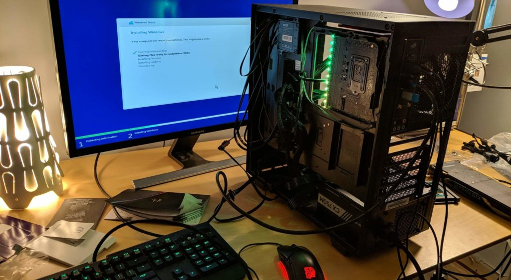
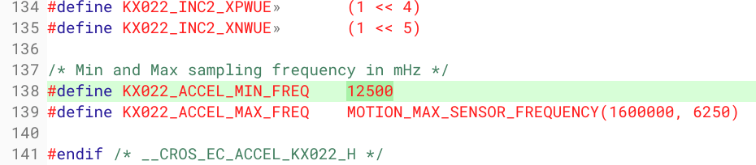
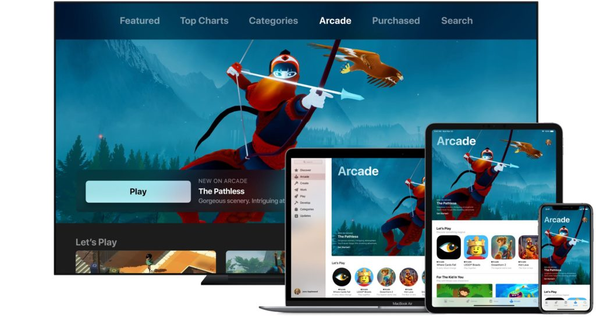
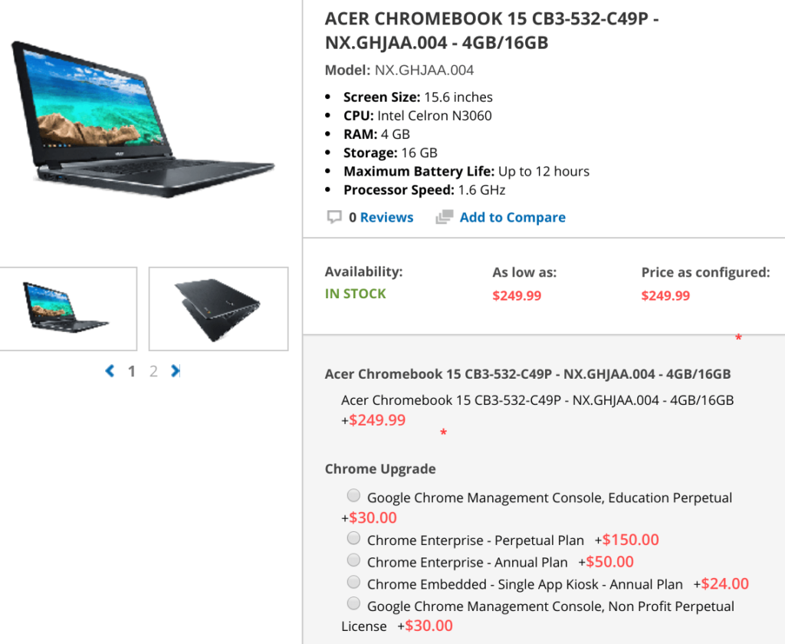
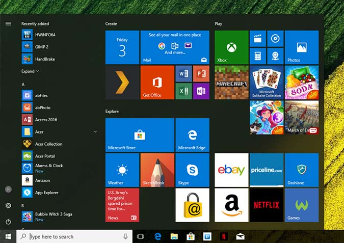

Over the weekend on the Chrome OS sub-Reddit, [I noticed this really great question](https://www.reddit.com/r/chromeos/comments/d4blsp/why_are_some_chromebooks_now_more_expensive_than/). It's one that I've heard a number of times, in fact.

> I've been shopping around recently for another Chromebook, and I realized how expensive they're getting in relation to Windows laptops. For example, you can get a new Windows PC, with better hardware and specifications, for like 100 dollars less than a Chromebook with half the ram, half the storage, and a worse CPU.

I chimed in with a short answer but then I realized there's not a single answer why a Chromebook can often cost more than a Windows laptop with seemingly similar hardware specifications.

There are several reasons actually.

Microsoft Windows runs on nearly anything but Chrome OS doesn't

Right off the bat, there's a _huge_ difference in how a Windows laptop is designed compared to a Chromebook. With Windows, Microsoft includes thousands of driver files to account for practically every reasonable combination of hardware, ranging from displays, hard drives, trackpads, wireless radios, webcams and more.

Essentially if a Windows device maker designs a laptop to run Windows, it can generally decide what hardware goes inside the computer and then install Windows. It's more or less the same process - just without input from design and marketing teams - for you to build your own PC with a range of store-bought parts. You put the machine together, install Windows, add missing driver files, if any, and go on your way. You don't work with Microsoft's Windows team to ensure the PC will do what you want it to do.

A Windows gaming PC my son and I built earlier this year

But you can't do that with Chrome OS and, more importantly, neither can Google's hardware partners.

Instead, the Acers, HPs, and Dells of the world have to work directly with and through the Chromium OS team at Google. This team, in conjunction with the laptop brand as well as Intel, AMD and other chip companies, designs a baseboard for use with Chrome OS. Code for every possible component is specifically built into the firmware and tested.

Keep in mind that not all components are "equal" either. Take the case of an accelerometer or gyroscope, both of which are in 2-in-1 Chromebooks and Windows laptops.

Having sifted through the Chromium code over the past few years, I've learned that there's a broad range of these components; each from different manufacturers, with different voltages or other parameters. Every single one of them is software tuned specifically in Chrome OS, which goes well beyond adding a supporting driver in Windows. And that's just **one** very small component of many inside a Chromebook. I've seen the same with camera sensors, trackpads, display drivers, hall sensors and more.

Code change for one specific gyroscope model's frequency

This process takes many months. Heck, we first saw the [Atlas baseboard, widely expected to power a new Pixelbook launching next week back in April of last year](https://www.aboutchromebooks.com/news/chromium-code-suggests-4k-chromebook-code-named-atlas-in-the-works/). Assuming [a Pixelbook successor](https://www.aboutchromebooks.com/news/fcc-quanta-atlas-chromebook-pixelbook-2/) does launch next month, that's 18-months of development time. You can build your own Windows PC in a weekend!

Somebody has to pay for all of that engineering and development time. I'm not able to share details on who, such as Chrome OS hardware partners, may or may not pay some or all of those costs, but they're there. And some of that has to be passed down to Chromebook consumers.

Just like with Apple MacBooks, you're paying a premium for a certain experience

This leads me to relate a similar situation with Apple's laptops. Unlike Windows, there's a bit of exclusivity with macOS, just like with Chrome OS. What I mean is, you can't slap hardware together and build computer running macOS; you have to buy that computer from the one and only hardware maker that has the software pre-installed.

\[Sidenote: Yes, you can build a "hackint0sh" computer and install macOS yourself if you know how. I've done it. But it's not exactly legal from a software licensing standpoint and it's not something that most computer owners do.\]

Unlike the ubiquity of Windows across hundreds, if not thousands of compatible devices, neither macOS or Chrome OS can officially be slapped on to some hardware. You have to buy it from the company who makes the hardware, or the case of a Chromebook, a Google hardware partner.

What does this mean in terms of cost?

There's a potential premium involved for such exclusivity and an experience that's far more consistent on devices built by or designed by the software maker. You also get premium integrations that add value.

Apple's iOS devices natively integrate with MacBooks with features such as Handoff and Continuity, for example. Got a call on your iPhone? You can take it on your Mac. That new Apple Arcade game subscription will work not just on your iPhone or iPad but on your Mac too. For some, these integration points are worth the extra cost of a Mac over a cheaper Windows laptop that has the same hardware parts.

Credit: Apple

From a Chromebook perspective, you're getting value-adds as well. If you weren't you'd just buy the least expensive hardware that meets your needs, install the Chrome browser on it and call it day.

I look at some of these Chromebook features that add to the experience as well as the premium cost, although I'm sure there are some that I've missed:

- Native Google Drive integration with offline support built-in.
- Android app support.
- Native Chromecast support.
- The ability to run Linux in a secure container. (Worth noting: Microsoft has added the Linux Subsystem for Windows recently, which is the same value add and I applaud them for doing so)
- Instant tethering features for supported Android phones.
- Software updates in the background that are much quicker to install since they're applied to a second boot partition. A reboot places you in the already updated version of Chrome OS.
- A massively reduced chance of getting a virus on your device and there's no third-party anti-virus software required. Not a single persistent Chrome OS compromise in Guest mode has yet to happen; [Google is now paying $150,000 for anyone who can demonstrate one](https://www.google.com/about/appsecurity/chrome-rewards/index.html).
- A broad range of Chrome Device Management features for enterprises and small businesses (note: license required)

Credit: Promevo.com

There's no bloatware on Chromebooks

Every Chromebook available for sale boots up with the same interface and the same core group of web apps and services. You can obviously add more, of course.

Now, look at Windows devices from any of Microsoft's partners.

Some devices, such as the Microsoft Signature Edition computers, came "clean" with Windows and no third-party add-ons. That program is gone and that means when you buy a Windows laptop, you're very likely going to see apps and services pre-installed with some third-party games, trials, anti-virus programs or other software.

Credit: LaptopMag.com

Guess who pays for that? Those third-party app makers. And guess who pockets the money? Acer, Asus, Dell, HP, Lenovo or whoever makes the computer. So in addition to any profit margin from the hardware, the device makers earn extra income that can range from just a few bucks to a total of $100 or more from pre-installed software.

That gives a Windows device maker more pricing flexibility. For example, it could drop the cost of a laptop by some, or even all, of that extra third-party bloatware income. Profits would be on the hardware alone and the lower device cost could spur more sales, which raises overall revenues.

Chromebook makers don't have that option because again, there is no third-party software bundled with a Chromebook. Profit margins are solely on the hardware, with the addition of other Google services such as Chrome Enterprise device management or EDU device seat licenses.

Put another way: The relatively same hardware for a Chromebook has little to no price movement opportunities compared to a comparable Windows laptop.

When you buy a Chromebook, you're _not_ just buying hardware

All of this is to say, not all laptops are equal, even if the spec sheet reads the same. With Chromebooks, you're essentially getting a custom-built laptop designed to provide a speedy, simple and secure experience that's consistent across devices.

Sure there are fewer choices by comparison. And Chrome OS doesn't meet the needs of everyone. If you need Windows, you should buy a Windows laptop. Heck, there's a good chance you'll pay less for a device that better suits your needs.

But if a Chromebooks meets your needs, don't be surprised to pay a premium compared to that same Windows laptop that appears to have the same guts.
