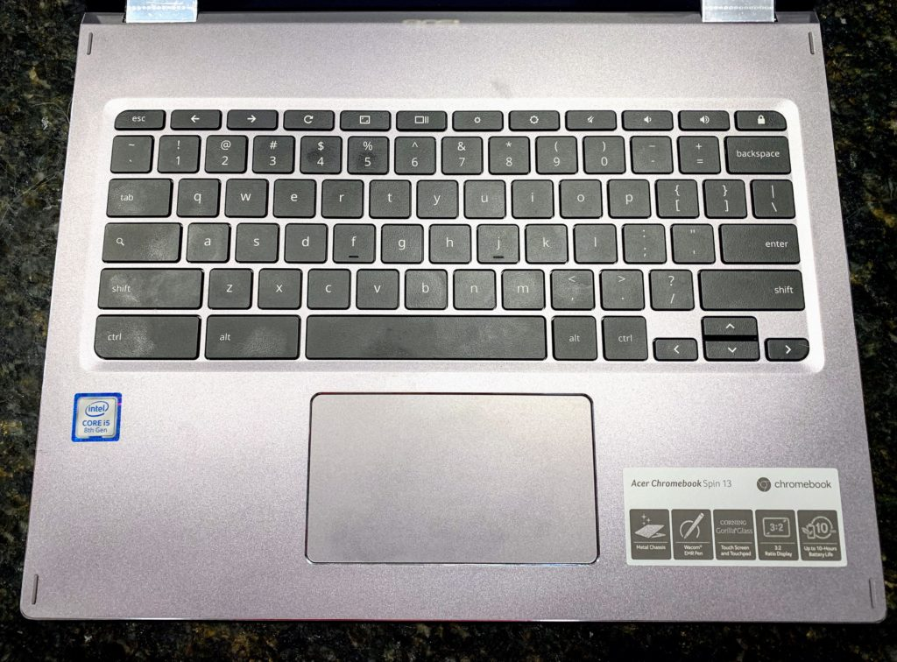

<iframe style="width:120px;height:240px;" marginwidth="0" align="right" marginheight="0" scrolling="no" frameborder="0" src="//ws-na.amazon-adsystem.com/widgets/q?ServiceVersion=20070822&amp;OneJS=1&amp;Operation=GetAdHtml&amp;MarketPlace=US&amp;source=ss&amp;ref=as_ss_li_til&amp;ad_type=product_link&amp;tracking_id=aboutchromebo-20&amp;marketplace=amazon&amp;region=US&amp;placement=B07GD4CMDH&amp;asins=B07GD4CMDH&amp;linkId=7bd099e3b019aa1ae37d5e08d6c02e1f&amp;show_border=true&amp;link_opens_in_new_window=true"></iframe>

About a year ago [I reviewed the $899 Acer Chromebook Spin 13](https://www.aboutchromebooks.com/reviews/acer-chromebook-spin-13-review-vs-pixelbook/) saying you can get better than Pixelbook-power for less than Google's then-flagship laptop. I liked it so much, I bought my own, although [I chose a model with 16 GB of RAM](https://www.aboutchromebooks.com/news/acer-chromebook-spin-13-with-16-gb-ram-should-you-buy-one/) for my coding activities. That same device I reviewed last year can be had with [a $300 savings on Amazon this weekend, costing you $599.99](https://amzn.to/2CUO3Fz).

This price is the same as it was on Amazon's Prime Day, and I haven't seen a better deal on this very capable Chromebook since that time.

## What you get for $599.99

Here are the hardware specifications, which I'd consider to be in the high-end range for a Chromebook:

- [Intel Core i5-8250U](https://ark.intel.com/content/www/us/en/ark/products/124967/intel-core-i5-8250u-processor-6m-cache-up-to-3-40-ghz.html) quad-core processor with 1.60 GHz clock speed
- 8 GB of LPDDR3 memory
- 128 GB of eMMC storage
- A 13.5 inch IPS touchscreen display with 2256 x 1504 resolution and 3:2 aspect ratio
- Intel UHD Graphics 620 with that shares memory with the system
- 360-degree hinge for 2-in-1 usage in tent, display and tablet modes
- An EMR pen that is stowed inside the Chromebook
- 802.11ac Wi-Fi (2×2 MIMO) and Bluetooth 4.2
- A pair of USB Type-C (USB 3.1, Gen 1) ports, a USB Type-A (USB 3.0) port, a microSD card reader, headphone jack, microphone and stereo speakers
- Backlit keyboard, Gorilla Glass trackpad
- Battery life expectations of up to 10 hours
- [Chrome OS software updates](https://support.google.com/chrome/a/answer/6220366?hl=en) through June 2025

When I tested this device and compared it to the Google Pixelbook I owned then, I was impressed:

> ...everything I’ve done on the Spin 13 has felt as fast, if not faster than the same activities on my Pixelbook. Those activities include light photo edits, up to 20 open tabs for web apps, watching full-screen YouTube TV, using a few Android apps and yes, running some Linux IDEs for coding Java apps by using [Project Crostini](https://www.aboutchromebooks.com/tag/project-crostini). I wouldn’t say I noticed that the more powerful Spin 13 is much faster than my Pixelbook in everyday use, but it’s definitely not slower if that makes sense.

Much of the performance and power difference is due to the U-Series processor inside the [Acer Chromebook Spin 13](https://amzn.to/2CUO3Fz).

While a lower-powered Y-Series chip can help a Chromebook last longer on a battery charge, I've been thrilled with how long my Chromebook Spin 13 battery lasts; I've never brought a charger with me for a day's use of computing.

The all-aluminum chassis and build quality are quite good on this device as well. So too are the backlit keyboard and the trackpad. My only nits to pick are that the 720p webcam is adequate: Not great but not bad either. I think the 1080p 60fps webcam on [the Pixelbook Go](https://www.aboutchromebooks.com/news/pixelbook-go-review-a-premium-price-validated-by-a-premium-device/) has spoiled me though.

And the downward-firing speakers on the Acer Chromebook Spin 13 aren't the best either. I thought that even before the excellent speakers of both the [Pixel Slate](https://www.aboutchromebooks.com/reviews/google-pixel-slate-review/) and Pixelbook Go impressed though.

If your budget can handle the cost and you're looking for high-performing, well build Chromebook, the Acer Chromebook Spin 13 should definitely be in the mix for consideration.
