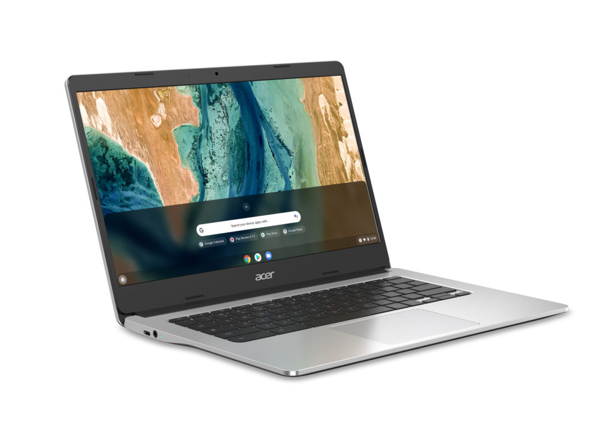

At its 2021 Global Press Conference on Thursday, [Acer introduced 4 new Chromebooks for home and work](https://news.acer.com/acer-launches-four-new-chromebooks-including-industrys-first-17-inch-model) in a range of sizes and prices. All of the new Acer Chromebooks use 11th-gen Intel processors while two also include Thunderbolt 4.0 support.

And in a first, Acer has a Chromebook with a 17.3-inch, 1080p display. Perhaps the most surprising aspect of that one is the sub-$400 starting price.

## Acer Chromebook 317

I'll start with that one, which is the Acer Chromebook 317. I actually have an early, hands-on look at that model coming shortly but let's look at the information Acer has provided today.

This is clearly targeting the entry-level market based on the $379.99 starting price and configuration options ranging between a dual-core [Intel Celeron N4500](https://ark.intel.com/content/www/us/en/ark/products/212326/intel-celeron-processor-n4500-4m-cache-up-to-2-80-ghz.html), quad-core [Celeron 5100](https://ark.intel.com/content/www/us/en/ark/products/212329/intel-celeron-processor-n5100-4m-cache-up-to-2-80-ghz.html), or quad-core [Pentium Silver N6000](https://ark.intel.com/content/www/us/en/ark/products/212330/intel-pentium-silver-n6000-processor-4m-cache-up-to-3-30-ghz.html) chipset.

However, this is actually the most intriguing of the new Acer Chromebooks to me because it offers other features and options that typically aren't found in an entry-level Chromebook.

Boy do I have a lot of room to work!

For example, all models use a 1080p IPS panel for that large 17.3-inch display. You'll often find low-quality TN panels near this price point.

You can also configure the Acer Chromebook 317 with either 4 or 8 GB of memory. Yes, you read that correctly: Unlike most Celeron / Pentium Chromebooks which only come with 4 GB of RAM, you can double it up here.

And all four USB ports (a pair each of Type-C and Type-A) are USB 3.2. All too often I've seen slower USB ports on low-cost Chromebooks, but not this time.

- 
    
- 
    
- 
    
- 
    

There are other features worth a mention, although they're optional and based on the model configuration.

Examples are the 82-degree wide view webcam (720p), a backlit keyboard, a dual-microphone setup in lieu of a single, and the addition of a touch option for that large screen. Here's a rundown of the basic specifications for the Chromebook 317, which Acer says is a North American arrival in June.

## Acer Chromebook 314

There's currently an Acer Chromebook 314 model available but it uses older Celeron chips.

This year, the updated Acer Chromebook 314 opts for the MediaTek 8183 ARM-based chip, in a likely effort to boost battery life. Indeed, the Chromebook 314 is expected to run for up to 15 hours on a charge. That's a 50% boost in battery life claim over the prior model.

- 
    
- 
    
- 
    
- 
    
- 
    

You still get your choice of an HD or FullHD display along with a touchscreen option and up to 64 GB of eMMC storage. But again, you can configure this entry-level 14-inch Chromebook with either 4 or 8 GB of memory.

I don't think I've seen any of the MediaTek 8183 Chromebooks with an 8 GB RAM option and that will allow for more browser tabs to be open simultaneously.

Availability of the Acer Chromebook 314 in North America starts in July with the base model expected at $269.99.

Keep in mind, that's very likely with the lower-resolution display and 4 GB of memory. Pricing for upgraded options isn't available yet but you'll pay incrementally more for the better screen, touch capabilities, and more RAM.

Regardless, I like that Acer is pushing the boundary of what capabilities an entry-level Chromebook can have.

## Acer Chromebook 514 and Chromebook Enterprise 514 (with Thunderbolt 4!)

Like the model I just mentioned above, Acer currently sells a Chromebook 514 and Chromebook Enterprise 514. These use AMD Ryzen processors. These updated clamshell models move to 11th-generation Intel Core chips and a pair of Thunderbolt 4 ports.

I'd really like to know the full specifications of the base model, but Acer has only provided an overall set of "up to" specs for this product line.

Yes, the top-end options look nice: A Core i7, up to 8 GB of memory, and speedy PCIe Gen3 4x4 NVMe storage up to 256 GB. However, there aren't any details yet on the base pricing configuration, which seemingly starts with a Pentium Gold and likely 4 GB of memory.

That could just be my interpretation as Acer doesn't say what configuration will be available at the $599.99 price point when the Chromebook 514 arrives in North American this August. So I'm not going to pass any judgment on the value proposition here until we have more information.

- 
    
- 
    
- 
    
- 
    

For the business peeps out there, the Acer Chromebook Enterprise 514 appears to be the same hardware and options, but with the inclusion of a Chrome Enterprise Upgrade license.

## Acer Chromebook Spin 713 (with Thunderbolt 4!)

You can probably see a pattern here as some of the new Chromebooks are upgrades of current models. And the Acer Chromebook Spin 713 is no exception. I don't mind that though because [last year's Chromebook Spin 713 was one of my personal favorites](https://www.aboutchromebooks.com/news/acer-chromebook-spin-713-review/).

I said this in my review of that model:

> If I haven’t made it clear, I’m simply amazed at what you get for the price here. The Acer Chromebook Spin 713 is already high on my short list for Chromebook of the year, although I’ll make that final determination at the end of 2020.

Well, Acer has taken everything good about that model and improved with those new Intel Core processors. This is actually the first Intel Evo platform-verified Chromebook, which is basically what we call Project Athena devices today.

You still get that high-resolution 3:2 touch display but now it's powered by a range of 11th-generation Intel Core i3, i5, and i7 processors with Intel Iris Xe graphics.

Just about everything else is the same as the prior model when it comes to storage and memory options save for one little tidbit: That pair of USB-C ports are Thunderbolt 4 compatible.

Not only can they work with DisplayPort and other output standards but you can transfer data at a whopping 40 Gb per second.

Like the large Acer Chromebook 317, the Acer Chromebook Spin is expected to land in North America next month.

However, there's a link that will go live later today (if it's not already) for [a Core i5 model at Best Buy priced at $699.99](https://www.bestbuy.com/site/acer-chromebook-spin-713-laptop-13-5-2k-gorilla-glass-intel-evo-core-i5-8gb-ram-256gb-ssd-thunderbolt-4/6458849.p?skuId=6458849), which is about $70 more than last year's base model.

That cost gets you the Core i5, 256 GB of fast NVMe storage, and 8 GB of memory.

- 
    
- 
    
- 
    
- 
    

Personally, my daily driver is still the Acer Chromebook Spin 13, which is the two-year-old version of this device. Until now, I haven't been interested in upgrading but the updated Acer Chromebook Spin 713 has me thinking about it. I just need to know how much [a model with 16 GB of memory](https://www.aboutchromebooks.com/news/acer-chromebook-spin-13-with-16-gb-ram-should-you-buy-one/) will set me back.

Oh, there is an enterprise version of this Chromebook as well. Yes, it's the same hardware but includes the Chrome Enterprise Upgrade license for those who need it.

One last important bit about all of these Acer Chromebooks.

They will receive Chrome OS updates from Google through at least June 2029, so you're getting the maximum support window possible. That's definitely worth considering if you're in the market for a Chromebook today. Buying an older model will surely save you some money but you may lose software support a bit earlier.
