This week, [Acer introduced four Chromebooks for a range of use cases](https://news.acer.com/acer-debuts-new-large-screen-chromebooks-for-work-school-and-entertainment), with three of the quartet getting the 11th-generation Intel CPU upgrades. The fourth model is ARM-based, powered by MediaTek's Kompanio 828 processor. Here in the U.S., availability begins next month with prices starting between $399.99 and $899.99, depending on the model.

Let's go through them from least to most expensive since this is a wide range when it comes to pricing.

## Acer Chromebook 514: $399.99 to start

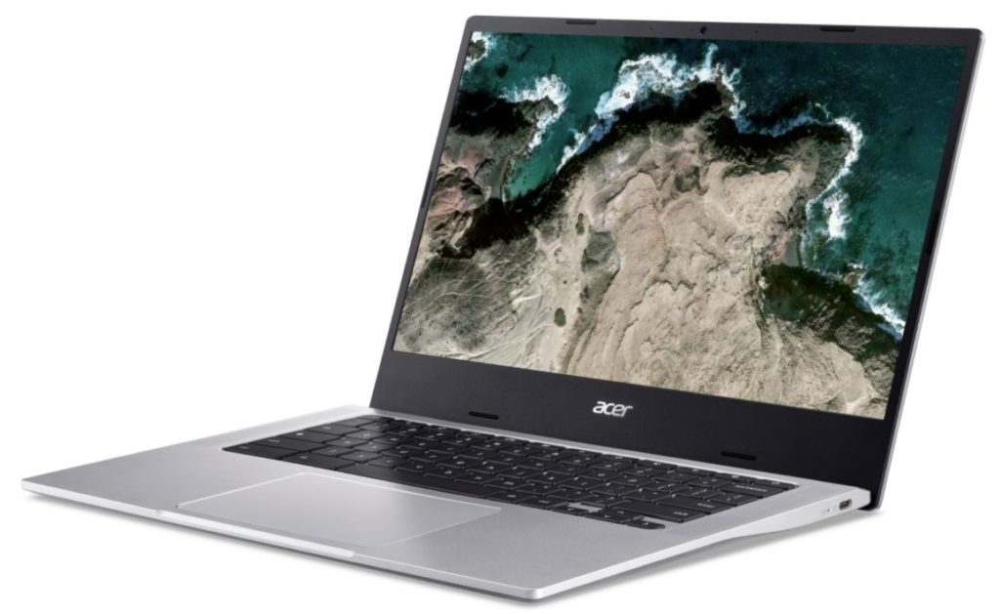

Arriving in December, the Acer Chromebook 514 is a basic clamshell laptop powered by an octa-core MediaTek Kompanio 828 Processor. That should help battery life, which Acer claims is up to 15 hours on a charge. The 14-inch matte display is a full 1920 x 1080 and there is a configuration with touch support. Memory is up to 8 GB, so expect entry-level configurations to have half that.

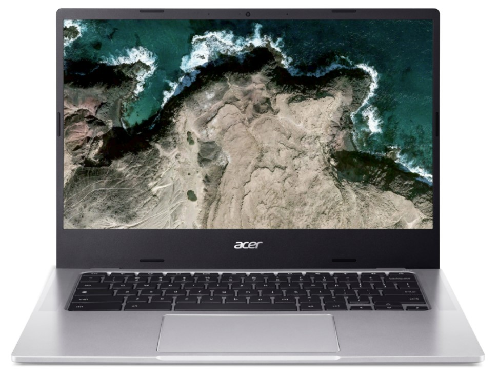

You're getting a pair of USB Type-C ports, one on each side, along with a USB Type-A port on the right. Connectivity uses Wi-Fi 6; this is the first ARM-based Chromebook I've seen to include the newer, faster wireless standard. Overall, this looks like a thin and relatively light all-day Chromebook idea for students and other on-the-go users that need the basics.

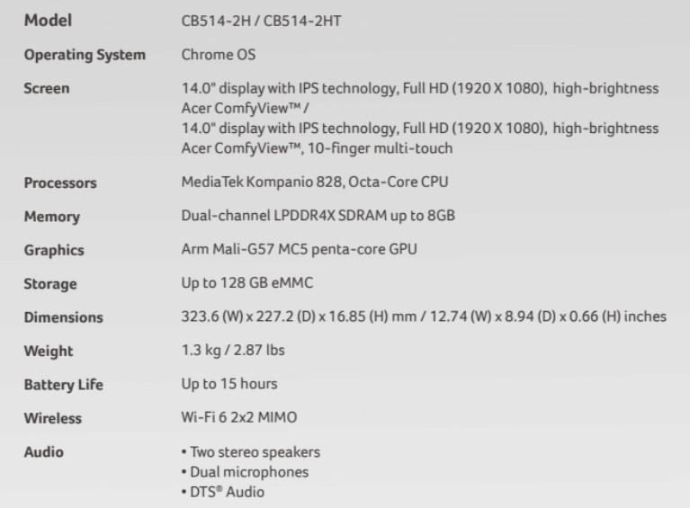

## Acer Chromebook Spin 314 (CP314-1H/N): $499.99 to start

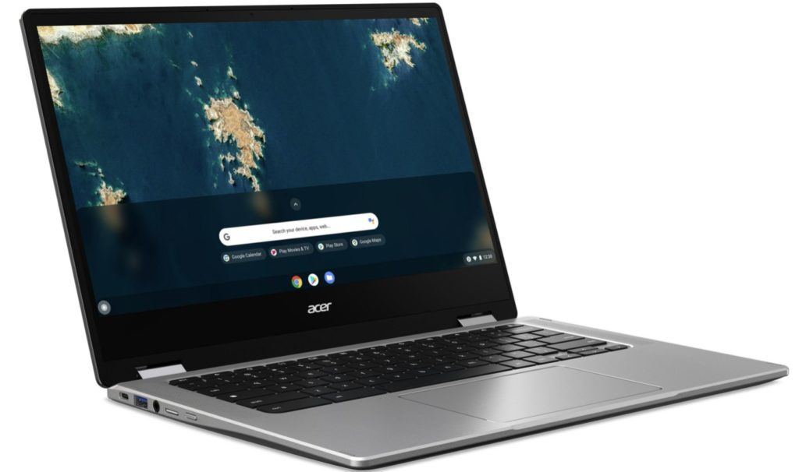

A"budget-friendly" device, the Acer Chromebook Spin 314 (HN) has a 14-inch 1920 x 1080 IPS touchscreen surrounded by 6-millimeter bezels on the sides and top. Note that there is a configuration with a 1366 x 768 panel, so check the model number if you plan to make the purchase. At this price, you're getting entry-level Celeron or Pentium processors and "up to 8 GB" of memory. Base models are likely to have just 4 GB.

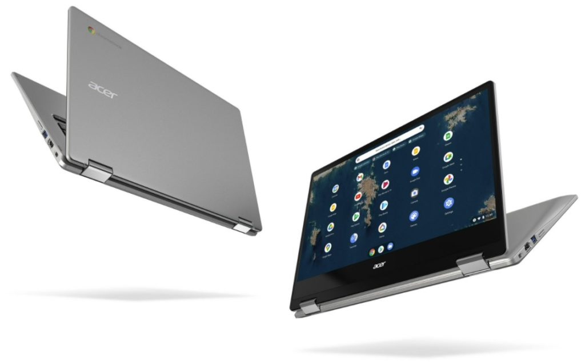

Although not shown on the published specifications, this convertible Chromebook has one USB 3.2 Type-C port, two USB 3.2 Type-A ports, an HDMI port, and a MicroSD slot to complement the eMMC storage.

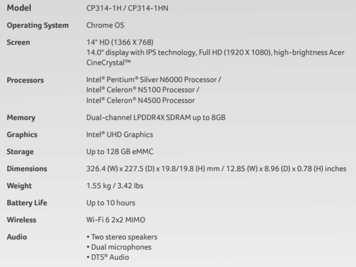

Look for the Acer Chromebook Spin 314 to arrive on sale in November.

## Acer Chromebook Enterprise 515: $649.99 to start

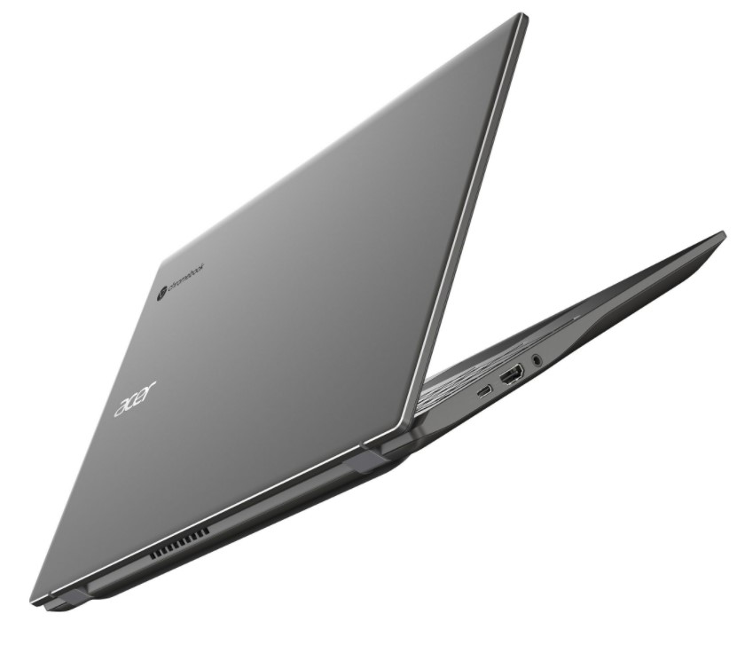

Landing in January is this enterprise-focused Chromebook, which bumps the specs, the screen size, and the price. All configurations use a 15.6-inch 1080p display as well as 11th-generation Intel processors. This one is a clamshell as well, which you can tell by the lack of "Spin" in the name.

You can outfit the Enterprise 515 with the latest Pentium Gold 7505 processor, which is [surprisingly peppy as I found using the Lenovo Chromebook 5i with the same chip.](https://www.aboutchromebooks.com/news/lenovo-ideapad-5i-chromebook-review-a-potent-pentium-powered-laptop/) But if you need more performance, you can choose among various Core i3, i5, and i7 chipsets as well. Just be prepared for higher prices. The same goes for memory and storage, which can be had with up to 16 GB of RAM and a speedy NVMe SSD with 512 GB of capacity. If you top these features out, I suspect you're looking at close to $1,000 but we'll find out when Acer starts offering these.

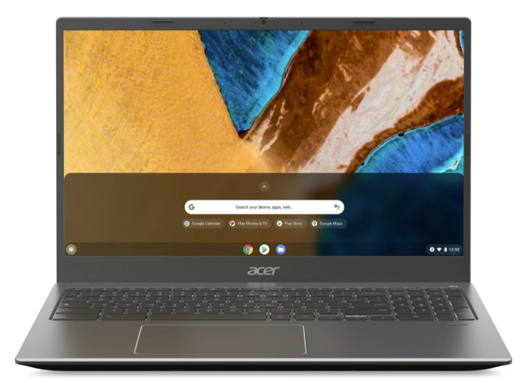

The larger display provides more room on the chassis to fit a full-sized numeric keypad on the backlit keyboard, which is nice, along with an offset trackpad if you like that sort of thing. And the clamshell also has the expected range of ports: A pair of USB 3.2 Gen 2 Type-C ports (one on each side, a Type-A, HDMI, and microSD slot.

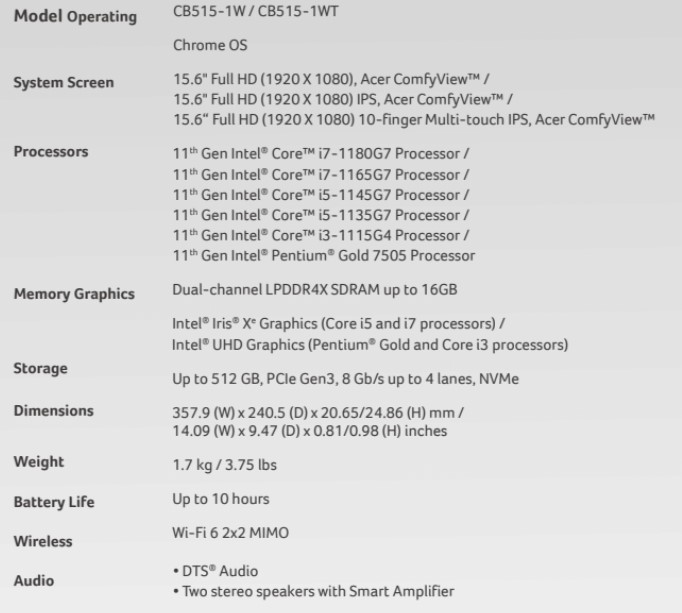

## Acer Chromebook Spin 514 and Chromebook Spin Enterprise 514: $699.99 and $899.99 to start

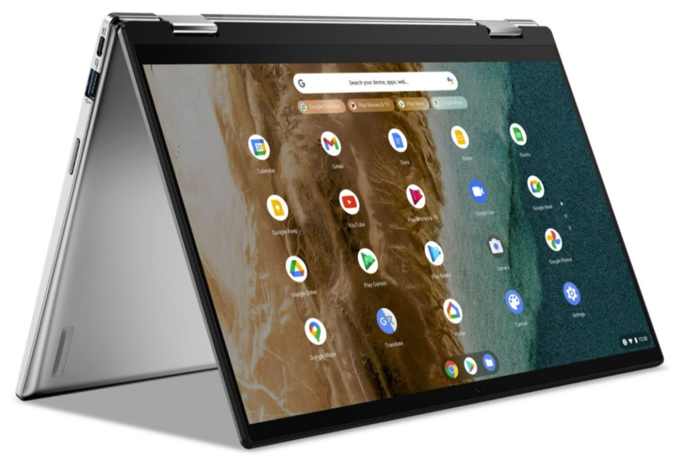

For the convertible, high-performance crowd, the Acer Spin 514, also available in an Enterprise version, is the highlight here. These are both similar to the clamshell Chromebook 514 but have 360-degree hinges. As such, they'll be available with mostly the same internal specifications as the clamshell edition: 11th-generation Intel processors, 14-inch 1080p touch displays, and the same options for memory and storage.

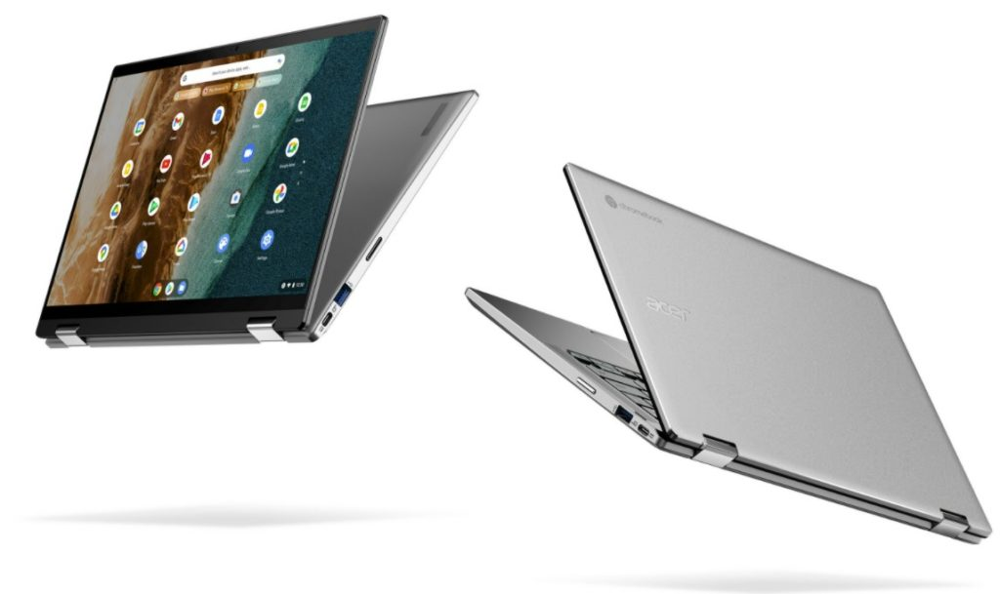

Unique to these models is a fullHD webcam with a blue light filter to reduce lens flare. And unlike my old Acer Chromebook Spin 13, the speakers are top-firing, for improved sound.

Acer says these devices are fanless, which is great if you hate the whirring sound of fans; interestingly these are the same processors as in the Chromebook 515 but there's no mention of "fanless" for those models.

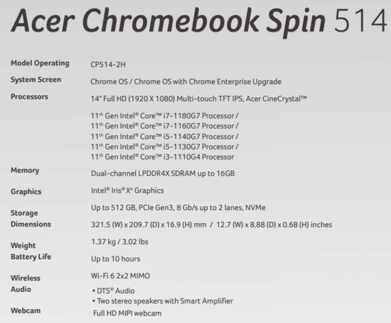

Acer expects to begin Chromebook Spin 514 sales in January with the Enterprise models arriving by December.
