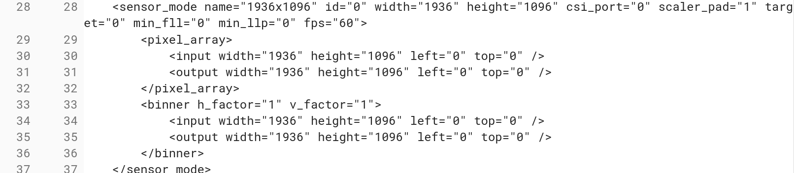

I was catching up on my feeds this morning and noticed that [ChromeUnboxed found a nice tidbit](https://chromeunboxed.com/news/madebygoogle-chromebook-nocturne-portrait-mode-google-camera-app/) on the upcoming [Nocturne Chromebook](https://www.aboutchromebooks.com/tag/nocturne): That device is expected to use the Android camera app will support "Portrait Mode" which creates a bokeh effect.

That makes you wonder if Nocturne is the [Pixelbook 2 or the 4K Atlas detachable](https://www.aboutchromebooks.com/news/pixelbook-2-atlas-detachable-4k-chromebook-availability-2018/) is it. Or will we see two Made By Google Chromebooks soon?

That thought got me looking around at code commits for Atlas today and although I don't see mention of Portrait Mode, I did find some interesting information about the device's front camera.

Unlike the current Pixelbook, which uses a 720p webcam for video calls, Atlas will support 1080p, or FullHD video conferencing at up to 60fps. And the camera sensor for this device is [Sony's IMX208](https://www.sony-semicon.co.jp/products_en/IS/sensor1/products/imx208.html), which has an active pixel resolution of 1936x1096. Sure enough the [camera settings code for Atlas uses that same specification](https://chromium-review.googlesource.com/c/chromiumos/overlays/board-overlays/+/1170713/5/overlay-atlas/media-libs/cros-camera-hal-configs-atlas/files/gcss/graph_settings_imx208.xml#18).

There are numerous camera resolution settings in the code commit, so not every video chat -- or Chromebook selfie, if that's your thing -- necessarily needs to be in Full HD. In fact, Google Meet only streams up to 720p currently, although I believe that the older Google Hangouts can handle 1080p video streams.

Does this help us figure out if Nocturne or [Atlas](https://www.aboutchromebooks.com/tag/atlas) will be the Pixelbook 2? Not quite yet, but clearly, both are shaping up to be high-end contenders.
