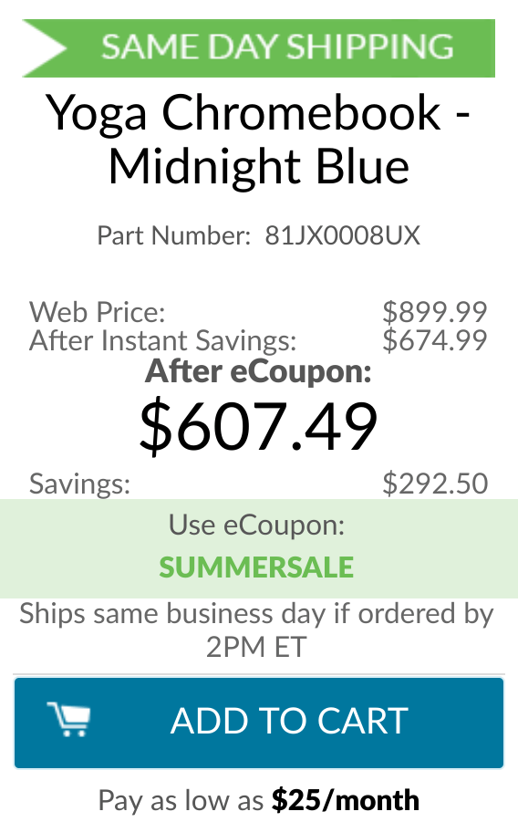

I've seen Lenovo offer regular sales on its [Yoga Chromebook C630 product line](https://www.lenovo.com/us/en/laptops/lenovo/lenovo-n-series/Yoga-Chromebook/p/88YGCC61096) but this is the biggest discount I've seen yet on the high-end 4K model.

The MSRP of this configuration is $899.99 and with current discounts, you can nab this top-end model with 4K display for $607.49 using the "summersale" code at check-out. That's less than $25 more than the current price of the same model with a 1080p display.

You get a lot of Chromebook for this price:

- 8th-Generation Intel Core i5-8250U processor (which uses a fan for cooling)
- Integrated Intel UHD Graphics 620
- 15.6-inch 3840 x 2160 IPS touch panel
- 8 GB of memory
- 128 GB of eMMC storage
- Bluetooth 4.1
- 802.11ac Wi-Fi (2 x 2 MIMO)
- 720p HD camera
- 2 USB Type-C ports, 1 USB Type-A port
- Backlit keyboard
- MicroSD card slot

The Yoga's size is a bit too much for my tastes since I gravitate to more portable 12- to 13.5-inch Chromebooks and I don't really need a 4K display; the Pixel Slate's 3000 x 2000 screen is crisp enough for me.

However, the U-series processor in the Lenovo Yoga Chromebook C630 is currently the most powerful CPU available in a Chromebook today; only the [HP Chromebook X360 14](https://www.aboutchromebooks.com/news/hp-chromebook-x360-release-date-price-specs/) can be configured with a Core i7 version of this chip family. That will set you back nearly $1,300 though.

Note that if you don't need the 4K display, you can opt for a 1080p configuration with the same internals right now for $583.19 direct from Lenovo with the same coupon code. But at that point, adding 4K is all of a $25 expense, so it's well worth the added cost. A core i3 option with half the storage can also be had for $485.99 with the coupon code.
