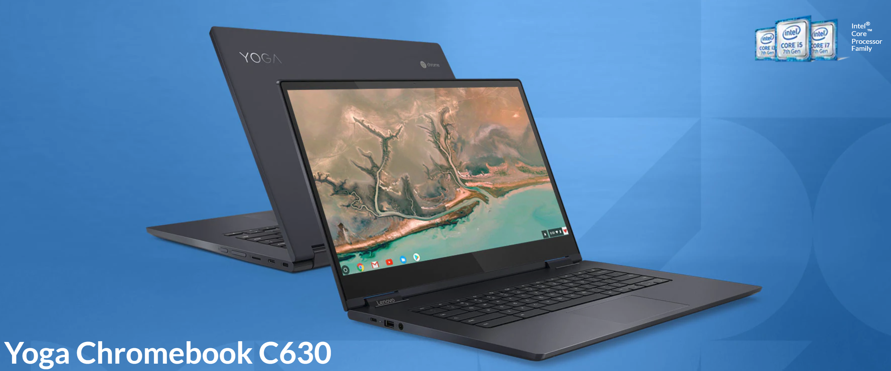
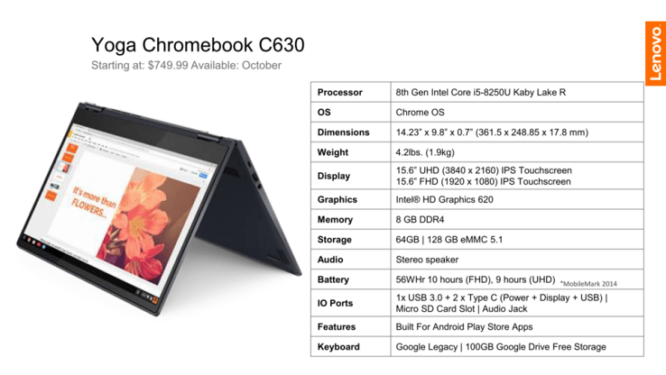

There's more Chromebook news coming out of IFA 2018 than I expected and that's a good thing. Following [Acer](https://www.aboutchromebooks.com/news/acer-chromebook-514-is-a-14-inch-laptop-with-gorilla-glass-trackpad-starting-at-349/) and [Dell](https://www.aboutchromebooks.com/news/dell-insipiron-14-chromebook-price-release-date-availability/), Lenovo announced its [Yoga Chromebook C630](https://www.lenovo.com/us/en/events/techlife/#Shot6): A 4K Chromebook running on 8th-generation Intel processors and starting at a surprisingly competitive price of $599.

Since this is a Yoga model, the Chromebook C630 is a 2-in-1 so you can fold the 15.6-inch display all the around to the back of the device for tablet and tent modes. That display had three smallish bezels and the base model comes with a standard 1080p touch screen. If you want to pay more -- Lenovo hasn't said how much yet -- you can get a UHD display. Some might think that's overkill for a Chromebook, but if you're a video streamer, it's a nice option to have.

That $599 base model includes the [Intel Core i5-8250U](https://ark.intel.com/products/124967/Intel-Core-i5-8250U-Processor-6M-Cache-up-to-3_40-GHz) processor, 8GB of memory and 64GB of eMMC storage. There will upgrade options for 128GB of storage but no mention of additional memory or chip choices. All models include a pair of USB Type-C ports, a full USB Type-A port and microSD card slot in the metal chassis. Even with the small bezels, packing a 15-inch display here brings the overall size in at 14.23” x 9.8” x 0.7" with a weight of 4.2 pounds. A small, light Chromebook this is not. Then again, cramming the pixel density of a UHD display into smaller screens doesn't bring much visual benefit. Lenovo says to expect up to 10 hours of battery life.

\[gallery type="slideshow" size="full" ids="1578,1579,1580,1582,1583,1584" orderby="rand"\]

Look for the [Lenovo Yoga Chromebook C630 to arrive in October according to 9to5 Google](https://9to5google.com/2018/08/30/lenovo-yoga-chromebook-official-specs-price/). That just happens to be when we expect to hear more about the next [Google Pixelbook](https://www.aboutchromebooks.com/news/pixelbook-2-atlas-detachable-4k-chromebook-availability-2018/).... or perhaps, Pixelbooks. Speaking of the Pixelbook 2, if you're thinking that perhaps the Yoga Chromebook 630 is the 4K Atlas device: It's possible but I don't think so. [Atlas is supposed be a detachable device and have a Google Assistant hardware key](https://www.aboutchromebooks.com/news/more-evidence-suggests-atlas-is-a-4k-detachable-chromebook-tablet/)  I don't see that key on the Yoga and it's clearly not a detachable screen.

_**Update:**_ Others are reporting [this device will start at $749.99](https://www.engadget.com/2018/08/30/lenovo-yoga-chromebook-c930-s730-refresh/) which is also the price I see on this spec sheet. I'll try to get confirmation on pricing directly from the company and update the post accordingly.

_**Update 2**_: I heard back from Lenovo asking about the Yoga Chromebook C630 price and received this response: "\[T\]he Yoga Chromebook starts at $599.99." So that confirms the base model cost that others are reporting as $749.99. It _may_ mean the UHD display configuration starts at $749.99 based on the above information and other reporting, which may have confused the base and upgraded models, but I do not yet have confirmation on that.
