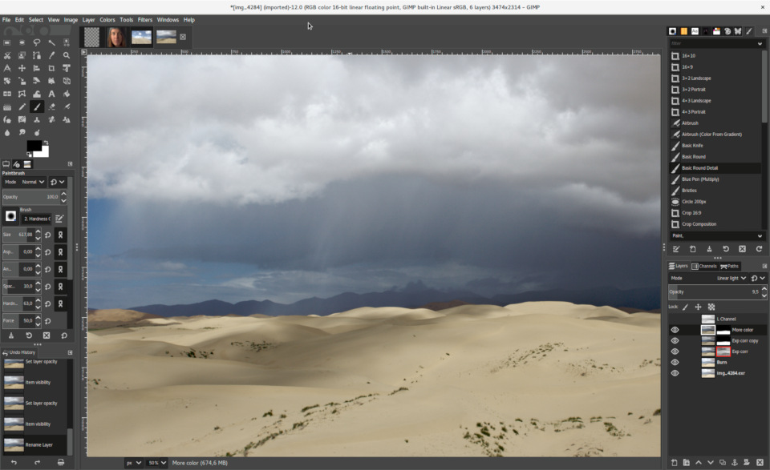
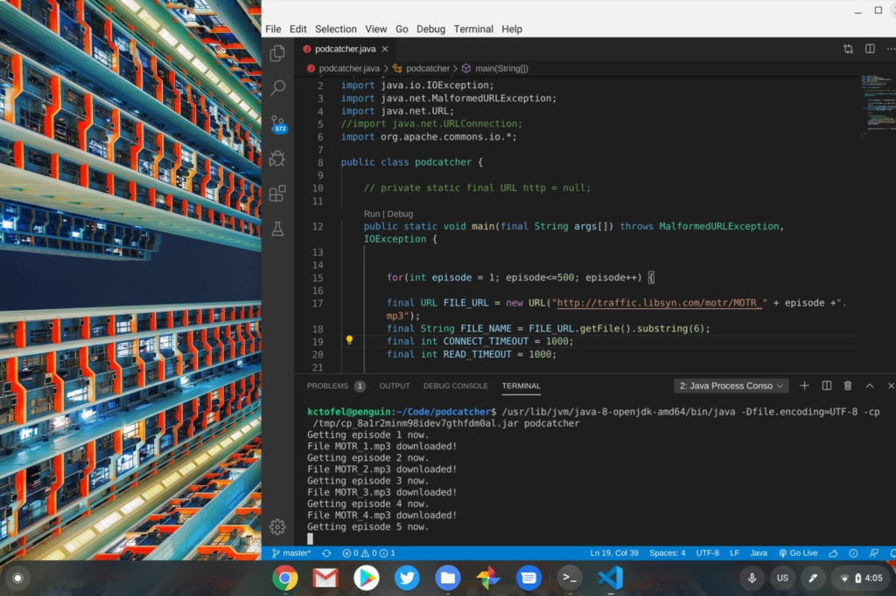

Although much of my day is spent using the browser on my Chromebooks, I also end up using [Linux apps](https://www.aboutchromebooks.com/tag/linux-apps/) quite a bit. I follow my own advice: Use the tools you need to use. I often get email questions or reader comments essentially asking "Why would (or do) you want to run Linux apps on your Chromebook? It just complicates what's a simple device."

That's a fair question. After all, one of the three pillars -- or "S's" -- of Chrome OS is simplicity. The other two are security and speed in case you're ever on Jeopardy, by the way.

If you can do everything you need to in a browser, or with Android apps, on your Chromebook, you're all set. And there's no need to flip the switch that enables Linux app support. It is optional, of course. However, there are some fairly common use-cases where it might make sense to flip that switch.

## You want to use a full desktop productivity suite

At this point in time, most web-based productivity suites such as Google Docs and Office 365 are on par with their desktop counterparts, save for a few features here or there. Perhaps those few features are key to your usage, though.

With Linux enabled on your Chromebook, it's a simple task to install a full desktop client for documents, spreadsheets, presentations and more. I tend to have [LibreOffice](https://www.libreoffice.org/download/download/) installed as a "just in case" situation when I need one of those advanced features. It's free, open-source and feature packed.

In January several new features were added that you won't see in online productivity suites, which are outlined in the below video.

https://youtu.be/-4boEj8S2JQ

## You want a better photo editor

I get all of my photo edits done online just fine and there are some good Android apps to make your photos shine as well. But as a blogger and someone who shares the occasional photo on social media, my editing needs are pretty limited. Graphic designers and pro photographers likely can't make do with the tools I use.

[GIMP](https://www.gimp.org/) tends to be the popular standard when it comes to open-source photo editing clients on Linux.

Again, it's too much power for me, but if you want Photoshop-like tools, you'll want to check out GIMP for Linux.

Created with GIMP

## You want to edit videos on your Chromebook

Related to photo editing is creating videos, which can be edited on a Chromebook with a number of Android apps. But you'll be limited when it comes to features and flexibility.

Why not keep a video editor installed on that Linux partition of your Chromebook?

I personally like [OpenShot](https://www.openshot.org/) (shown below) for its simplicity but [Shotcut](https://shotcut.org/) is also a standout option. With either of these, or similar alternatives, you can create professional looking videos with a range of options and tools that (so far) no Android app on a Chromebook can match.

Openshot UI

## You are or want to be a developer

This one should come as no surprise to regular readers because I've written about using Linux for my Computer Science college program a number of times prior. I've even suggested that in some cases, you might be able to [use a Chromebook for a CompSci degree](https://www.aboutchromebooks.com/news/can-you-learn-to-code-in-a-college-computer-science-program-with-a-chromebook/). That's going to depend on the supported tools at your school of choice, of course, so check those requirements first.

With Linux, however, I've been able to install and use even the most complicated and powerful integrated development environments for Java, Python, C++ and other languages. And if your Chromebook [has enough horsepower, it can run Android Studio for mobile app development](https://www.aboutchromebooks.com/news/android-studio-3-5-arrives-bringing-official-chrome-os-support/).

So far, I've used IntelliJ, Eclipse, some basic text editors, and my current favorite: Microsoft Visual Code, which is [also now officially supported on ARM-based Chromebooks](https://www.aboutchromebooks.com/news/microsoft-brings-official-visual-studio-code-to-arm-powered-chromebooks/).

Java in Visual Code on a Chromebook

## Just.... to learn Linux!

I'm a big believer in always learning new things. And although I've had a very cursory understanding of how to use Linux prior to it being supported on Chromebooks, I've learned a lot more about how to use it effectively.

And that's not a bad thing: More skills are always good to have, even if they're not particularly relevant to what you do day in and day out!

I say flip the Linux switch if you want to learn more about the platform. You can always disable Linux and reclaim the storage space it takes up at any time.

If you decide to take the plunge, there are tons of online sources to guide you. There are even some free eBooks such as this introductory one from The Linux Foundation ([PDF](http://tldp.org/LDP/intro-linux/intro-linux.pdf)) and the comprehensive "Linux Fundamentals" ([PDF](http://linux-training.be/linuxfun.pdf)) from Paul Cobbaut. This FreeCodeCamp article is also a fantastic resource: [The Linux Commands Handbook](https://www.freecodecamp.org/news/the-linux-commands-handbook/).

Good luck and enjoy the Linux lifestyle!

_Note: This post was originally published on May 20, 2020 and has been updated_
