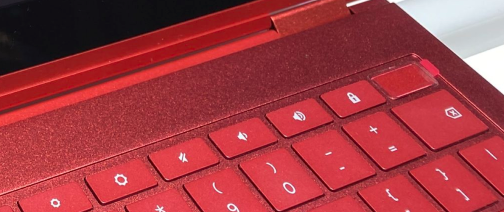
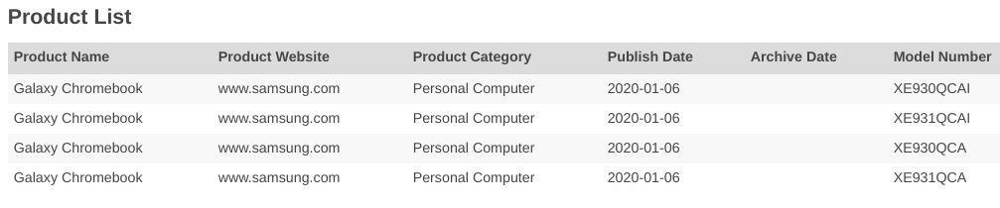
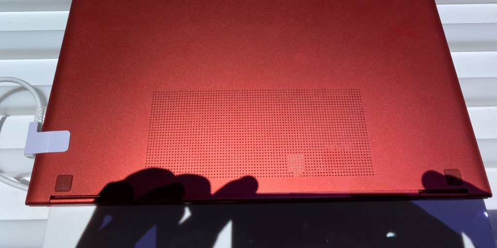
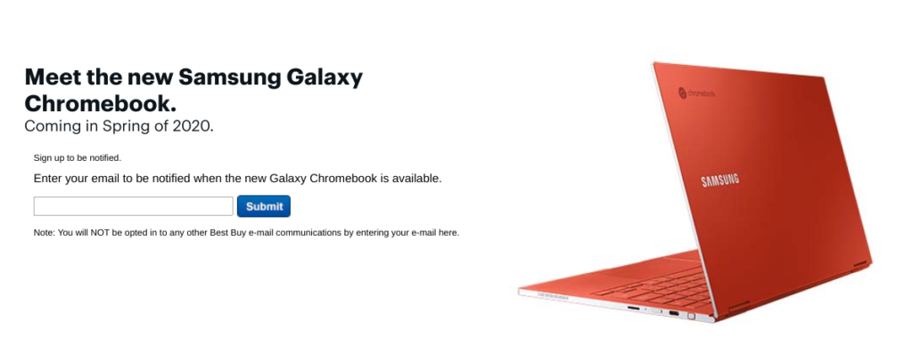

I've been home from the Consumer Electronics Show for several days but under the weather until today. That's pretty much the norm when you're walking around with 150,000 people in small spaces.

But this gave me more time to do some additional research on the [Samsung Galaxy Chromebook after my hands-on time with it](https://www.aboutchromebooks.com/news/samsung-galaxy-chromebook-hands-on-yes-its-as-nice-as-it-looks/). And it offered the same to About Chromebooks reader George, who tipped me on several of the six new things you should know about this device, which was the talk of CES for those who care about Chromebooks. Thanks George!

We've seen that fingerprint sensor tech before

The topmost right key on the keyboard of the Samsung Galaxy Chromebook looks dull, however, it's pretty important. It's the biometric fingerprint scanner you can use to log in to this 2-in-1. Turns out that [Fingerprint Cards is the company behind the tech](https://mobileidworld.com/biometrics-news-fpc-places-fingerprint-sensor-samsung-asus-chromebooks-010904/) and it's exact same as that found in the Acer Chromebook 714 and 715 models. The only difference is the implementation: Instead of a keyboard key, the Acer models use a small scanner.

There will be at least two, if not four, different models

A recent [Bluetooth certification for the Samsung Galaxy Chromebook found by DroidShout shows](https://www.droidshout.com/samsung-new-galaxy-chromebook-bluetooth-certification/) four different device model numbers: XE930QCA, XE931QCA, XE930QCAI, and XE931QCAI.

My take is that there are two main models as represented by the 930 and 931 nomenclature, each meant for either the North American or International markets. However, there could be four distinct models available. We already know that the base Samsung Galaxy Chromebook will cost $999 "to start" in the US with 8 GB of memory and 256GB of NVMe storage. Samsung says you can configure this Chromebook with up to 16 GB of RAM and 1 TB of SSD storage, so we know there will be options. Expect to pay a pretty penny for the highest configuration though.

This Chromebook will support wideband Bluetooth for richer audio in voice apps

I reported on [wideband speech Bluetooth HFP support back in June of last year for Chromebooks](https://www.aboutchromebooks.com/news/chrome-os-wideband-hd-voice-calls-bluetooth-headphones-chromebook/) and [the new Samsung will have it based on this code commit that adds it](https://chromium-review.googlesource.com/c/chromiumos/overlays/board-overlays/+/1916159). You'll need a Bluetooth headset that supports wideband audio codecs, of course, but if you have one, voice chats will sound much better than without this functionality.

Google Assistant input will use a specific microphone on the Samsung Galaxy Chromebook

The microphone situation is a bit unique on the Samsung Galaxy Chromebook. There's a mono microphone near that "world-facing" camera above the keyboard; that's for use in tablet mode and taking video. And then there's the dual-array microphone on the top edge of the display. [That pair of microphones will be the one that Google Assistant listens to](https://chromium-review.googlesource.com/c/chromium/src/+/1988698) for any voice commands based on this code commit.

I'm a _little_ surprised by this choice because as the display is angled back, those microphones are farther from the user than the mono microphone. However, with a dual-array setup, I suppose they're still likely to be more accurate at hearing your voice requests.

That 10th-gen Intel Core i5 can hit up to 25W TDP but probably won't

Most recent Chromebooks use Intel's Y-Series processors which use less power and generate less heat compared to the U-Series powering the Samsung Galaxy Chromebook. The typical Y-Series will dissipate 5W worth of heat without a fan but can adjust to between 3.5W and 7W.

The [Core i5-10210U inside Samsung's new Chromebook can dissipate 15W of heat under normal circumstances and toggle between 10W and 25W TDP](https://ark.intel.com/content/www/us/en/ark/products/195436/intel-core-i5-10210u-processor-6m-cache-up-to-4-10-ghz.html), depending on the CPU temperature and cooling mechanism. There doesn't appear to be any active cooling in the Samsung Galaxy Chromebook (read: no fan), so the chances of hitting that upper limit during a heavy load are highly unlikely.

Instead, I'd expect the Intel Core i5 to be throttled down in most usage scenarios unless there is some type of active cooling Samsung hasn't yet revealed. This would mean lower performance as compared to a similar device with a fan since the CPU could run at a higher processing load for longer.

You can sign up to be notified on availability through Best Buy now

OK, this is more about the purchase experience than the device itself but it might come in handy if you want to be among the first to own the Samsung Galaxy Chromebook. [Hit this link and register your email address for availability updates from Best Buy](https://www.bestbuy.com/site/clp-computers-tablets/samsung-galaxy-chromebook/pcmcat1577204269617.c?id=pcmcat1577204269617).

Having said that, given what we know about the Samsung Galaxy Chromebook, who's got their wallet open already to purchase one?
