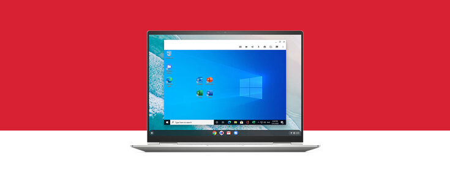

[Parallels Desktop for Chrome OS launched earlier this year](https://www.aboutchromebooks.com/news/enterprise-chromebooks-windows-office-desktop-apps-parallels/) bringing Windows in a virtual machine to a variety of Chromebooks and a single Chromebox. Today the company announced an expansion as [9 more Chromebooks and Chromeboxes get Windows support](https://www.parallels.com/blogs/parallels-desktop-chrome-os/). Devices are no longer limited to Intel CPUs as a few with AMD processors make the cut.

If you haven't seen [Windows running on a Chromebook quite seamlessly](https://www.aboutchromebooks.com/news/windows-10-on-a-chromebook-a-look-at-parallels-desktop-for-chromebook-enterprise/), it's actually pretty impressive. Essentially, it's a similar approach to how we can run Linux on our Chrome OS devices. But Parallels has added quite a bit of shine to the experience with special integrations and functions.

Here's the complete list of supported devices, with the latest additions marked with an asterisk and are italicized:

- HP Elite c1030 Chromebook, Intel  
- HP Pro c640 Chromebook, Intel 
- _\*HP Pro c645 Chromebook, AMD_ 
- HP Chromebox G3, Intel 
- Google Pixelbook, Intel  
- Google Pixelbook Go, Intel 
- Acer Chromebook Spin 713, Intel  
- Acer Chromebook Spin 13, Intel  
- _\*Acer Chromebook Spin 514, AMD_ 
- _\*Acer Chromebook 714, Intel_ 
- _\*Acer Chromebook 715, Intel_ 
- _\*Acer Chromebox CXI4, Intel_ 
- Dell Latitude 5300 2-in-1 Chromebook, Intel  
- Dell Latitude 5400 Chromebook, Intel  
-  Dell Latitude 7410 Chromebook, Intel 
- \*_Lenovo ThinkPad C13 Yoga Chromebook, AMD_ 
-  Lenovo Yoga C630 Chromebook, Intel 
-  ASUS Chromebook Flip C436FA, Intel  
- _\*ASUS Chromebook Flip CM5, Intel_ 
- _\*ASUS Fanless Chromebox, Intel_ 
- _\*ASUS Chromebox 4, Intel_ 

First, it's **great to see more Chromebox support. These devices can be configured with very capable, high-performing** hardware for less than a similar Chromebook. You have to supply your own display, of course, but that's where the savings can come into play if you already have a nice monitor.

Second, is the addition of AMD-powered Chromebooks to the list. That's another excellent move as we're starting to see more Chromebooks either switch to AMD or provide an option between Intel and AMD inside. I expect this trend to continue so getting Parallels Desktop for Chrome OS support on AMD now is good timing.

Also new to the latest Parallels Desktop for Chrome OS release is improved support for device cameras and microphones and some video conferencing additions:

> Through Parallels Desktop for Chrome OS, users can now fully leverage key features (depending of course on the application) like whiteboards, annotations, end-to-end encryption, remote control and others.

I'm guessing that most of you don't want or need Windows on your Chrome OS device. I'm actually in the same club. Still, there are some that do, such as enterprise workers, or people that haven't switched to Chrome OS because they require certain Windows applications. I get that, so I'm all for what Parallels is bringing to the table.
