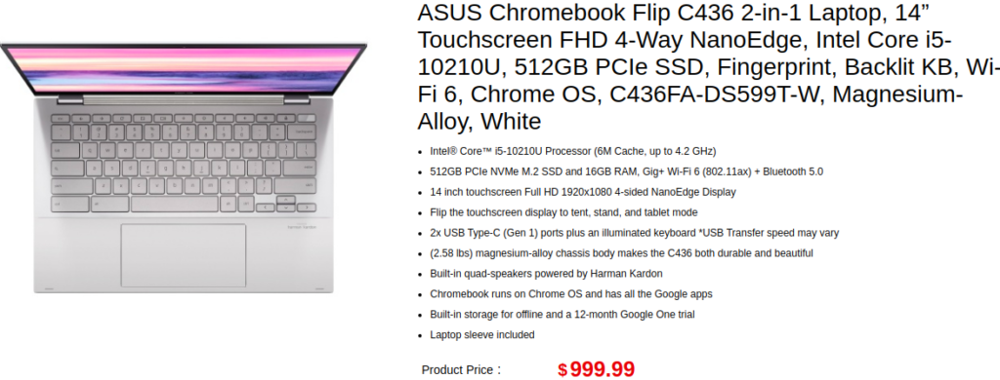

Seems like Asus doesn't want to let the [newly available Samsung Galaxy Chromebook](https://www.aboutchromebooks.com/news/samsung-galaxy-chromebook-review-round-up/) to hog up the spotlight. Today, the company put the higher-end model of the [Asus Chromebook Flip C436 for sale on its store site, which you can find here](https://store.asus.com/us/item/202003AM210000007).

When these two laptops debuted at CES, I wondered if folks would opt for the $799 model of the Asus over the $999 Samsung Galaxy Chromebook. That model isn't yet available although I'd expect to see it arrive soon.

But even the $999 Asus Chromebook Flip C436 may be the better device for most people comparing the two based on early reviews of Samsung's high-end Chromebook.

<iframe style="width:120px;height:240px;" marginwidth="0" marginheight="0" scrolling="no" align="right" frameborder="0" src="//ws-na.amazon-adsystem.com/widgets/q?ServiceVersion=20070822&amp;OneJS=1&amp;Operation=GetAdHtml&amp;MarketPlace=US&amp;source=ss&amp;ref=as_ss_li_til&amp;ad_type=product_link&amp;tracking_id=aboutchromebo-20&amp;marketplace=amazon&amp;region=US&amp;placement=B083Z8K6D8&amp;asins=B083Z8K6D8&amp;linkId=e132abe3efb6a7a11ec2fb001d6a1329&amp;show_border=true&amp;link_opens_in_new_window=true"></iframe>

That device showed a battery life of around 4 hours for regular use, for example. And although it has no fan which eliminates any fan noise, the passive cooling doesn't seem to be enough. Both reviewers and one person I know that bought a Samsung Galaxy Chromebook said the device gets uncomfortably hot on your lap.

Sure, you don't get that awesome 4K AMOLED display on the Asus model, which [Chrome Unboxed notes isn't quite bright enough at around 220 nits](https://chromeunboxed.com/asus-chromebook-flip-c436-review/).

But you'll get a full day of battery life without needing to carry your charger around. Here's the full Chrome Unboxed video review so you can see what else you gain or lose as compared to the Samsung Galaxy Chromebook:

https://youtu.be/vQgZTMZlkc4

As far as the $999 Asus Chromebook Flip C436, you'll get a few hardware boosts over that $799 model such as 512 GB of NVMe storage, which is four times the base model, a jump from the Core i3 to a Core i5 processor, and a doubling of memory to 16 GB.

Unless you're developing apps in Linux on a fairly regular basis, the $799 model ought to be more than capable for everyday use, but if you want more horsepower, you can spend an extra $200 to get it.

**Update**: [Amazon is also now selling the $999 model of the Asus Chromebook Flip C436](https://amzn.to/2xTtXwi).
