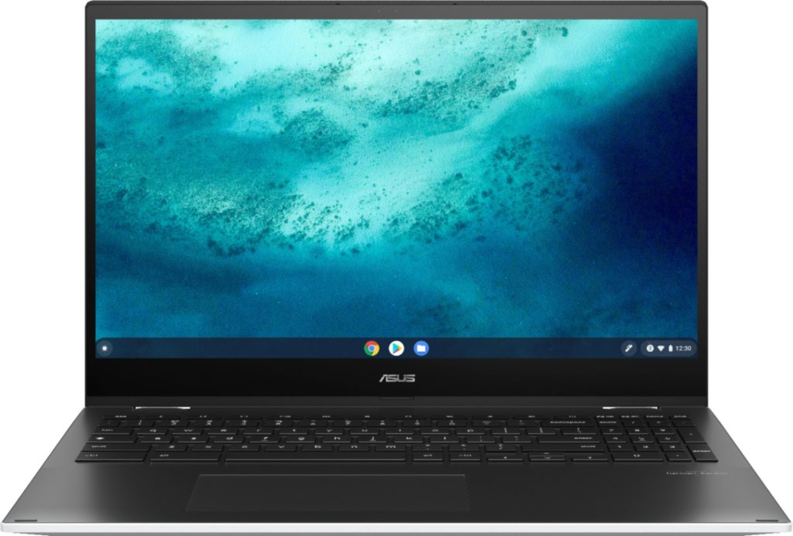
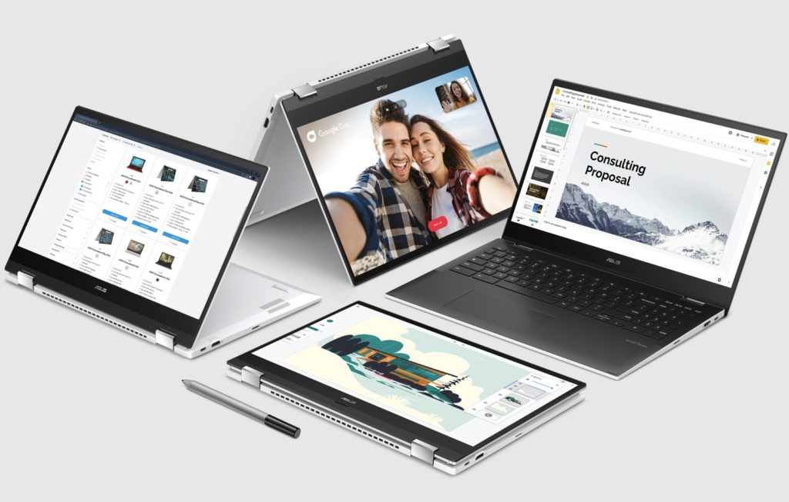

Thanks to a tipster, I found this little news bit in my Inbox earlier this morning. While you can [already buy](https://www.aboutchromebooks.com/news/you-can-now-buy-the-asus-chromebook-flip-c536-cx5/) the Asus Chromebook Flip C536 / CX5 with a Core i3 processor, an upgraded model is on the way. According to [Google's own Chromebook site](https://www.google.com/chromebook/device/asus-chromebook-flip-cx5-16gb-128gb/), a version with Intel Core i5, 16 GB of memory, and 128 GB of storage is on the way. There's an obvious premium over the currently available model, of course. This configuration will have an MSRP of $799.99.

Given that the Core i3 model runs $529.99, that may sound like a big price boost. And I think it is, based on the limited information we have.

We know the price difference includes the following upgrades:

- 11th-gen Intel Core i5 vs an 11th-gen Intel Core i3
- 16 GB of memory vs 8 GB
- 128 GB of NVMe storage vs... 128 GB of NVMe storage

No, that's not a typo in the last item. Only two of the three main hardware components will get boosted.

Unless there's something more that's getting an upgrade, and I don't see how that's possible, $230 is quite a premium.

I'm sure the bulk of that cost is due to the upgraded Intel processor because swapping out a RAM module (or adding another one) for the memory boost can't be more than $60 or so.

Even so, I haven't seen many Core i5 Chromebooks offered with 16 GB of memory in the past. [I have one](https://www.aboutchromebooks.com/news/acer-chromebook-spin-13-with-16-gb-ram-should-you-buy-one/) and when I bought it in 2019, there weren't any other choices that I can remember.

So maybe, Asus is trying to wiggle its way into a unique market here and figures it can charge more for it, given fewer choices.

As far as the rest of the Asus Chromebook Flip C536 / CX5 specifications, they should remain the same.

That 15.6-inch display is full HD, or 1920 x 1080, which is still more than adequate for a screen of this size. There is a backlit keyboard with a full numeric keypad, plus a memory card slot, WiFi 6 support, Bluetooth 5, and an HD webcam. You get two USB Type-C ports, one USB Type-A, and a full-sized HDMI out port.

This configuration is right up my alley due to [Computer Science coding classes](https://www.aboutchromebooks.com/news/linux-on-chromebooks-just-might-get-me-through-a-masters-in-computer-science/) although I prefer a slightly smaller Chromebook. And to be fair, I did pay more for my Core i5 Chromebook with 16 GB of memory.

I bought it refurbished for $819 and I believe the MSRP was $999. Hmm... maybe $799.99 doesn't sound quite as bad? I just can't get the $569.99 Core i3 model out of my head. The price of technological progress...

