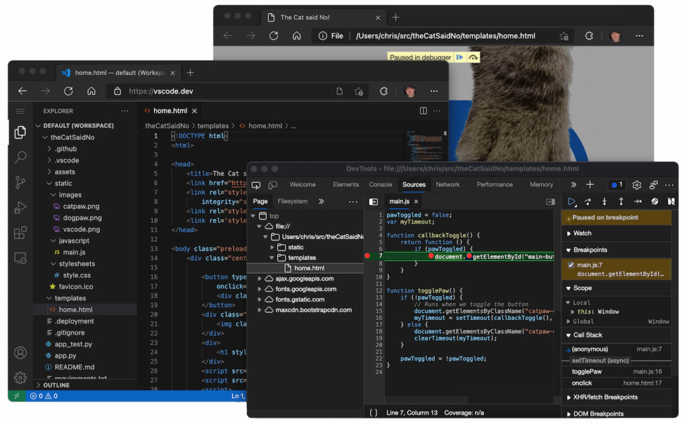

I know not everyone is a developer but this news is too big not to share. [Microsoft this week announced an online version of its popular VS Code integrated development environment (IDE), bringing a new option for](https://code.visualstudio.com/blogs/2021/10/20/vscode-dev) people who want to code on a Chromebook.

By pointing your Chromebook's browser to [https://vscode.dev/](https://vscode.dev/), you'll have an online instance of VS Code that looks no different from the desktop version. That's the IDE I've tended to use on my Chromebook, [first for undergraduate Computer Science classes](https://www.aboutchromebooks.com/news/can-you-learn-to-code-in-a-college-computer-science-program-with-a-chromebook/), and currently [for a Masters in CS at Georgia Tech](https://www.aboutchromebooks.com/news/linux-on-chromebooks-just-might-get-me-through-a-masters-in-computer-science/).

Of course, up to now, I've had to rely on my Chromebook's Linux feature to install the full VS Code application to code on a Chromebook. And it works well. This latest Microsoft project, however, doesn't require an installation of any desktop app. Instead, you just work in the IDE in your browser.

There is a downside though.

Using VS Code on the web has some constraints that make it better for coding in certain languages than others. My first stumbling block was noticing that there's no Terminal support in this implementation.

Microsoft offers some helpful hints as to what coding experiences will be good and which will be better, based on the constraints and available features:

**Good**: For most programming languages, vscode.dev gives you code syntax colorization, text-based completions, and [bracket pair colorization](https://code.visualstudio.com/blogs/2021/09/29/bracket-pair-colorization). Using a [Tree-sitter](https://tree-sitter.github.io/tree-sitter) syntax tree, we're able to [provide additional experiences](https://github.com/microsoft/vscode-anycode) such as [Outline/Go to Symbol](https://code.visualstudio.com/docs/editor/editingevolved#_go-to-symbol) and [Symbol Search](https://code.visualstudio.com/docs/editor/editingevolved#_open-symbol-by-name) for popular languages such as C/C++, C#, Java, PHP, Rust, and Go.

**Better**: The TypeScript, JavaScript, and [Python](https://devblogs.microsoft.com/python/python-in-visual-studio-code-september-2021-release/#a-rich-python-editing-experience-in-the-browser-via-github-dev) experiences are all powered by language services that run natively in the browser. With these programming languages, you'll get the "**Good**" experience plus rich single file completions, semantic highlighting, syntax errors, and more.

**Best**: For many "webby" languages, such as JSON, HTML, CSS, and LESS, the coding experience in vscode.dev is nearly identical to the desktop (including Markdown preview!).

While there are some very big limitations, the online version of VS Code could be handy for some quick development efforts. As long as you're online, you've got another tool in your toolbox to code on a Chromebook!
