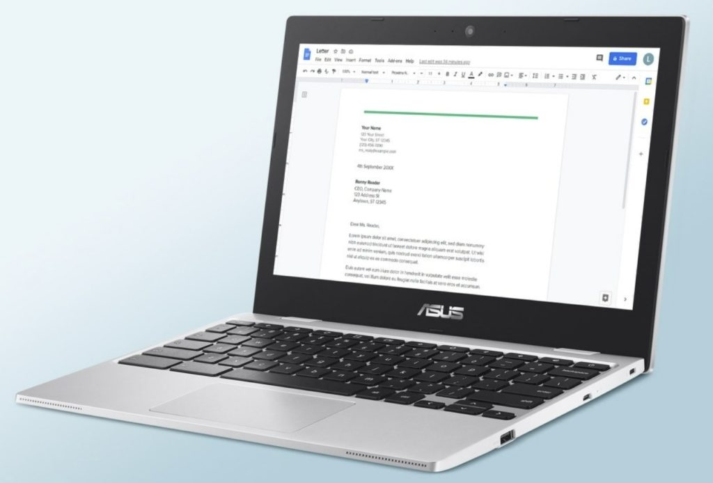
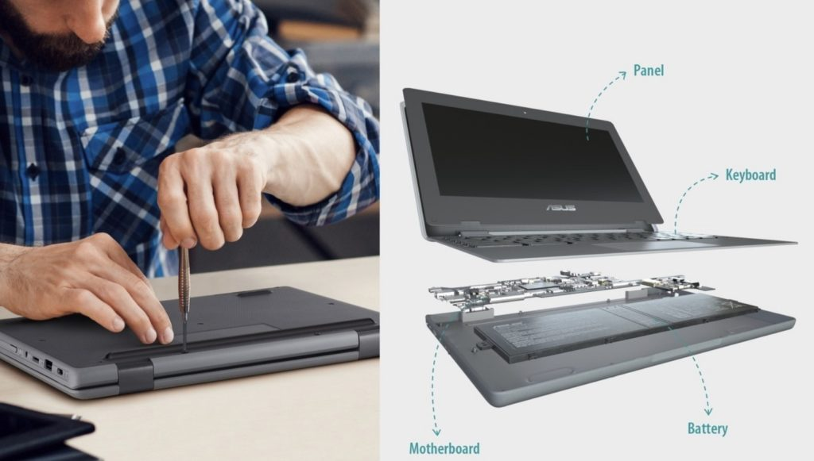

It looks like Asus isn't waiting until January's Consumer Electronics Show to debut new devices [like it did last year](https://www.aboutchromebooks.com/news/asus-makes-the-biggest-ces-2021-splash-with-three-new-chromebooks-cm5-cx9-and-flip-c536/). The company quietly introduced [three new entry-level laptops for the education market and Liliputing caught the information](https://liliputing.com/2021/11/asus-launches-three-new-11-6-inch-chromebooks.html). Here's what you need to know about this trio of Asus Chromebooks for students, likely to go on sale soon.

The [Asus Chromebook CX1](https://www.asus.com/Laptops/For-Home/Chromebook/ASUS-Chromebook-CX1-CX1101/), [Asus Chromebook CR1](https://www.asus.com/Laptops/For-Students/Chromebook/ASUS-Chromebook-CR1-CR1100/), and [Asus Chromebook Flip CR1](https://www.asus.com/Laptops/For-Students/Chromebook/ASUS-Chromebook-Flip-CR1-CR1100/) are the three models.

The CX1 will likely cost the least because there are only two Intel Celeron processor options. These are also older "Gemini Lake Refresh" chips, which debuted in 2019. The CR1 and convertible Flip CR1 can be configured with either an Intel Celeron or an Intel Pentium Silver chipset. These CPUs are a little newer as part of Intel's "Jasper Lake" series of silicon, debuting earlier this year.

Asus Chromebook CX1

All three share the same display size and resolution, which is 11.6-inches and 1366 x 768 pixels. Brightness between the panels varies but it isn't a very wide range at 200 to 250 nits, depending on the model. Only the Asus Chromebook Flip CR1 has a touchscreen, which will also help keep costs down on the other two.

As you can probably guess, the base models have a minimal 4 GB of memory and 32 GB of eMMC for local storage. Configuration information suggests versions with up to 8 GB of memory and 64 GB of storage will be available. The Asus Chromebook CX1 supports WiFi 5 and Bluetooth 5.0 / 5.1 while the CR1 models both have integrated Wi-Fi 6 and Bluetooth 5.2 inside.

Since these Asus Chromebooks for students are likely to take a beating, all three are ruggedized. They meet the MIL-STD 810H standard US military tests and can handle more than 25 kilograms of force on the display. I suppose students do step on computers but that's generally frowned upon in my household.

Asus released a video for the Chromebook Flip CR1 to show off its rugged nature plus the garage stylus, and it looks pretty solid:

https://youtu.be/FAhy9HH-JKE

And kudos to Asus for making this Chromebook easy to open. The "modular design" looks like you can swap out the battery, motherboard, and/or keyboard. The video also mentions "up to 4G LTE" connectivity, so that could be another configuration option.

Asus Chromebook CX1 modularity

Without any pricing or availability, it's difficult to say if any of the three Asus Chromebooks for students are worth considering.

I'd guess the following for base model pricing though, at least if Asus wants to be aggressive:

- Asus Chromebook CX1: $199
- Asus Chromebook CR1: $249
- Asus Chromebook Flip CR1: $299

Hopefully, we won't have to wait until January to find out the actual prices. Watch the Asus site if you want more details as they become available.
