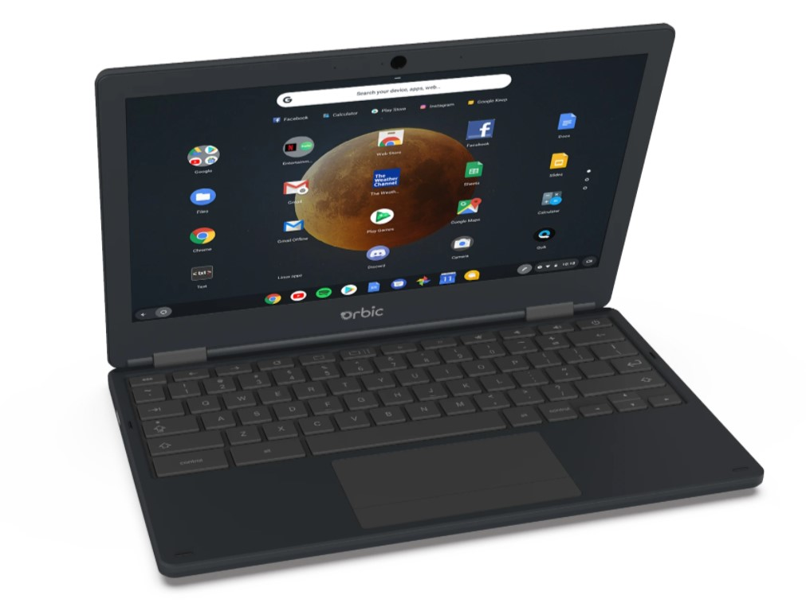
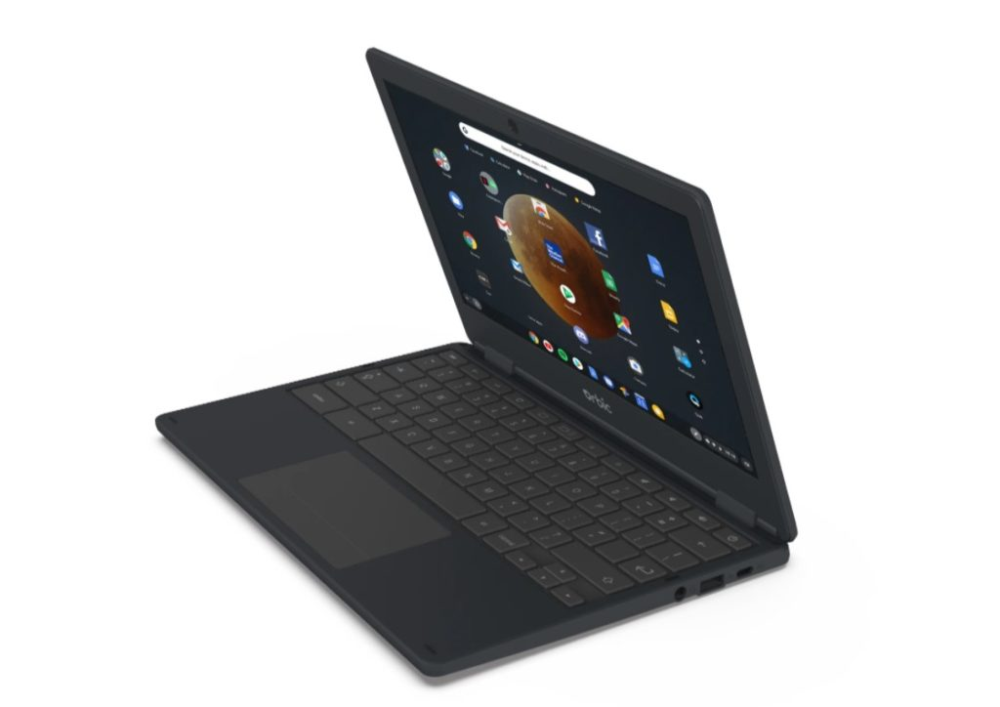

I've recently mentioned that [there aren't too many LTE Chromebooks available](https://www.aboutchromebooks.com/news/want-an-lte-chromebook-here-are-your-current-options/). However, there have been a few new additions to the shortlist over the last six months or so. And it appears there will soon be another. Thanks to a tipster, a Verizon-branded LTE Chromebook is expected to launch in the U.S.

Don't get _too_ excited about this newcomer though. I'd say the overall package is uninspiring. That's fairly typical of most carrier-branded mobile devices.

What do I mean by uninspiring?

Well, [the device is reportedly this one](https://orbic.us/products/orbic-chromebook-4g?variant=40505027264718), made by Orbic. It's called the Orbic Chromebook 4G and has what I'd call minimum viable specifications.

The 11.6-inch display is HD, likely meaning 1366 x768 resolution, for example. Inside is the first-generation Qualcomm Snapdragon 7c Compute Platform, also [found in the HP Chromebook X2 11](https://www.aboutchromebooks.com/news/hp-chromebook-x2-11-review-a-good-value-when-on-sale/). That silicon has already been superseded by a newer chip. That's the one inside the [Lenovo Duet 5 Chromebook](https://www.aboutchromebooks.com/news/lenovo-duet-5-chromebook-review-a-better-laptop-than-tablet-but-great-for-the-money/). There's 4 GB of memory and 32 GB of local storage. A 1 MP camera tops it all off.

Of course, there's 4G LTE built-in, which is the key selling point here. And I would anticipate a rather low price for the hardware, perhaps even free from Verizon. The company will make up the difference on the likely required 4G data plan.

But you don't need a carrier logo slapped on your Chromebook for a device like this today. [The Acer Chromebook Spin 513](https://www.aboutchromebooks.com/news/acer-chromebook-spin-513-lte-review-a-lot-to-pay-for-that-mobile-broadband/) offers a larger, higher-resolution display with the same Snapdragon 7c. And it bumps the memory up to a generous 8 GB plus it includes 128 GB of local storage. I don't think it's worth the $699 asking price, but it's an option.

Perhaps there will be some demand if the Verizon-branded LTE Chromebook is heavily subsidized for customers that just need a very basic laptop. I'm skeptical of a bit hit here, however.
