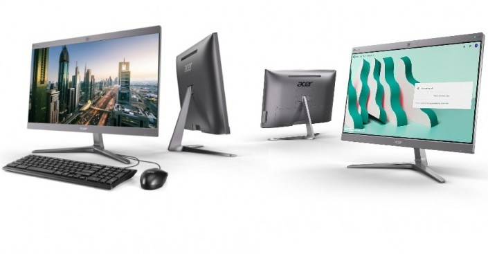

Chromebases. They're the Rodney Dangerfield of Chrome OS devices because they get no respect. And yet, they can be both a pretty powerful desktop as well as the centerpiece for business meetings. Maybe the next generation of Acer's Chromebase 24 will help change the perception: [Acer debuted its Chromebase 24v2 and 24i2 models on Monday, starting at $999](https://www.prnewswire.com/news-releases/acer-debuts-two-sleek-chromebases-for-meetings-and-productivity-300788726.html).

The 24v2 starts at $999, which sounds high when compared to traditional Chrome OS devices, and that's because it is. Then again, this is a Chrome OS desktop that's aimed at businesses and enterprises: You're also getting a lot of performance, a potential kiosk use case and [an optimized Google Hangouts experience](https://cloud.google.com/blog/products/g-suite/design-better-meeting-rooms-with-new-hardware-partnerships-for-hangouts-meet). And in the looks department, I think this is a big improvement from the original model that [debuted back in 2016](https://www.acer.com/ac/en/US/press/2016/175129).

For video chats, the 5-megapixel camera in Acer Chromebase 24v2 has a 100-degree wide field-of-view, helping to fit everyone around the conference table in the video. Since it's designed for Hangouts, you can include 25 callers with Google Hangouts Meet, up to 50 callers with G Suite Business, and up to 100 callers with G Suite Enterprise.

Of course, you can use the 24-inch 1920 x 1080 desktop as a Chrome OS workstation as well. You'll get an 8th-gen Intel Core i7 i7-8550U processor, 4 GB of RAM, and a 32GB SSD for daily work when not on conference calls on the Acer Chromebase 24v2. I expect the 24i2 model to have multiple configurations and price-points since Acer says it can be had "with an 8th Gen Intel Core processor, up to 8GB DDR4 RAM, and up to 128GB SSD." Both models have a USB Type-C 3.1 port, four USB Type-A 3.1 port, HDMI out, SD card reader and integrated Ethernet jack.

Clearly, these are for business since they're typically offered with Chrome OS Management fees, something an individual consumer doesn't want or need. So don't expect to see these in your local Best Buy when they arrive on sale this summer. But every so often I hear from readers wanting a Chrome OS all-in-one desktop for their personal use. Looks like you have two new choices.
