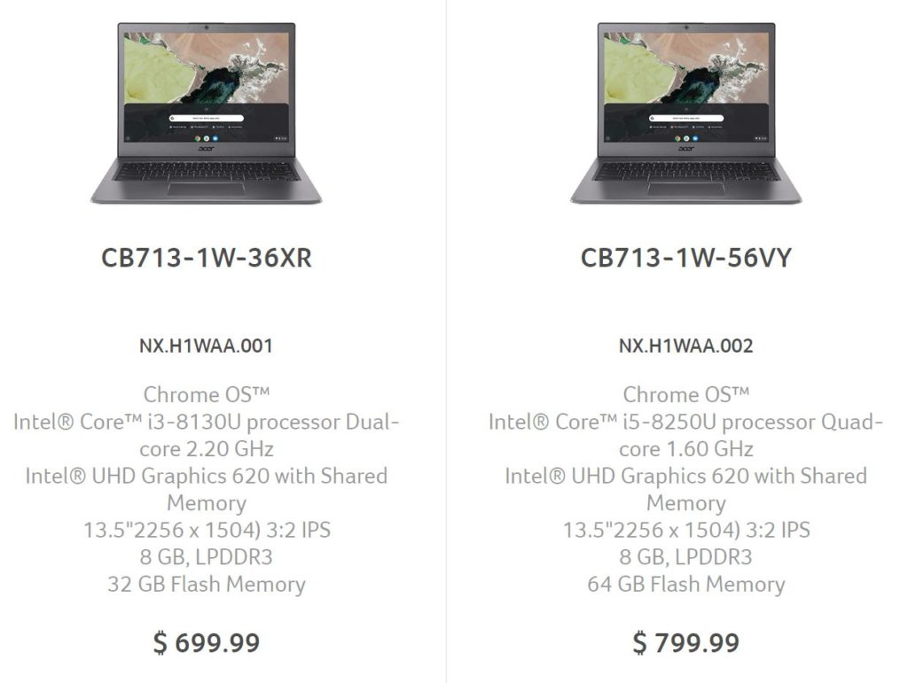

The non-tablet version of the Acer Chromebook Spin 13 has appeared on Acer's site with [two configurations priced at $699 and $799](https://www.acer.com/ac/en/US/content/professional-models/laptops/acerchromebook13cb713), respectively. Since the Acer Chromebook 13 uses a traditional laptop form factor, you can get all of the [power of the Acer Chromebook Spin 13](https://www.aboutchromebooks.com/reviews/acer-chromebook-spin-13-review-vs-pixelbook/) for less money if you don't mind giving up 2-in-1 usage and a Wacom digitizer found in the Spin model.

Essentially, these two model use the mostly same internal parts, aluminum chassis, Gorilla Glass trackpad and 2256 x 1504 resolution display as the Spin model. The other key difference, aside from the lack of 360-degree hinges and display digitizer, is no touchscreen.

If you plan to rely heavily on Android apps and don't want to use the trackpad to navigate them, the more expensive Spin 13 might be better suited for your needs. Also, the $799 Chromebook Spin 13 that runs on an Intel Core i3 includes 64GB of storage; the base Acer Chromebook 13 uses the same processor but only provides have the storage capacity.

If you can live without a touchscreen 2-in-1 Chromebook and a digital stylus, you'll pay $100 less for the Acer Chromebook 13 than the comparably equipped Chromebook Spin 13. I think that's a fair compromise and a nice choice to have.

\[gallery type="slideshow" size="large" ids="2238,2239,2240,2241,2242,2243,2244,2245,2246"\]

I recently [reviewed the $899 Acer Chromebook Spin 13](https://www.aboutchromebooks.com/reviews/acer-chromebook-spin-13-review-vs-pixelbook/) and found that it met or exceeded the performance of my 2017 Google Pixelbook. The 13.5-inch 3:2 aspect ratio display was outstanding for viewing content or work. And I could do either for at least 8.5 to 9 hours a day on a single charge.

At the moment, it doesn't appear that anyone is selling the Acer Chromebook 13 but I'd expect that to change soon. Since this is part of Acer's "For Work" series, we might not see availability, or at least broad availability, in retail box stores, so keep an eye out for third-party sellers and purchase options on Acer's online store. Thanks to Al for the tip!
