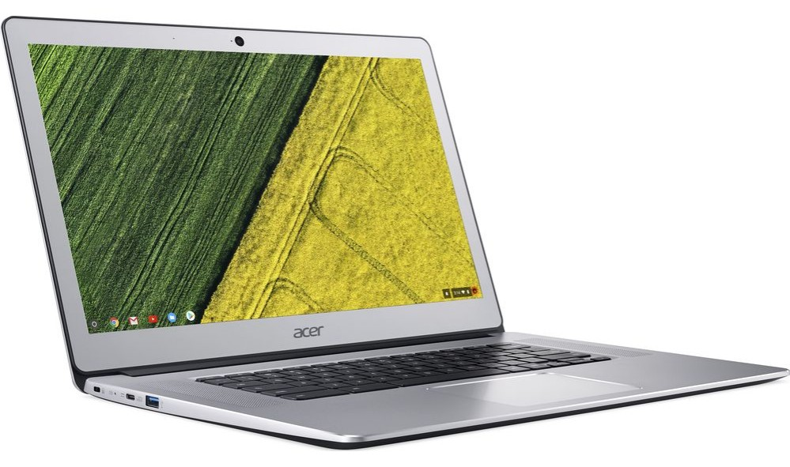

This week's Best Buy ad shows a few discounted Chromebooks and while I normally highlight one of the newer devices, I thought to give the [Acer Chromebook 15](https://www.acer.com/ac/en/US/content/models/laptops/acerchromebook15) a shout out for those on a limited budget. It's not as high performing as the latest and greatest Chromebooks out there of course, but it doesn't have a high price either.

You can [nab the Acer Chromebook 15 for $179 this week](https://www.bestbuy.com/site/acer-15-6-chromebook-intel-celeron-4gb-memory-16gb-emmc-flash-memory-granite-gray/6170703.p?skuId=6170703), which is a savings of $70 from the normal $249 price tag.

Keep in mind that this Chromebook is what I'd call a basic or entry-level device. It's ideal for someone who just needs a screen and keyboard to check email, surf the web and other general internet usage. Yes, it can run Android apps, but I'd limit those to just one at a time and keep expectations in check.

Here's a rundown of the Acer Chromebook 15 specs:

- Dual-core 1.6 GHz [Intel Celeron N3060](https://ark.intel.com/content/www/us/en/ark/products/91832/intel-celeron-processor-n3060-2m-cache-up-to-2-48-ghz.html) processor
- 4 GB of memory
- 16 GB of eMMC storage with an SD card slot for additional capacity
- 15.6-inch TFT LED display with 1366 x 768 resolution
- 802.11ac Wi-Fi and Bluetooth 4.2
- Two USB 3.0 Type-A ports and one HDMI port
- 720p webcam, integrated microphone and headphone jack
- Stereo speakers

Again, these are basically entry level specs as evidenced by the older Celeron processor and 720p display which likely has limited viewing angles. And before you decide this is for you, know that the display is _not_ a touchscreen nor is the keyboard backlit.

Even so, I'm considering purchasing one of these myself for use as a secondary device the whole family can use.

We keep an old MacBook in the living room and it's nearing the end of its useful life. But we don't need to spend $500, $1,000 or more for a communal laptop when most of the time we fire it up for some quick internet use. Instead, for under $200, we can get a basic Chromebook that's easy to share, won't require as much maintenance, can 'cast content to our television set, and boots quickly.
