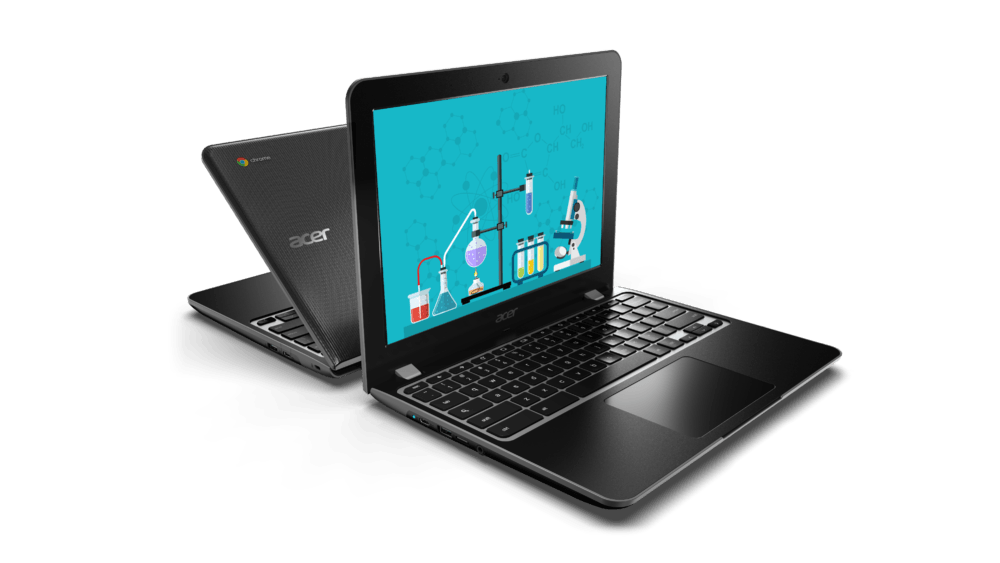

We've had a slew of [new consumer](https://www.aboutchromebooks.com/news/acer-introduces-chromebook-spin-15-covertible-and-chromebook-15/) and [enterprise Chromebooks](https://www.aboutchromebooks.com/reviews/acer-chromebook-spin-13-review-vs-pixelbook/) arrive over the past several months from Acer and now it's time for the education market. This week at BETT, formerly known as the British Educational Training and Technology Show, in London, Acer introduced four 11.6-inch and a pair of 12-inch Chromebooks for the classroom.

Many of these devices share common features, such as U.S. MIL-STD 810G military standards compliance, multiple USB Type-C ports, IPS display options. Here are some highlights of the different models that will be made available to schools in North America and the EMEA markets starting this April. These first four models have 11.6-inch HD displays.

## Acer Chromebook 311-C721 ($279.99) and Chromebook Spin 311-R721T ($349.99)

- 7th Gen AMD A-Series A4-9120C APU with Radeon graphics
- Spill-resistant keyboards that routes spills of up to 330 ml (11 fluid ounces) of water out the bottom of the chassis.
- Moisture-resistant touchpads.
- The C721 version is a traditional clamshell Chromebook while the R721T is a convertible 2-in-1 design with Antimicrobial Corning Gorilla Glass touch display

## Acer Chromebook 311-C733 ($299.99)

- Intel Celeron N4000 and N4100 processors
- Clamshell design
- Spill-resistant keyboard

## Acer Chromebook Spin 511 (R752T)

- Intel Celeron N4000 and N4100 processors
- Convertible 2-in-1 design
- Antimicrobial Corning Gorilla Glass touch display
- Optional Wacom EMR Stylus

The 12-inch devices are unique in that the displays have a 3:2 aspect ratio to fit more content on the display without having to scroll up or down.

## Acer Chromebook 512 (Price: TBD)

- Dual-core Intel Celeron N4000 processor
- 4 or 8 GB of memory
- 32 or 64 GB of eMMC storage
- 1366 x 912 resolution display, available in touch (with antimicrobial coating) and non-touch
- microSD Card reader
- 802.11ac Wi-Fi, Bluetooth 5.0
- Two USB Type-C 3.1 ports, two USB Type-A 3.0 ports
- 180-degree hinge
- Spill-resistant keyboard
- Front-facing HD video camera, optional rear-facing 5-megapixel camera
- Up to 12 hours of battery life

## Acer Chromebook Spin 512 (Price: TBD)

- Intel Celeron quad-core processor N4100 or Intel Pentium Silver N5000 processor
- 4 or 8 GB of memory
- 32 or 64 GB of eMMC storage
- Antimicrobial Corning Gorilla Glass display with 1366 x 912 resolution
- microSD Card reader
- 802.11ac Wi-Fi, Bluetooth 5.0
- 8-megapixel front-facing camera with 720p video support, rear camera with 720p HDR support
- Two USB Type-C 3.1 ports, two USB Type-A 3.0 ports
- MIL-STD 810G compliant
- Spill-resistant keyboard
- Included Wacom EMR stylus
- 3.31 pounds
- Up to 12 hours of battery life

 

Being Chromebooks, all of them are easy for school districts to centrally manage from a web-based console and quick to deploy. For these reasons, as well as the speed, simplicity, and security of Chrome OS, I'm not surprised that [Google made a big announcement this week at BETT](https://blog.google/outreach-initiatives/education/around-the-world-and-back/), saying there are now 80 million educators and students around the world using what has become G Suite for Education and 30 million Chromebooks in classrooms worldwide.
