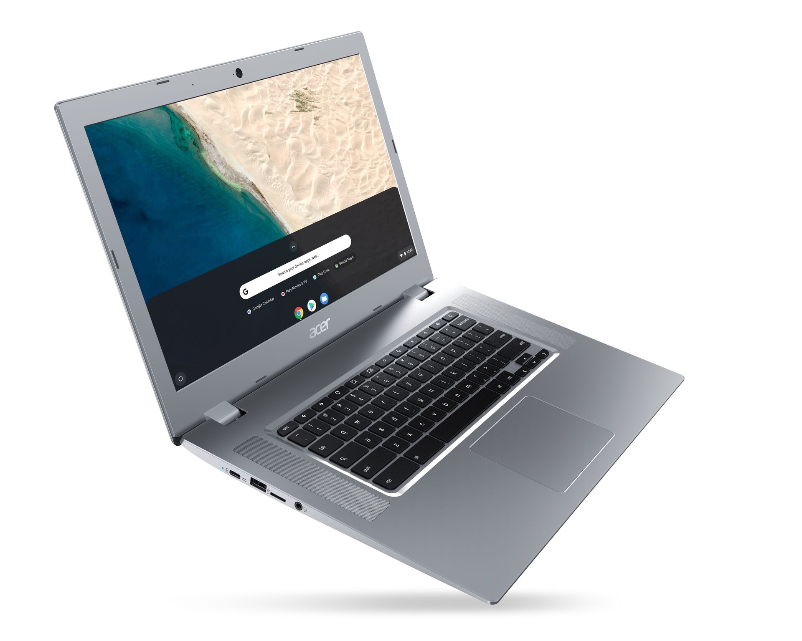

Here come the Chromebooks _without_ Intel chips inside: The [Acer Chromebook 315](https://www.acer.com/ac/en/US/press/2019/479116) was announced at the Consumer Electronics Show with an AMD processor and a starting price of $279.99. There are both touch and non-touch models of this 15.6-inch Chromebook that will be available next month in the U.S.

Here's a rundown of the specs:

- 7th Generation AMD A-Series dual-core A6-9220C APU or 7th Generation AMD A-Series dual-core [A4-9120C APU with Radeon R4 Graphics](https://www.amd.com/en/products/apu/7th-gen-a4-9120c-apu) (note: both options include the Radeon R4)
- 4 GB or 8 GB of dual-channel DDR4 RAM
- 32 or 64 GB of eMMC storage
- Dual speakers that support high-definition audio
- Display choices of 15.6-inch touch display with IPS technology, Full HD 1920x1080 resolution,high-brightness Acer CineCrystal LED-backlit TFT LCD; 16:9 aspect ratio; viewing angle up to 170 degrees or 15.6-inch display with IPS technology, Full HD 1920x1080 resolution, Acer ComfyView LED-backlit TFT LCD; 16:9 aspect ratio; viewing angle up to 170 degrees, or 15.6-inch display, HD 1366x768 resolution, Acer ComfyView LED-backlit TFT LCD; 16:9 aspect ratio
- 802.11ac Wi-Fi and Bluetooth 4.2
- HD webcam with 1280 x 720 resolution, 720p video recording and high dynamic range imaging (HDR)
- 2 USB Type C3.1 Gen 1 ports (up to 5 Gbps), DisplayPort over USB-C, USB charging 5/9/15/20V; 3 A; DC-in port 20 V; 45 W
- 2 USB 3.0 ports
- microSD Card reader
- 3.5mm headphone/speaker jack
- Backlit keyboard
- Estimated 10 hours of battery life

What we don't know yet is how Chrome OS will perform on these AMD processors. With a base price point under $300, I'd expect an experience at least comparable to some of the low-cost ARM-based Chromebooks, if not better. But I'm not expecting Pixelbook performance for the cost. Then again, that would be a nice surprise. Hopefully, Acer has demo units available this week at CES and I can do some general benchmarking and run a few Chrome tabs and Android apps. I'm really curious to see if the Radeon R4 graphics has a noticeable impact.

\[gallery type="slideshow" size="large" ids="2648,2649,2650,2651,2652,2653"\]

I also wonder about the build quality because, at this price, you're likely getting a plastic chassis over one made from lightweight metals such as aluminum. Even so, this big machine tips the scales at 3.97 pounds.

While Acer mentions that Google Play Store support is there for Android apps, I don't know if this device will run Linux apps out of the box. Yes, the AMD processor is x86-compatible, so Crostini shouldn't be dependent on Intel chips for running Linux apps, but I plan to ask if this has been tested on the new Acer Chromebook 315, even though entry-level devices aren't the likely target for such a feature.
