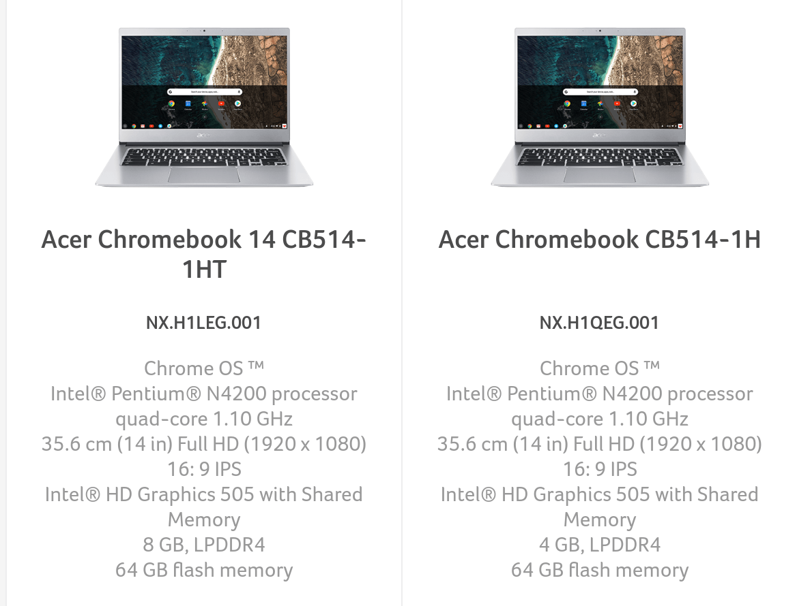
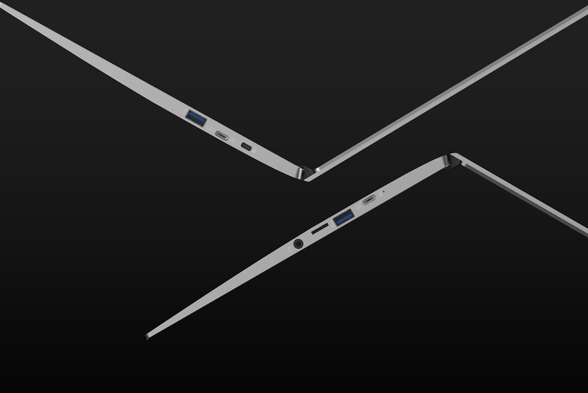

[Announced in August, the Acer Chromebook 514](https://www.aboutchromebooks.com/news/acer-chromebook-514-is-a-14-inch-laptop-with-gorilla-glass-trackpad-starting-at-349/) is one of the devices I've been most asked about lately. People want to know when it will be on sale. Well, we know that Acer has built at least one of the devices because [the FCC tested it last month for U.S. availability](https://www.aboutchromebooks.com/news/acer-chromebook-cb-514-specs-release-date-october/). Acer surely made more because [folks in Germany can buy one of the two available models, starting at €449](https://www.acer.com/ac/de/DE/content/models/laptops/acerchromebook514).

I found both models on Acer's Germany store site, with very little difference between the two: Both have an Intel Pentium N4200 processor quad-core processor with 1.10 GHz speed, 14-inch 1080p IPS touch display and 64GB of flash storage.

The only difference between the base model and the €539.00 option appears to be a doubling of RAM for 8GB of memory and the addition of touch on the display. Other specs for both include 802.11ac Wi-Fi, four USB ports (two Type-C and two Type-A), a backlit keyboard.

Note that I don't see any mention of either Bluetooth or a memory card reader on either model although those may just be missing from the list: You can see a microSD card reader in the official device image below:

Don't bother converting the price from Euros to dollars: [Acer already said the Chromebook 514 will start at $349](https://www.aboutchromebooks.com/news/acer-chromebook-514-is-a-14-inch-laptop-with-gorilla-glass-trackpad-starting-at-349/) for the base model. I'd expect another $100 for the upgraded options, but that's not an official price from Acer, of course.
