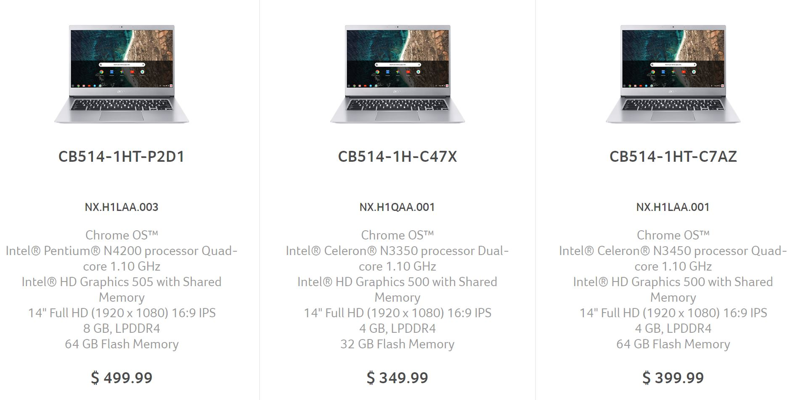

Last week an [official product page for the Acer Chromebook 514 went live](https://www.aboutchromebooks.com/news/acer-chromebook-514-price-specifications/) with a single $499 model. Now, there are [two more configurations appearing on Acer's site](https://www.acer.com/ac/en/US/content/models/laptops/acerchromebook514), both with lower prices. None of the three Chromebooks yet appear on Acer's site for purchase, however, the two of three models are now on Amazon with a "Temporary out of stock" message, suggesting that sales could soon begin.

All three devices look the same on the outside as you'd expect and all share the same 14-inch 1080p display. The key differences are with the processor choices and the amount of both RAM and storage.

Dropping from the $499 model down to the [base $349 Acer Chromebook 514](https://www.amazon.com/gp/product/B07L25B814/ref=as_li_qf_asin_il_tl?ie=UTF8&tag=aboutchromebo-20&creative=9325&linkCode=as2&creativeASIN=B07L25B814&linkId=2488a1d22370e1017621b5bbbcf33a9f) (_affiliate link_) halves both the memory and storage to 4 GB and 32 GB, respectively. You'll also be running Chrome OS with a dual-core Celeron N3350 chip and integrated Intel HD Graphics 500 instead of a quad-core Celeron N4200 and HD Graphics 505, although I wouldn't expect the performance decrease to be too drastic.

[For $399](https://www.amazon.com/gp/product/B07L24TWSG/ref=as_li_qf_asin_il_tl?ie=UTF8&tag=aboutchromebo-20&creative=9325&linkCode=as2&creativeASIN=B07L24TWSG&linkId=0d9e11f165b54c8f29d62c46acf2017c) (_affiliate link_), you do get a quad-core processor in the Celeron N3450 but again, the performance difference is likely negligible. However, you also get 64 GB of storage by upgrading over the base model.

\[gallery type="slideshow" ids="2178,1930,1929,1928,1927,1926,1551,1549,1548,1547" orderby="rand"\]

What's concerning to me is that all three of these Chromebook configurations use processors that are between two and two-and-a-half years old. Just above this price range, you can usually find Chromebooks and 2-in-1 devices with more modern hardware under the hood; the [HP Chromebook X360 also has a 14-inch full HD display and is on sale this week for $449](https://www.aboutchromebooks.com/news/deals-on-a-pair-of-chromebooks-all-this-week-from-hp-and-lenovo-at-best-buy/), for example.

That device has an eighth-generation Intel Core i3, 8 GB of memory and 64 GB of storage and I'm sure you actually would see noticeably better performance over any of these Acer models. Yes, the sale drops the cost of the Chromebook X360 by $200 below the standard price, but it seems like there's a lot of price pressure on Chromebooks, with various sales on a weekly basis. Definitely shop around and take advantage of sales if you're in the market for a new Chromebook.
