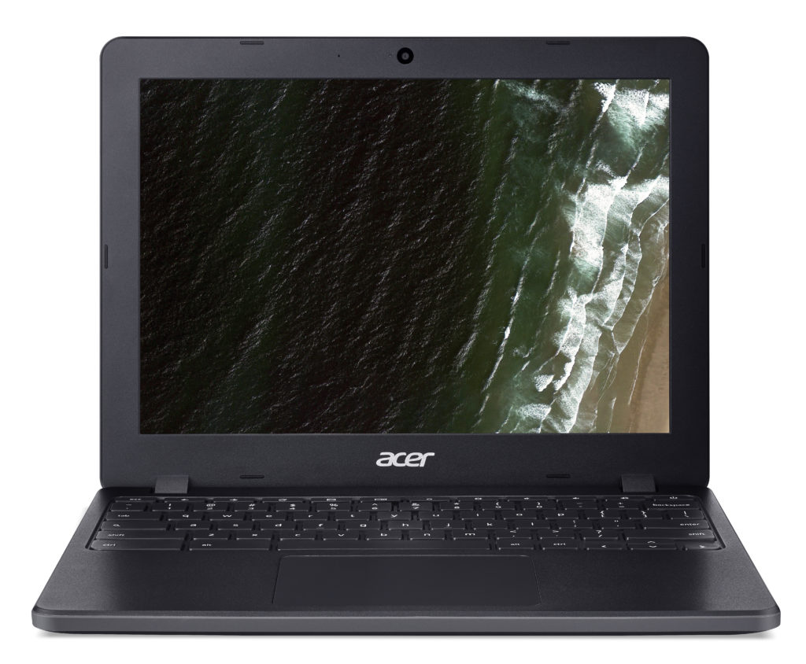
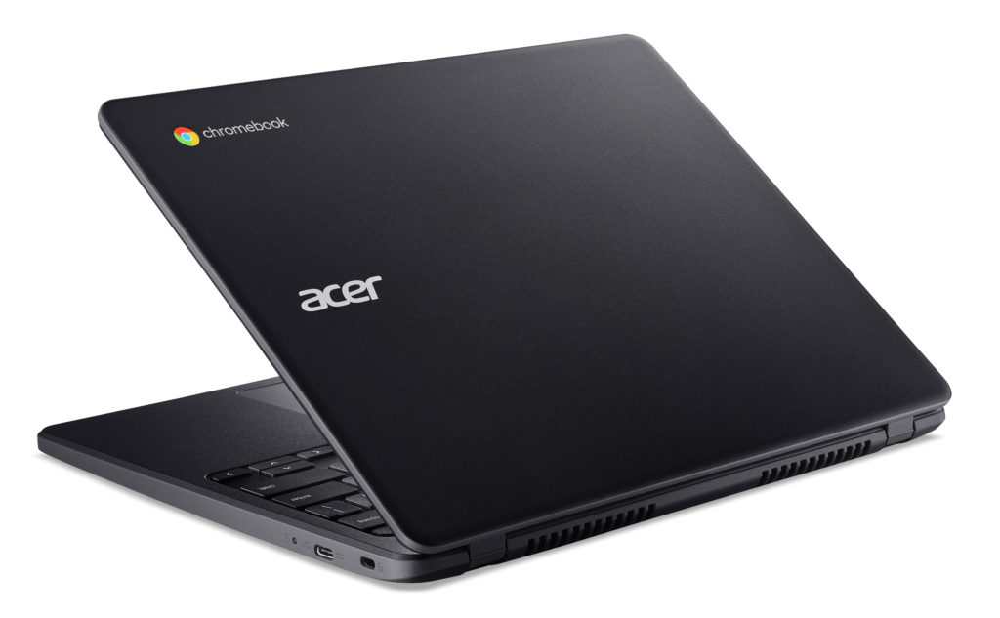

The [BETT show for education](https://www.bettshow.com/) takes place in London this week and we typically see a few Chromebooks for education launch at this annual event. Acer is the first out of the gate on Monday, [introducing the Acer Chromebook 712](https://news.acer.com/acer-launches-high-performance-durable-12-inch-chromebook-designed-specifically-for-education) (aka, the Acer Chromebook C871), a rugged clamshell with a 12-inch 3:2 aspect screen.

The Acer Chromebook 712 will start at $329.99 when it arrives in the US this March. The base model is powered by an Intel Celeron 5205U, the first Chromebook I've seen with this newer processor, paired with 4 GB of memory. Schools can opt for up to an Intel Core i3-10110U and 8 GB of RAM, however.

Being a Chromebook for EDU, there are always some features limited to keep costs down. You can't get a 1080p display, for example, as the only choice is a 1366 x 912 TFT LED panel. A touch screen is also optional. Still, an HD+ resolution is likely more than adequate in the classroom. There's no backlit keyboard either but it's safe to assume most schools are paying their electric bills.

On the flipside, ruggedized features are added including MIL-STD 810G certification, mechanically anchored keys, and a spill-resistant keyboard. And there's a heavy-duty hinge "that remains intact even when students pick it up by the display," according to Acer.

Here's a rundown on the hardware specifications for the Acer Chromebook 712:

<table class=""><tbody><tr><td>CPU</td><td>Intel Celeron 5205U Intel Pentium Gold 6405U Intel Core i3-10110U</td></tr><tr><td>GPU</td><td>Intel Graphics</td></tr><tr><td>Display</td><td>12-inch, 1366 x 912 TFT LCD panel, 3:2 aspect ratio, touch optional, folds to 180-degrees</td></tr><tr><td>Memory</td><td>4 GB DDR4 8 GB DDR4</td></tr><tr><td>Storage</td><td>32 / 64 GB eMMC, microSD slot</td></tr><tr><td>Connectivity</td><td>WiFi 6, Bluetooth 5.0</td></tr><tr><td>Input</td><td>Non-backlit keyboard, multitouch trackpad, built-in microphone, 720p webcam with SHDR imaging</td></tr><tr><td>Ports</td><td>Two USB Type-C ports, one USB Type-A, headphone jack</td></tr><tr><td>Battery</td><td>48 WHrs, claimed run time up to 12 hours</td></tr><tr><td>Weight</td><td>3.09 pounds</td></tr><tr><td>Software</td><td>Chrome OS software automatic update expiration date: June 2028</td></tr></tbody></table>

While we don't know the costs of the upgrade models, the Acer Chromebook 721 is surely the most powerful education Chromebook I've seen yet, at least in its top-line configuration. I can't remember seeing an Intel U-Series processor inside one of these.

That suggests to me that there's either a market for better-performing education Chromebooks or that Acer _thinks_ there's a market for one. I'd be curious to see what any educators think, particularly if they've used lower-powered Chromebooks in the classroom before.
