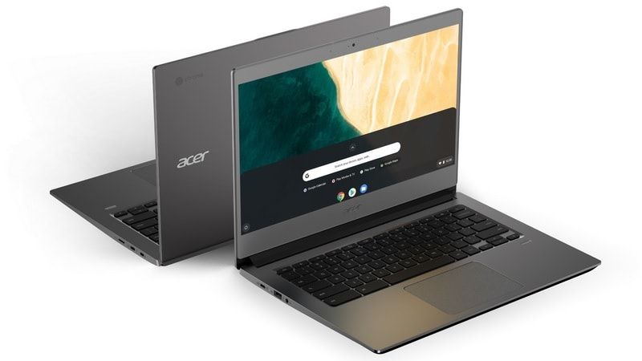
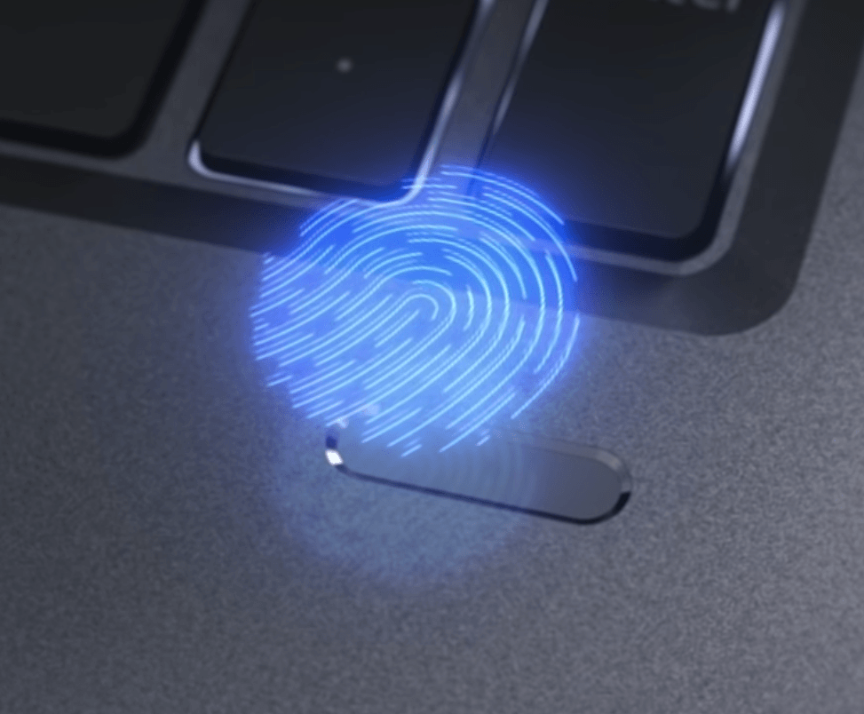

Today at the global Next@Acer event in New York City, [the Acer Chromebook 714 and 715 were introduced](https://www.prnewswire.com/news-releases/acer-expands-chromebook-to-the-enterprise-with-two-new-durable-premium-models-300830506.html). These are [targeted for "front-line" workers in business](https://cloud.google.com/blog/products/chrome-enterprise/acer-introduces-the-chromebook-714-and-715-built-for-frontline-workers) based on durability, security and - in the case of the Acer Chromebook 715 - a dedicated numeric keypad alongside a standard keyboard.

Both models are expected to be available in July with a base model price of $499.

Acer didn't disclose all of the base model specs but you can get idea of most hardware options shared between the two Chromebooks:

- Up to 8th-gen Intel Core i5 processors and 16 gigabytes of memory
- 14-inch 1920 x 1080 IPS display on the Chromebook 714
- 15.6-inch 1920 x 1080 IPS display on the Chromebook 715
- Two USB Type-C 3.1 ports
- 802.11ac/a/b/g/n 2x2 Wi-Fi, Bluetooth 4.2
- Wide-angle webcam
- An integrated fingerprint reader to the right of the keyboard
- Gorilla Glass touchpad
- All aluminum chassis designed to withstand up to 4-foot drops and 132 pounds of downward force
- An optional touchscreen and backlit keyboard
- 12 hours of battery life

Integrated fingerprint sensor

Given that you have to [sign up for updates on these Chromebooks through Google's Chrome Enterprise page](https://forms.gle/ZZAretawRgTVN65H9), I don't anticipate consumer availability; at least not in retail stores. If either of these clamshells is of interest to you for consumer use, you might find them available from Promevo, or another business-centric reseller.

Here's a closer look at the Acer Chromebook 15 and that extra number pad, which would be handy not just for work spreadsheets, but also math programming applications:

https://youtu.be/qvk8eerh33Y
