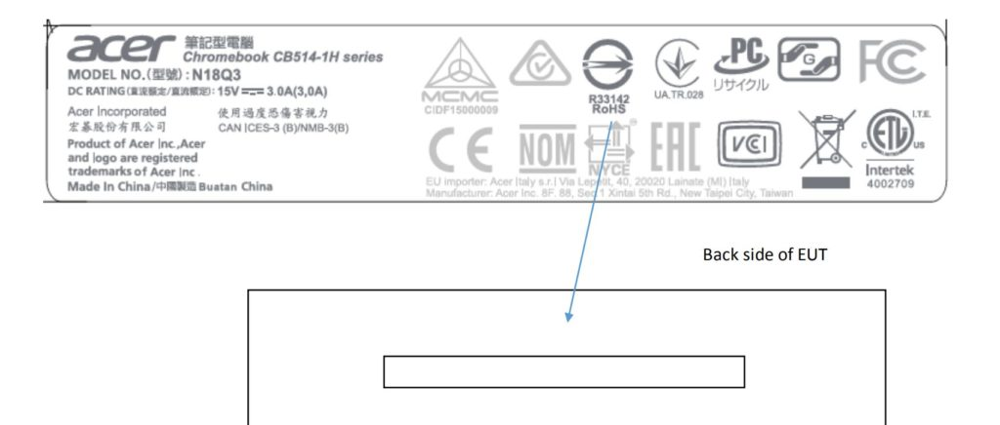

Back in August, [Acer introduced the Chromebook 514, a 14-inch laptop expected to start at $350](https://www.androidpolice.com/2018/09/04/acer-chromebook-514-hands-possibly-flimsiest-chromebook-can-get-350/). The company then said it would be available in North America around October and here we are: It appears the large Chromebook with a relatively small price tag is about to go on sale in the U.S.

The Acer Chromebook 514 was certified this week by the FCC and I caught the above label information showing the model number which confirms which device was tested.

\[gallery type="slideshow" size="large" ids="1927,1928,1929,1930"\]

At the time of the device announcement, hardware information was generally non-existent. But Android Police took the device for a spin about a week later -- they weren't impressed by the build quality but that could have been an early production model -- and came away with these specifications:

> CPU: Intel Celeron Quad Core N3450 or Intel Pentium Quad Core N4200 (both Apollo Lake) Display: 14"FHD Acer ComfyView IPS LED LCD or FHD (1920x1080) IPS Multi-touch LCD Graphics: Intel HD Graphics 500 or 505 RAM: 4 or 8GB Storage: 32 or 64GB eMMC Camera: HDR Battery: 12 hours Connectivity: 2x USB 3.0, 2x Type C (Power and data on both sides), MicroSD card slot, 3.5mm headphone jack

Surely, the expected $350 price tag is for a combination of the Intel Celeron, no touchscreen, 4GB of memory and 32GB of storage, so upgrades will set you back another $100 to $250 in my opinion, depending on your choices. Assuming the final build quality is improved over what Android Police experienced in September, the Acer Chromebook 514 might be a nice entry-level Chrome OS laptop for those on a budget.
