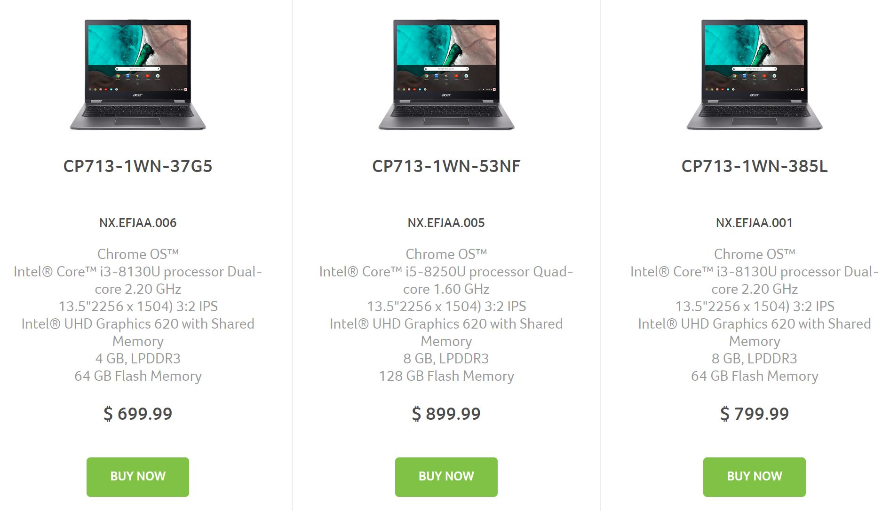
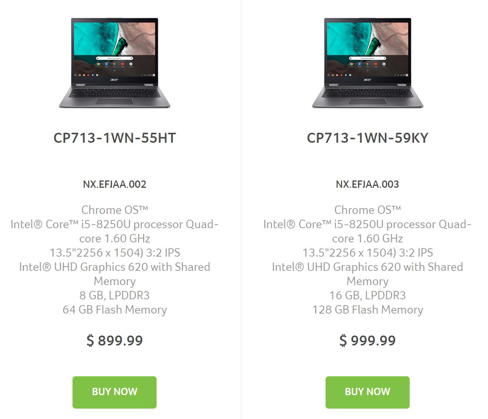

This holiday season a slew of [previously announced Chromebooks](https://www.aboutchromebooks.com/news/new-acer-chromebook-spin-13-chromebook-13-launching-at-acer-next-event/) will be available with updated processors and other internals. Among them is the Acer Chromebook 13 and [Chromebook Spin 13, the pricing of which are now showing on Acer's site](https://www.acer.com/ac/en/US/content/professional-models/laptops/acerchromebookspin13), as spotted by [Chrome Unboxed](https://chromeunboxed.com/news/acer-chromebook-spin-13-listing-live). If you thought the top-end configuration would be cheap, you're in for a surprise: Prices range from $699.99 to $999.99 depending on the options.

The entry point of $699 gets you an 8th-gen [Intel Core i3-8130U](https://ark.intel.com/products/137977/Intel-Core-i3-8130U-Processor-4M-Cache-up-to-3-40-GHz-) dual-core processor, 4GB of memory and a reasonable 64GB of flash storage. You'll need to pony up $100 to double the RAM, while $200 also gets you 8GB of RAM, a generous 128GB of storage and a processor bump to the [Intel Core i5-8250U](https://ark.intel.com/products/124967/Intel-Core-i5-8250U-Processor-6M-Cache-up-to-3-40-GHz-) chipset, as well as a stylus. That latter package is priced at $899.99.

Strangely, there's another $899.99 option without a stylus and only has 64GB of storage. I see no other differences when [comparing the two](https://www.acer.com/ac/en/US/content/professional-compare/NX.EFJAA.005-NX.EFJAA.002) so I don't understand why someone would spend the same amount of money to half their flash storage and lose the stylus. Something doesn't sound right on that configuration.

Finally, the fully loaded Acer Chromebook Spin costing $999.99 brings the Core i5, 128 GB of storage and a whopping 16GB of memory.

All models include the 13.5-inch touchscreen display at 2256 x 1504 resolution, one USB Type-C port, two USB Type-A ports, 802.11ac WiFi, and Bluetooth 4.2. Acer previously said the devices would be available in September but that month has passed. And there's no indication when direct sales have started although a few online retailers are taking orders now.

\[gallery type="slideshow" size="full" ids="1327,1326,1325,669"\]

Keep in mind that these Chromebooks all use the Intel U-series processor which will run hotter than the Y-series chips typically found in many Intel-powered mid- and high-end Chromebooks. They'll likely have a fan, as a result, if that matters to you.
