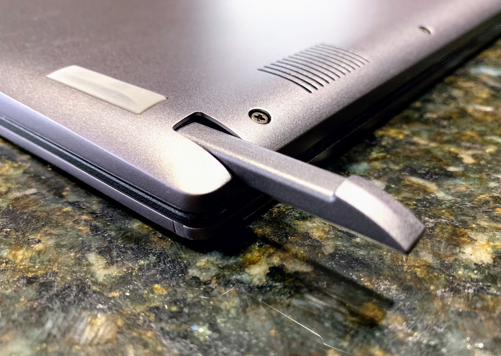

Until recently, if you wanted the most powerful Chromebook, you'd turn to the Google Pixelbook. However, a number of new high-end devices have recently been introduced from Acer, [Dell](https://www.aboutchromebooks.com/news/dell-insipiron-14-chromebook-price-release-date-availability/), and [Lenovo](https://www.aboutchromebooks.com/news/4k-lenovo-yoga-chromebook-c630-specs-price-release-date-599/) however, and the first of these that I've taken for a drive is the [Acer Chromebook Spin 13](https://www.acer.com/ac/en/US/content/professional-series/acerchromebookspin13).

Yes, it's cheaper and better than the Pixelbook in many ways, but not quite as good in a few. I've been using the Spin 13 as my daily driver for over week, and here's what I think: Despite a few small flaws, the Acer Chromebook Spin 13 should be near the top of the list for any heavy-duty or enterprise Chromebook user.

## What you get for $899

There are five configurations of the Spin 13 available and [Acer loaned me the $899 model](https://www.acer.com/ac/en/US/content/professional-model/NX.EFJAA.002), which has the following hardware specifications.

- Intel Core i5-8250U quad-core processor with 1.60 GHz clock speed
- 8 GB of LPDDR3 memory
- 64 GB of eMMC storage
- A 13.5 inch IPS touchscreen display with 2256 x 1504 resolution and 3:2 aspect ratio
- Intel UHD Graphics 620 with that shares memory with the system
- 360-degree hinge for 2-in-1 usage in tent, display and tablet modes
- An EMR pen that is stowed inside the Chromebook
- 802.11ac Wi-Fi (2x2 MIMO) and Bluetooth 4.2
- A pair of USB Type-C (USB 3.1, Gen 1) ports, a USB Type-A (USB 3.0) port, a microSD card reader, headphone jack, microphone and stereo speakers
- Battery life expectations of up to 10 hours

Compared to my similarly spec'd Pixelbook which has an MSRP of $999 -- but can often be found on sale these days -- the Spin 13 adds a larger display, albeit with a lower resolution, an 8th generation Intel U-Series processor vs the 7th gen Intel Y-series CPU, a pen that doesn't need to be charged or carried, and a USB Type-A port.

\[caption id="attachment\_2144" align="aligncenter" width="3625"\] You probably won't lose me and you don't need to charge me.\[/caption\]

Of course, the larger display inside the aluminum chassis makes for a larger and heavier device. The Spin 13 weighs 3.31 pounds while my Pixelbook weighs notably less at 2.4 pounds. Measuring 12.2 x 9.7 x 0.7-inches, the Spin 13 is bigger than the Pixelbook in every way as well because that device is 11.4 x 8.7 x 0.4-inches.

## Let's talk about raw power and performance

I'll get benchmarks out of the way first for two reasons. One, I'm not a fan of them because some people place way too much emphasis on them. I find them a good general indication of performance comparisons but everyday use is more important to me. Two, people still seem to ask for them. Every. Single. Time.

So I ran several industry standard tests on both the $899 Acer Chromebook Spin 13 and the $999 configuration of the Google Pixelbook. All tests were run in Guest Mode after a full reboot. One caveat: The left the Spin 13 in the Stable Channel of Chrome OS 69, which is how it was shipped to me; I have checked for updates, but there haven't been any. My Pixelbook is running the Dev Channel of Chrome OS 71. As a result, there are likely to be minor differences due to different software.

Having said that, here are the numbers for those who want them:

| Test | Google Pixelbook | Acer Chromebook Spin 13 |
| --- | --- | --- |
| Speedometer 1.0 | 117 | 164.1 |
| Speedometer 2.0 | 69.4 | 96.73 |
| JetStream | 118.74 | 174.52 |
| Basemark | 414.2 | 426.18 |
| Octane 2.0 | 22,309\* | 36,448 |

_\***Note**: I have seen many Pixelbooks score into the low-to-mid-30,000 range on Octane tests. I don't know why my results are much lower, although it may be due to running Chrome OS 71 Dev Channel. This appears to be an outlier and suggests that while the Spin 13 benchmarks higher in Octane, the difference isn't as dramatic as my results above._

Benchmarks aside, everything I've done on the Spin 13 has felt as fast, if not faster than the same activities on my Pixelbook. Those activities include light photo edits, up to 20 open tabs for web apps, watching full-screen YouTube TV, using a few Android apps and yes, running some Linux IDEs for coding Java apps by using [Project Crostini](https://www.aboutchromebooks.com/tag/project-crostini). I wouldn't say I noticed that the more powerful Spin 13 is much faster than my Pixelbook in everyday use, but it's definitely not slower if that makes sense.

That type of performance is to be expected of course, due to the newer U-Series processor which can run longer at a heavier processor load than Y-Series chips. There's a compromise though: The Acer Chromebook Spin 13 has a fan to help dissipate heat in those circumstances. It fires up a boot and again whenever you've got your foot on the gas pedal, but it's not obscenely loud. Noticeable, yes, but I've heard far worse.

Acer says you can expect around 10 hours of run time on a charge with mixed usage and that's a close estimate in my week of testing. Most days, 10 hours was a little more optimistic than reality but I always experienced at least 8.5 to 9 hours of use. The included 45W charging brick is exactly that -- a rectangular brick -- which is not my favorite form factor. However, it does use USB C for charging and you can top off fairly quickly.

## About that display: Less pixel density, more information density

With its 2256 x 1504 resolution spread across 13.5-inches, the Acer Chromebook Spin 13 has a pixel density of 200 PPI (pixels per inch). It's not quite as clear as the Pixelbook and its 235 PPI but the difference is negligible to my four eyes. However, you get more information on the display of the Spin 13 due to the larger screen and a slightly different default scaling setting.

For example, when in the default display resolution, the Spin 13 acts like a 1410 x 910 monitor. The Pixelbook in default mode? 1280 x 800. Perhaps it's better to illustrate the difference though. Here are two screen caps of the Techmeme home page from this morning on both devices. You can read farther down the page without scrolling on the Acer Chromebook Spin 13.

\[caption id="attachment\_2134" align="aligncenter" width="2400"\] Pixelbook\[/caption\]

\[caption id="attachment\_2135" align="aligncenter" width="2256"\] Spin 13\[/caption\]

Obviously, on both devices, you can customize your display and zoom settings. But out of the box, you can see more information -- albeit smaller -- on the larger screen of the Spin 13. And if you have the right monitor and cables, you can use an external UHD/4K display over USB C on just about any high-end Chromebook.

Viewing angles are quite good on the Spin 13 -- up to 178-degrees says Acer -- although you'll see a drop in brightness at wide angles. I don't have a way to formally test the screen brightness of the Spin 13, but the full brightness level is too much for my eyes to take, meaning it should be good for nearly everyone.

I'm not a fan of the Wacom sticker on the lower left of the screen bezel (yes, it has big bezels like the Pixelbook), but perhaps it can be removed; I don't modify review devices.

\[caption id="attachment\_2148" align="aligncenter" width="3209"\] Stickers and plastic framing. Meh.\[/caption\]

## Input is as important as output

<iframe style="width: 120px; height: 240px;" src="//ws-na.amazon-adsystem.com/widgets/q?ServiceVersion=20070822&amp;OneJS=1&amp;Operation=GetAdHtml&amp;MarketPlace=US&amp;source=ac&amp;ref=qf_sp_asin_til&amp;ad_type=product_link&amp;tracking_id=aboutchromebo-20&amp;marketplace=amazon&amp;region=US&amp;placement=B07GD4CMDH&amp;asins=B07GD4CMDH&amp;linkId=adb9ff8d3db0b2b37b1fb8d0db924465&amp;show_border=true&amp;link_opens_in_new_window=true&amp;price_color=333333&amp;title_color=0066c0&amp;bg_color=ffffff" frameborder="0" marginwidth="0" marginheight="0" scrolling="no" align="right"></iframe>

Screens are only part of the equation on any device. How you interact with it is just as important. I'll admit, I'm a bit spoiled by the Pixelbook's keyboard and trackpad. And to be fair, Acer did an admirable job here. The keyboard is backlit, the trackpad is covered by Corning Gorilla Glass (as is the display), and the typing experience is solid.

I prefer the Pixelbook's keyboard in every way, however. If you've never used it, you might be fine with the travel and feel of the Spin 13's keyboard. The same goes for the trackpad, which is a little smaller than it could have been in my opinion. Both are good, but not over the top great. And there are some missing Chrome OS-specific keys on the Spin 13. There are no buttons for the app launcher button, Google Assistant, Play/Pause or Chrome OS settings. That may be due to Google limiting such keyboards to its own devices, but it's still worth a mention.

One input area the Spin 13 shines in is inking. I love the fact that the small stylus is stowed in the chassis and doesn't use batteries. You give up some functionality with this type of setup: I wouldn't recommend it for digital artists, but for note-taking it's fantastic. Better even than on the Pixelbook due to near-zero (if not zero) input lag. There's no pressure or tilt sensitivity here but again, for taking notes, it's great.

## Other random thoughts

I'll just bullet point some of my other impressions that are important, but secondary when compared with performance, display, input and output items:

- The 720p webcam is serviceable but not fantastic. Make sure you have a well-lit environment when using it for Hangouts or other video purposes.
- The build quality is quite good with a caveat. I find the edges of the aluminum chassis to be sharp; particularly on my wrists when typing. The Pixelbook has hard edges too, but the soft palm rests make sure that my wrists don't feel the edge of the device.
- Acer says the Chromebook Spin 13 is all aluminum. And it is. Mostly. Just under the bottom screen bezel is dark plastic. You may not notice it but I did and it's as if Acer got 99 percent of the way towards a full high-quality design.
- The stereo speakers are under the front of the device base. I don't find the placement ideal when using the Spin 13 in tablet or tent mode. And even when using it in clamshell mode, I have to boost the volume to between 30 and 40 percent to clearly hear the sound. More often when watching a video, I had the volume boosted to between 80 and 90 percent. The sound is acceptable but not loud until you really get to the higher volume settings.

 

- For true tablet mode, I find the Acer Chromebook Spin 13 usable for a short while due to the weight. If you're planning to use this is a tablet for hours every day, you'd better have big biceps. I do not. ;)

## Who should buy it

I'm saving my money for a Pixel Slate, but that's not because the Acer Chromebook Spin 13 isn't a viable option. Overall, it's a great Chromebook with more power than most Chromebook users need; at least in the $899 configuration.

Taking a cue from [my Pixel Slate buyers guide](https://www.aboutchromebooks.com/opinion/which-google-pixel-slate-to-buy-guide/), I'd say that the model I'm using is good enough for nearly any Chromebook power user. Even developers that want to use Linux or enterprise customers would likely be well served by this model. For $100 more, [you can double both storage and memory](https://www.acer.com/ac/en/US/content/professional-model/NX.EFJAA.003) if you need 128 GB of flash storage and 16 GB of RAM.

For basic Chromebook usage and some Android apps, this model is probably overkill. However, Acer does offer two Intel Core i3 models for a little less money. You still get the same screen, chassis and everything else:

- The [$699 model](https://www.acer.com/ac/en/US/content/professional-model/NX.EFJAA.006) uses an Intel Core i3 with 4GB of memory and 64GB of storage.
- The [$799 model](https://www.acer.com/ac/en/US/content/professional-model/NX.EFJAA.001) uses the same Core i3 but doubles the memory to 8GB.

That's more than most of the recent mid-range Chromebooks in the $400 to $600 price points. But none of those that I know of use Intel U-Series processors, so you're likely getting a good performance update with the entry-level Acer Chromebook Spin 13 models. Still, for basic Chromebook users, you don't need to spend $700 or more to get a solid device like this: This camp should consider the Spin 13 if a high-resolution, large display and inking is a must.

Overall, the Acer Chromebook Spin 13 is the first Chromebook I've used that rivals or exceeds the Google Pixelbook. And it does so at a lower cost. That's impressive.

I plan to return the Acer Chromebook Spin 13 at the end of the week, so if you have specific questions, get them in quick and I'll try to answer them.
