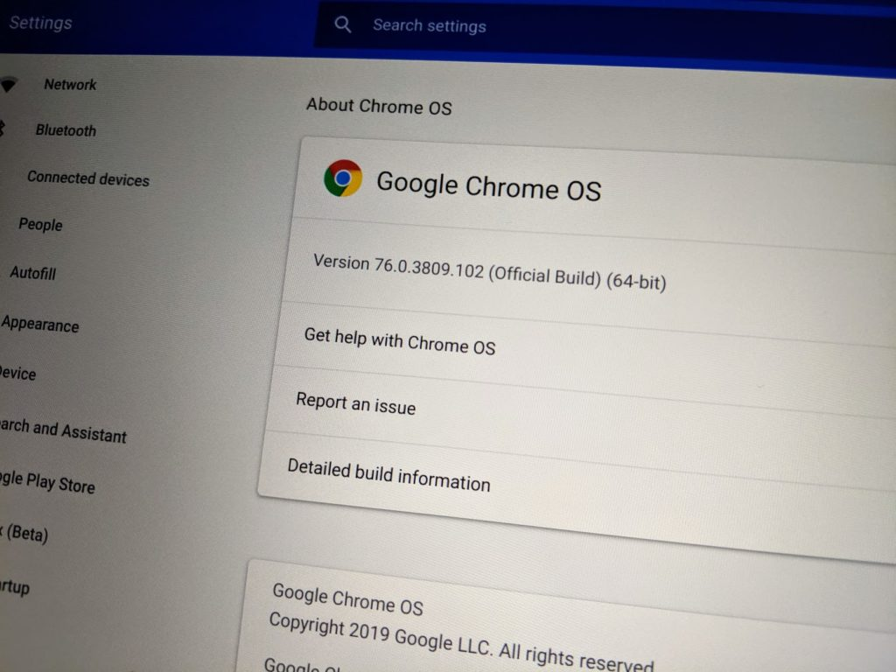
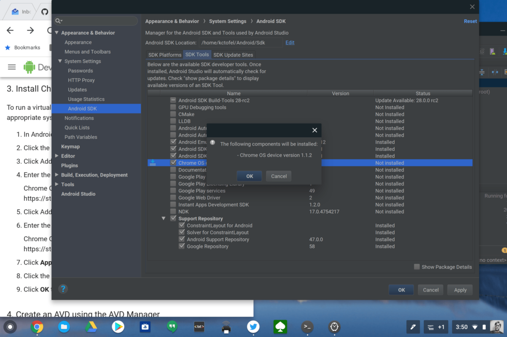

<iframe style="width:120px;height:240px;" marginwidth="0" align="right" marginheight="0" scrolling="no" frameborder="0" src="//ws-na.amazon-adsystem.com/widgets/q?ServiceVersion=20070822&amp;OneJS=1&amp;Operation=GetAdHtml&amp;MarketPlace=US&amp;source=ac&amp;ref=qf_sp_asin_til&amp;ad_type=product_link&amp;tracking_id=aboutchromebo-20&amp;marketplace=amazon&amp;region=US&amp;placement=B07GD4CMDH&amp;asins=B07GD4CMDH&amp;linkId=9c71d1612233064d25e17b4b5d9150d5&amp;show_border=true&amp;link_opens_in_new_window=true&amp;price_color=333333&amp;title_color=0066c0&amp;bg_color=ffffff"></iframe>

I'll get this out of the way right up front and answer the headline question: **_Probably not._**

Since you're reading, however, I'll explain what I bought and why I bought it for two reasons. First, it should help some folks save money by not buying more hardware they need in a Chromebook. Second, people who have similar use cases to mine might find the information useful for their own purchase decisions.

So, I ended buying an Acer Chromebook Spin 13 with Core i5-8250U processor, 16 GB of memory and 128 GB of flash storage. This is essentially [the same device I reviewed back in November](https://www.aboutchromebooks.com/reviews/acer-chromebook-spin-13-review-vs-pixelbook/), with the only difference being [that model has 8 GB of memory and costs $899](https://www.acer.com/ac/en/US/content/professional-model/NX.EFJAA.005).

[Acer charges $999 for the configuration I just bought](https://www.acer.com/ac/en/US/content/professional-model/NX.EFJAA.003) so I was going to purchase this from B&H Photo for $959. Then I noticed B&H had a used, "like new" unit for $819, so I pulled the trigger.

If someone did use this Chromebook, I sure as heck can't tell. It arrived in the original packaging that was previously opened, and all of the paperwork, protective packing and the power cord. It also had Chrome OS 68 installed, suggesting to me that if was used, it hasn't been for many months. I immediately upgraded it to [Chrome OS 76, which just arrived with many new features](https://www.aboutchromebooks.com/news/chrome-os-76-stable-version-arrives-heres-what-you-need-to-know/). That took all of six minutes. Hello, [virtual desks](https://www.aboutchromebooks.com/news/chrome-os-77-first-look-at-virtual-desks-video-chromebook/)!

Why did I get a nearly top-of-the line Chromebook? Note: I say "nearly" because [Acer offers a $1,569 configuration with Core i7](https://www.aboutchromebooks.com/news/acer-chromebook-spin-13-with-core-i7-16-gb-ram/), as does [HP for its Chromebook X360 14](https://store.hp.com/us/en/ConfigureView?catalogId=10051&langId=-1&storeId=10151&urlLangId=&catEntryId=3074457345619122818&quantity=1) ($1,248) and [Lenovo will as well for the Yoga Chromebook C630](https://www.aboutchromebooks.com/news/4k-lenovo-yoga-chromebook-c630-core-i7-16gb-ram-specs-price-estimate-availability/), but we don't know the price yet.

As soon as [Google announced its minimum recommended Chromebook specs to run Android Studio](https://www.aboutchromebooks.com/news/android-studio-chrome-os-chromebook-recommendation-google-io-2019/), I started thinking about a device like the one I just bought. I code for my Computer Science classes with the Pixel Slate and it works well, but as my apps become more complex and/or I need more powerful developer tools, the Core i5 Y-series processor and 8 GB of memory aren't going to be optimal.

Setting the memory difference aside for a second, there are a few variances between the [Core i5-8200Y](https://ark.intel.com/content/www/us/en/ark/products/185280/intel-core-i5-8200y-processor-4m-cache-up-to-3-90-ghz.html) in the Pixel Slate and the [Core i5-8250U](https://ark.intel.com/content/www/us/en/ark/products/124967/intel-core-i5-8250u-processor-6m-cache-up-to-3-40-ghz.html) in the Acer Chromebook Spin 13. You get two CPU cores capable of running four threads on the Pixel Slate, for example. The U-series Core i5 in the Acer has four CPU cores and can handle eight concurrent threads. There are some other small differences in the Intel HD Graphics chips, chip cache and clockspeed, but those are fairly minimal, not influencing my purchase decision.

And as far as the memory? You have to remember that the Linux container - where developers would run IDEs, or integrated development environments for coding - is running at the same time as Chrome OS and any Android apps you might be using. More memory is always welcome in this situation.

Implementing a linked list stack in Java on the Pixel Slate - yay!

Long story short, if you do use or plan to use a Chromebook for [Linux apps](https://www.aboutchromebooks.com/tag/project-crostini) and coding environments within Linux, you'll really want a device that has the U-Series processors. These can be had with 8 GB of memory, but if you can afford it, doubling up on the RAM will go a long way towards happy developing as well as typical Chrome OS browsing and usage.

Not coding or even running any Linux apps on a Chromebook? You'll be more than happy with the experience of a Chromebook with a less powerful but recent Intel processor even with just 4 GB of memory. That means you don't have to spend $900, $1,000 or more. Instead, evaluate your options in the $250 to $450 or so price range and focus on the features that mean the most to you: amount of local storage, screen quality and resolution, weight, battery life, digital stylus support, etc...

Before someone asks the expected "Why wouldn't you wait for the next Pixelbook, likely arriving in October?", I'll tackle that too. Near as I can tell, the processors in the [next Pixelbook, code-named "Atlas", aren't likely to be any better than the chip in the Acer I just bought](https://www.aboutchromebooks.com/news/atlas-pixelbook-processors-acer-chromebook-13-lenovo-yoga-c630-hp-360/).

In fact, they could even be the _same_ ones as in the Pixel Slate. I'm fairly confident in the next Pixelbook chip situation and don't see the point of waiting for something that won't likely meet my needs any better and will probably cost more. Assuming I'm correct, I decided to pull the trigger now and just sell one of the two Pixel Slates I use today; I'll keep one for continued testing and news about the first, [and last, Made By Google Chrome OS tablet](https://www.aboutchromebooks.com/news/made-by-google-exit-tablet-business-pixel-slate-chrome-os-chromebooks/).
