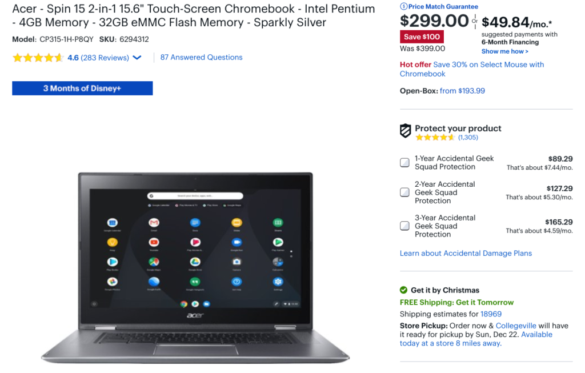
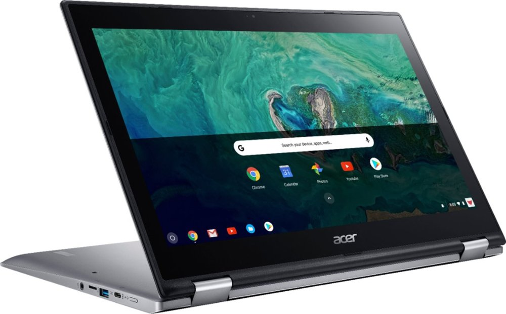
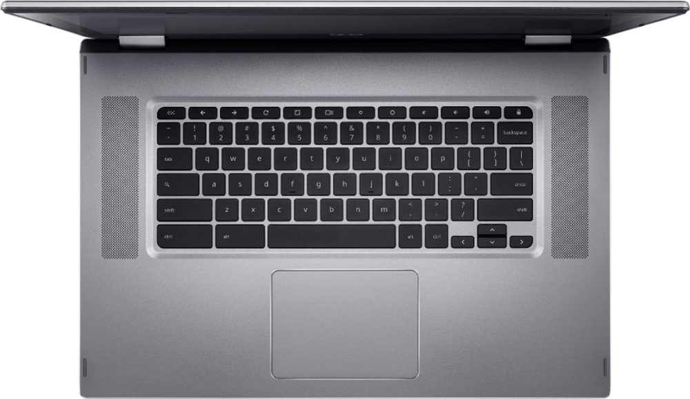

I tend to feature deals on higher-end Chromebooks but the current $100 savings on an Acer Chromebook Spin 15 makes it appealing for basic use with a big screen on a budget.

Normally priced at $399, this [15.6-inch convertible Chromebook is down to $299](https://www.bestbuy.com/site/acer-spin-15-2-in-1-15-6-touch-screen-chromebook-intel-pentium-4gb-memory-32gb-emmc-flash-memory-sparkly-silver/6294312.p?skuId=6294312).

For under $300, you're not getting a powerful Intel Core processor, nor do you get more than 4 GB of memory.

But this combination is perfectly fine for basic browsing as long as you don't get too "tab happy": Keep the number of open tabs to 10 or less and you should be fine.

I'd drop that number by two or three tabs for every Android app you might open at the same time too.

What you do get is a large, 15.6-inch touchscreen with 1920 x 1080 resolution and backlit keyboard. That combination generally can't be touched for under $350 to $400.

Here's the rest of the specifications:

<table class=""><tbody><tr><td>Processor</td><td>Quad-core Intel Pentium 4200 clocked at 1.1 GHz</td></tr><tr><td>GPU</td><td>Intel HD Graphics 505</td></tr><tr><td>Memory</td><td>4 GB LPDDR4</td></tr><tr><td>Storage</td><td>32 GB eMMC, memory card slot</td></tr><tr><td>Display</td><td>15.6-inch 1080p IPS touchscreen</td></tr><tr><td>Connectivity</td><td>802.11ac WiFi, Bluetooth 4.2</td></tr><tr><td>Input</td><td>Backlit keyboard, Gorilla Glass trackpad</td></tr><tr><td>Camera</td><td>wide-view HDR webcam</td></tr><tr><td>Speakers</td><td>Stereo to the left and right of the keyboard</td></tr><tr><td>Ports</td><td>2 USB Type-C, 2 USB Type-A, headphone jack</td></tr><tr><td>Battery</td><td>4670 mAh, claimed runtime of 13 hours</td></tr></tbody></table>

This [laptop was introduced back in May of 2018](https://www.aboutchromebooks.com/news/acer-introduces-chromebook-spin-15-covertible-and-chromebook-15/) and has a Chrome OS automatic update expiration date of June 2024, so you're covered with software updates for the next four-and-a-half years.

The bezels are a bit large and at 4.85 pounds this isn't a Chromebook I'd likely want to carry around too much, so there are some additional tradeoffs.

For an "at-home" device on the desk or coffee table, however, this is a good deal if you just need the basics on a large screen and you keep your expectations in check.
