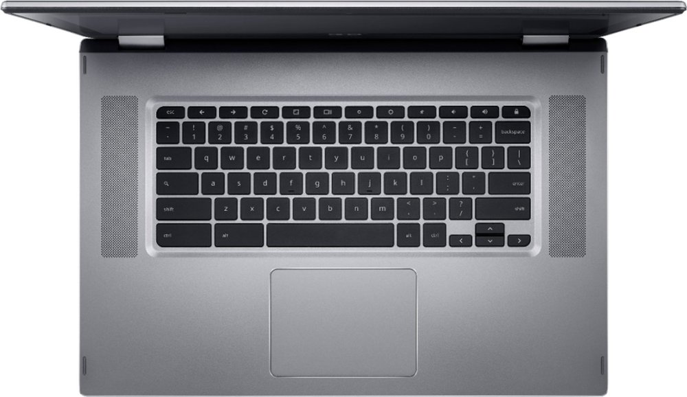

There aren't many Chromebooks in the 15-inch and up range so for those who want a large display, choices are fairly limited. While you can get a [top-end 15.6-inch Chromebook from Lenovo for around $549.99 on sale](https://www.lenovo.com/us/en/laptops/lenovo/student-chromebooks/Yoga-Chromebook/p/88YGCC61096), that price tag doesn't fit everyone's budget. If you're looking to spend less, you may want to [check out the Acer Chromebook Spin 15, currently discounted to $329 at Best Buy](https://www.bestbuy.com/site/acer-spin-15-2-in-1-15-6-touch-screen-chromebook-intel-pentium-4gb-memory-32gb-emmc-flash-memory-sparkly-silver/6294312.p?skuId=6294312).

I'd never compare the performance between a $329 Chromebook with Intel Pentium N4200 processor and the Core i5 in the Lenovo Chromebook Yoga C630 that's costs $220 or more, of course.

You're not going to get Core processor performance in a Chromebook with display this large for a few hundred dollars. And you're limited by the 4 GB of memory and 32 GB of storage, although you can use a microSD card to expand the storage capacity.

So keep your expectations in check: This is an ideal plastic Chromebook for basic browsing and Android apps, provided you store most of your work in the cloud or are willing to throw a memory card inside.

Having said that, there's a case to be made for the Acer Chromebook Spin 15 at this price, even with its limited internal hardware.

You're getting a full HD, 1920 x 1080 IPS 16:9 touchscreen with 360-degree hinge, for example. And you'll have two pairs of both USB Type-A and Type-C ports as well as a wide-view 720p HDR camera and backlit keyboard.. Plus, a larger device typically has a larger battery; Acer says you can expect up to 13 hours of run-time, although I suspect 10 or so is more likely.

The Acer Chromebook Spin 15 will get automatic Chrome OS software updates through June of 2024, so you're still looking at 4+ years of support in that category.

Are there better 15.6-inch Chromebooks out there? Of course! But not everyone wants or needs to spend $550 or more to get an everyday machine.
