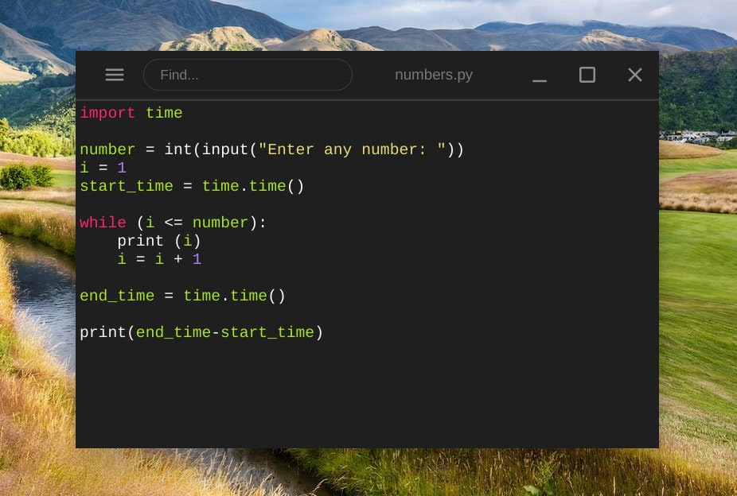

Last week, I shared some [first impressions of the Acer Chromebook Spin 513 LTE](https://www.aboutchromebooks.com/news/hands-on-acer-chromebook-spin-513-lte-first-impressions/). It's a very light and reasonably well-built Chromebook. Indeed, it's one of the few with an integrated LTE radio. After using it as my daily driver for the last week, is it [worth the $699 price tag](https://www.acer.com/ac/en/US/content/professional-model/NX.AA6AA.001)? Read on to find out in my Acer Chromebook Spin 513 LTE review.

## This is really for the enterprise

To level-set expectations here, Acer does list this under their Enterprise models. That means while consumers can purchase these models, they may be paying for something they don't need: The Chrome Enterprise Upgrade license. I actually thought the Acer Chromebook Spin 513 LTE configuration I was sent includes that for the $699. But that's not what the Acer product page shows. For that, you have to pay $799.

Compared to the [$399 non-LTE configuration of the Acer Chromebook Spin 513](https://www.acer.com/ac/en/US/content/models/laptops/acerchromebookspin513), you're paying $300 extra for the LTE radio, double the memory, and double the local storage. That's a big ask in terms of a price premium for consumers, less so for enterprises.

It's an even bigger ask when you consider what you're getting for the price and how well the device performs. Let's see what I mean in this Acer Chromebook Spin 513 LTE review.

## Specs and performance

The display is great. I'm not sure of the exact brightness but I'd estimate it to be around 300 nits.

And I appreciate having more memory to keep more apps and tabs open at once. Using older WiFi, and to a lesser extent, older Bluetooth, standards are a bit of a letdown. So too are the downward-firing speakers but they're fine for some light music and the occasional video. I'd recommend headphones though for just about any Chromebook with a few exceptions.

None of these observations are universal deal-breakers. Save for the processor, this is a nice little package that you'd find in a mid-range Chromebook. Plus it's surprisingly light and thin. There are enough ports for most people and there is a USB Type-C on each side of the chassis.

There are a fair bit of plastic materials here. However, that doesn't compromise the sturdiness. Overall, aside from the top row of keys, which are a little more loose and clicky than the rest, the build quality is solid.

Here's a rundown of the Acer Chromebook Spin 513 LTE specs:

<table><tbody><tr><td>CPU</td><td>Octo-core <a href="https://www.qualcomm.com/products/snapdragon-7c-compute-platform" target="_blank" rel="noreferrer noopener">Qualcomm Snapdragon 7c Computer Platform</a> up to 2.4 GHz</td></tr><tr><td>GPU</td><td>Adreno 618 Graphics</td></tr><tr><td>Display</td><td>13.3-inch IPS 1920 x 1080 display, glossy finish, Gorilla Glass, 16:9 aspect ratio</td></tr><tr><td>Memory</td><td>8 GB DDR4x 2133MHz memory</td></tr><tr><td>Storage</td><td>128GB eMMC 5.1 storage microSD card slot for expansion</td></tr><tr><td>Connectivity</td><td>802.11ac (2x2) WiFi 5, Bluetooth 5, Cat 12 LTE downloads supporting up to 600 Mbps, Cat 13 LTE uploads supporting up to 150 Mbps</td></tr><tr><td>Input</td><td>Backlit keyboard, multi-touch Gorilla Glass trackpad 720p webcam</td></tr><tr><td>Ports</td><td>1 USB Type-A 3.2 (Gen 2), 2 USB Type-C 3.2 (Gen 12 supporting PD 3.0, data and DisplayPort, headphone/microphone combo jack</td></tr><tr><td>Battery</td><td>2-cell 4670 mAh, expected run-time up to 14 hours</td></tr><tr><td>Weight</td><td>2.65 pounds</td></tr><tr><td>Software</td><td>Chrome OS automatic updates through June 2029</td></tr></tbody></table>

Simply put, this is essentially an entry-level Chromebook when it comes to performance.

That shouldn't surprise anyone who's paid attention to the Qualcomm Snapdragon 7c chipset since its 2019 debut. The first words on Qualcomm's product page for this platform spell it out: "The Snapdragon 7c compute platform is upgrading what you should expect in an entry-level PC."

The goal for Qualcomm was to get some performance boost over the Intel Celerons and Pentiums back then while also adding some power efficiency to add more battery life. And I think Qualcomm has done that. But if you're buying a Chromebook today, you probably aren't looking for a device with performance and battery life from 2019.

Instead, you're considering something with newer internals, and here's where the Acer Chromebook Spin 513 LTE stacks up with two recent models. I have benchmark data on the [2020 Lenovo Flex 5 with 10th-gen Core i3](https://www.aboutchromebooks.com/news/lenovo-flex-5-chromebook-hands-on-and-first-impressions/) and the new [Lenovo IdeaPad 5i with a current-generation Pentium that I recently reviewed](https://www.aboutchromebooks.com/news/lenovo-ideapad-5i-chromebook-review-a-potent-pentium-powered-laptop/). Note that device costs $440 at full pr

I realize the Core i3 in the Flex 5 isn't what most people would consider an entry-level chip. But that Chromebook can be had for around 50% less than the cost of the Acer Chromebook Spin 513, so I'm including it for perspective.

<table class="has-fixed-layout"><tbody><tr><th class="has-text-align-center" data-align="center">Test</th><td class="has-text-align-center" data-align="center"><strong>Acer Chromebook Spin 513 1st-gen Snapdragon 7c</strong></td><th class="has-text-align-center" data-align="center">IdeaPad 5i 11th-gen Pentium</th><th class="has-text-align-center" data-align="center">Flex 5 10th-gen Core i3</th></tr><tr><td class="has-text-align-center" data-align="center">Speedometer 1.0</td><td class="has-text-align-center" data-align="center">88.1</td><td class="has-text-align-center" data-align="center">249.8</td><td class="has-text-align-center" data-align="center">207</td></tr><tr><td class="has-text-align-center" data-align="center">Speedometer 2.0</td><td class="has-text-align-center" data-align="center">49.4</td><td class="has-text-align-center" data-align="center">144.0</td><td class="has-text-align-center" data-align="center">118</td></tr><tr><td class="has-text-align-center" data-align="center">JetStream 2</td><td class="has-text-align-center" data-align="center">53.96</td><td class="has-text-align-center" data-align="center">130.35</td><td class="has-text-align-center" data-align="center">113.87</td></tr><tr><td class="has-text-align-center" data-align="center">Basemark 3.0</td><td class="has-text-align-center" data-align="center">256.08</td><td class="has-text-align-center" data-align="center">1,032.8</td><td class="has-text-align-center" data-align="center">528.1</td></tr><tr><td class="has-text-align-center" data-align="center">Octane 2.0</td><td class="has-text-align-center" data-align="center">22,053</td><td class="has-text-align-center" data-align="center">47,152</td><td class="has-text-align-center" data-align="center">42,429</td></tr></tbody></table>

Higher numbers are better

My usage experience is pretty comparable to what the numbers suggest. In 2021, the Qualcomm Snapdragon 7c just can't compete.

Doing my regular daily tasks (save for coding in Linux) work fine but aren't quick. There are times when I'll click something and there's a noticeable lag before any action is taking by the Spin 513 LTE. It's as if you have a click and small wait type of interface, rather than a click and see something happening experience. Don't get me wrong: If you're fine with entry-level performance and aren't expecting a continuously snappy workflow, you'll get your tasks done.

Even writing this review on it got a little frustrating though. With about 6 tabs open, my typing wouldn't appear on the screen for a second or two near the end.

Still, for basic online browsing, writing, email, social media, and content consumption. It all works. It's just not optimal for the $699 price although I will say YouTube video streaming at 1080p is a good experience with few to no dropped frames.

As I've previously noted, I don't use many Android apps on my Chromebook these days. I did test a few and they ran perfectly fine just as they would on an Android phone. I didn't test any intense games but other reviews have noted less than stellar performance in that regard.

Here's what [Chrome Unboxed had to say about Android games](https://chromeunboxed.com/acer-chromebook-spin-513-review-snapdragon-7c) on the non-LTE version:

> I fully expected Android apps to fly on this thing since Qualcomm Snapdragon chips are the standard in nearly all Android phones.  It was actually the opposite, however, and games that play surprisingly well on the lesser Lenovo Chromebook Duet and its MediaTek MT8183 processor were pretty awful on the Spin 513.  Call of Duty Mobile wouldn’t let me move the graphics up past the lowest options and PUBG Mobile was just as choppy and messy on this Chromebook as it is on Intel devices. 

Given the performance experience, I wouldn't use Linux on this Chromebook for my needs, which are fairly intensive. Still, I did install Linux to run the same basic test I performed on more recent Chromebooks that cost less.

I used my very simple Python script to print out the numbers 1 to 1,000,000 sequentially. The test then displays the time, in seconds, indicating how long the script took to run.

No, it's not ideal and it probably tests the ALU (Arithmetic Logic Unit) of the processor more than anything else.

Even so, you can assume Linux apps aren't going to run as fast here by comparison:

<table class="has-fixed-layout"><tbody><tr><td class="has-text-align-center" data-align="center">Spin 513</td><td class="has-text-align-center" data-align="center">35.52</td></tr><tr><td class="has-text-align-center" data-align="center">IdeaPad 5i</td><td class="has-text-align-center" data-align="center">9.963</td></tr><tr><td class="has-text-align-center" data-align="center">Flex 5</td><td class="has-text-align-center" data-align="center">11.78</td></tr></tbody></table>

All times in seconds, lower numbers are better

For occasional, lightweight Linux use, the Acer Chromebook Spin 513 LTE again will work. Just don't expect it to work quickly.

## Battery life is quite good

One of the benefits of having that ARM-based processor inside a Chromebook is better power efficiency than most x86-powered Chromebooks. Both Acer and Qualcomm should be commended here.

No, the claim of 14 hours expected run-time wasn't met in my testing, my average usage was between 10 and 11 hours on WiFi. And that's more than acceptable in my book for such a light device. Note that using the LTE connection will hit the battery harder. But even here, working all day on an LTE connection got me through 8 hours of usage.

## LTE is nice to have and works well

The star of the show here is clearly the LTE capabilities. This isn't the fastest LTE modem you can find on a mobile device but it does the job admirably. Connectivity is seamless to set up and seamless to use.

I literally just popped the T-Mobile SIM card out of my iPhone 12 and inserted it into the Acer Chromebook Spin 513 LTE for testing. Chrome OS quickly ran through the one-time setup and I had mobile broadband connectivity.

There's little point to sharing or testing mobile broadband speeds as they really only apply to my coverage area. Suffice it to say, if you have good LTE coverage, this Chromebook will easily keep you online and productive. Downloads are roughly four times faster than uploads but I don't see that as a major issue for most online activities when using this Chromebook.

## Should you buy it after reading this Acer Chromebook Spin 513 LTE review?

The value proposition here is pretty clear. For $699, you're getting a nice Chromebook with basic performance but with the addition of that integrated LTE modem.

If you have to have LTE inside your Chromebook, then sure, this is a viable option. I'd remind you though that there [are a few other LTE Chromebooks](https://www.aboutchromebooks.com/news/want-an-lte-chromebook-here-are-your-current-options/) that will offer similar performance but cost much less. Or you can spend more, get your LTE and have much better performance.

The [Samsung Galaxy Chromebook Go costs $349](https://www.aboutchromebooks.com/news/samsung-galaxy-chromebook-go-with-5g-lte-lands-at-att/), not including the data plan, for example. You'll get a comparable Intel Celeron N4500 inside but you are giving up a nice display: The Chromebook Go uses a 768p display, which is a shame.

Again, as I stated earlier, the Acer Chromebook Spin 513 LTE is targeted at the enterprise user. That's why you're getting and paying for a Chrome OS Enterprise upgrade license. Consumers don't need that, so given the price to value ratio, I'd say most consumers should pass on this model.

Enterprise users? Since you're not likely paying for the device, if your needs can be met by an entry-level Chromebook and you want mobile broadband, it might make sense. Keyword: might.
