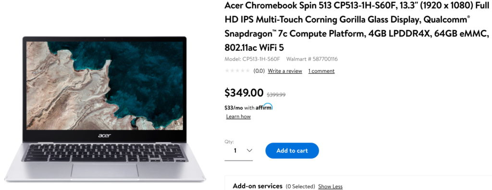
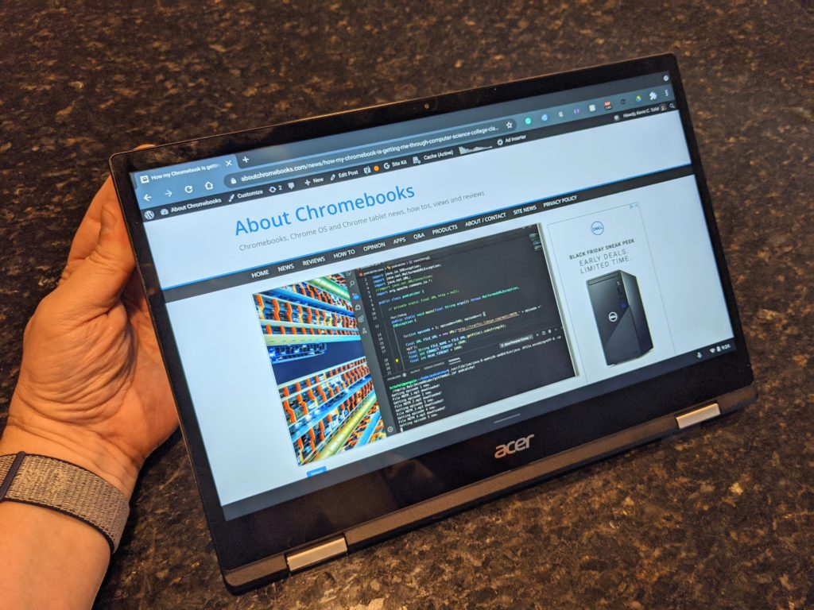

After taking [a first look at the Acer Chromebook Spin 513 with Qualcomm Snapdragon 7c back in October](https://www.aboutchromebooks.com/news/hello-acer-chromebook-spin-513-the-first-with-a-qualcomm-snapdragon-7c/), I was cautiously optimistic about the laptop. Build quality was decent and the display was quite good but there was still a big unknown: That Snapdragon chip. Now that some people have taken this convertible for a "spin", most of the unknown is known. Here's what various folks found, presented in an Acer Chromebook Spin 513 review roundup.

First a quick answer to the preemptive question of: "Why didn't you review it?" That's a great question! I had been in contact with Acer from October and was told I'd be getting a review unit. Then all went quiet around the time I was reporting on the various pricing for this device. Maybe it was just an oversight and at this point, I may simply buy my own for review.

I should be clear that while the [Acer site first showed $479](https://www.aboutchromebooks.com/news/acer-chromebook-spin-513-starts-at-479-with-snapdragon-7c/) and then [$529 for the Chromebook Spin 513](https://www.aboutchromebooks.com/news/uh-oh-acer-chromebook-spin-513-prices-are-now-50-higher/), the reviewed base model has a $399 MSRP. As of last week, [you can buy it at Walmart for $349](https://www.walmart.com/ip/Acer-Chromebook-Spin-513-CP513-1H-S60F-13-3-1920-x-1080-Full-HD-IPS-Multi-Touch-Corning-Gorilla-Glass-Display-Qualcomm-Snapdragon-7c-Compute-Platform/973209903). I suspect the $529 model includes LTE support as the $399 configuration as tested does not. As I said previously, adding an LTE radio (and the royalty license for it) typically adds $120 to a device. Personally, I think the whole pricing information being put on the Acer site was a bit of a confusting fiasco, but that's just me.

Anyway, question answered; at least to the best of my ability. Now, on to the various reviews!

## Chrome Unboxed didn't like it at the higher price but thinks is a good value now

Based on the publicly available pricing information, [Chrome Unboxed initially thought that $529 was a tough sell for the Acer Chromebook Spin 513](https://chromeunboxed.com/acer-chromebook-spin-513-review-snapdragon-7c). They actually had to re-cut part of their video as they got the $399 pricing after getting the device. I can understand the initial thought: For about the same price, you can get a far more powerful Chromebook with Core i3 at the sacrifice of battery life.

And the battery life is a key part of the value equation here. Going for 8 or 9 hours with the screen brightness at 75% is quite good while dropping brightness to 50% gets you close to 13 hours with the Acer Chromebook Spin 513. Performance may not yet be consistent due to some optimizations needed for Chrome OS with this processor. Browsing and web work is certainly possible as long as you don't push the limits by using an external monitor. Hopefully, some software updates provide a boost in the near future.

Here's their full review video covering those and many other points:

https://youtu.be/IAofQ5En1nY

## Android Authority: Snapdragon is better for Chrome OS than Windows

[I enjoyed reading the Android Authority review](https://www.androidauthority.com/acer-chromebook-spin-513-review-1221822/), mainly because it's the only one where the reviewer had prior experience with the Snapdragon 7c. That was for Windows on ARM, of course, so this provides a nice comparison between which of the two operating systems does "more with less", so to speak:

> As for day-to-day use, I’ve tested [the Snapdragon 7c in Windows machines](https://www.androidauthority.com/lenovo-flex-5g-review-1140612/) and can tell you that basic performance of this chip is solid. Whereas in Windows machines the Snapdragon 7c introduces an app limitation based on the ARM compute profile, you’ll find no such limitations here in Chrome OS. The 7c delivers the power the Spin 513 needs to push through everyday tasks. It allowed the device to download and install Android apps, and it never suffered from slowdowns or lag while I tested the Chromebook.

Overall, the Acer Chromebook Spin 513 earned an 8 out of 10 in this review, which was mostly positive. However, there was no mention of Android app performance, nor Linux (but that's not what this Chromebook is intended for), so keep that in mind.

## Android Central wasn't impressed with the performance

You sort of know what to expect when [the headline of this review](https://www.androidcentral.com/acer-chromebook-spin-513-review) included "Sending a mobile processor to do a desktop's job". Android Central found similar lagginess reported by Chrome Unboxed when using an external monitor, for example. Multitasking also left a little to be desired.

> The 7c is meant to compete with the Celeron and MediaTek Chromebooks that dominate the budget-end of the market, and it does that decently — or at least it will once Google finishes optimizing for it. But I know many of you are interested in this Chromebook for the processor, so I need to be blunt about its limitations: it's a budget-minded processor that's geared towards casual computing and battery efficiency, and it shows.

Even so, the review echoed a common theme: Priced in the entry-level segment, the Acer Chromebook Spin 513 has great battery life, a very nice display, and an overall design. I can vouch for the latter two bits myself as that's the impression I got in October, even with that not being final hardware and software.

## The Verge rates it a 7.5 out of 10

As long as you expect an entry-level experience for the entry-level price, The Verge thinks [the Acer Chromebook Spin 513 has a place in the market](https://www.theverge.com/22412759/acer-chromebook-spin-513-review-specs-price). The device got high marks for the design (again), the display (again), pen support, and battery life.

Aside from similar performance experiences, The Verge isn't too keen the lack of a microSD card slot. I know some folks won't buy a Chromebook without one but I'm actually in the minority here.

I can live without expandable storage because my workflow is almost completely cloud-based. I might be able to get by with 32 GB of storage although a 64 GB minimum is the better option for me. Note that I don't install many Android apps and with Linux usage, storage is super important. But I wouldn't buy an entry-level device for what I need to do in Linux.

For the average everyday browser or an education focused laptop, The Verge suggests this is worth a look.

## What do you think?

After reading or watching the Acer Chromebook Spin 513 reviews, what do you think? Some might have expected more from the Snapdragon 7c, but keep in mind, it's already getting a bit old by comparison to other ARM chips. Then again, so is the MediaTek MT8183, which is why the next generation of ARM processors, currently in the works, might be worth waiting for. Or not, depending on what you need a Chromebook for.

If it's for basic web tasks and not a ton of multitasking, the Acer Chromebook Spin 513 is a nice package overall with excellent battery life for under $400.
