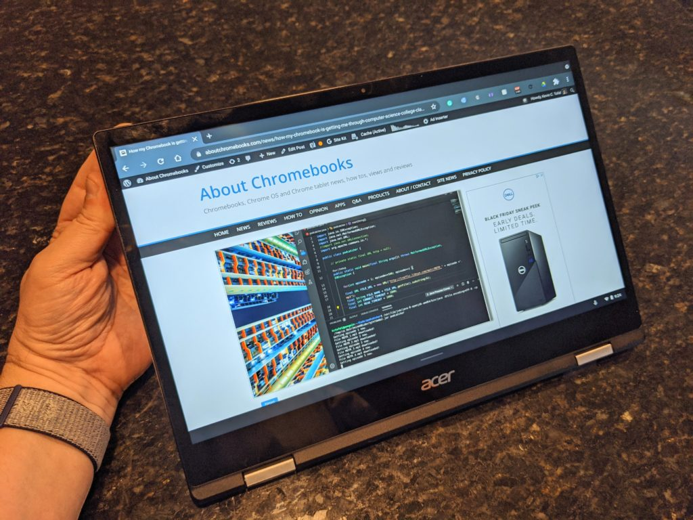

Remember that [Qualcomm Snapdragon 7c-powered Acer Chromebook Spin 513 I got an early look at in October](https://www.aboutchromebooks.com/news/hello-acer-chromebook-spin-513-the-first-with-a-qualcomm-snapdragon-7c/)? This LTE-option convertible Chromebook was expected by the first quarter of this year. It hasn't on sale yet, but it appears that availability is imminent. [Acer is now showing two US models with pricing and "Buy Now" links](https://www.acer.com/ac/en/US/content/models/laptops/acerchromebookspin513) that don't yet point to sellers. You can see the Acer Chromebook Spin 513 starts at $479 with the Qualcomm Snapdragon 7c.

To be clear though, there are two models and the price difference between the two is only $20. I'm scratching my head on that one as that's a small premium to pay for a doubling of system memory from 4 GB to 8 GB. Note that in the UK, [a base model with 4 GB of memory costs £399.99](https://www.aboutchromebooks.com/news/acer-chromebook-spin-513-with-snapdragon-7c-available-in-the-uk-for-399-99/), [but only has 32 GB of local storage](https://www.aboutchromebooks.com/news/acer-chromebook-spin-513-with-snapdragon-7c-available-in-the-uk-for-399-99/).

Note also a key point: Neither of these two models shows LTE for connectivity when drilling down on the specifications. I'd fully expect additional configurations to be made available that include LTE.

The price to add mobile broadband is anyone's guess, but it generally costs at least $100 on a laptop or tablet. I suppose it's possible that you can buy this model and pay to enable the Qualcomm Snapdragon X15 LTE modem radio as I believe it's integrated with the processor board.

It's also worth mentioning that there's no microSD card slot on the Acer Chromebook Spin 513, so the local storage you get is what you get.

As far as what you do get for just under $500, here are the specifications:

<table class=""><tbody><tr><td>CPU</td><td>Qualcomm Snapdragon 7c, Qualcomm Kryo 468 Octa-core 2.40 GHz</td></tr><tr><td>GPU</td><td>Qualcomm Adreno 618 shared memory</td></tr><tr><td>Display</td><td>13.3-inch 16:9 1920 x 1080 IPS touchscreen</td></tr><tr><td>Memory</td><td>4/8 GB DDR4x</td></tr><tr><td>Storage</td><td>64 GB eMMC 5.1</td></tr><tr><td>Connectivity</td><td>WiFi 5 (802.11ac), Bluetooth 5.0</td></tr><tr><td>Input</td><td>Backlit keyboard, multitouch trackpad, microphone, 720p webcam</td></tr><tr><td>Ports</td><td>2 USB Type-C (3.2) with DP and PD, 1 USB Type-A (3.2), combination microphone / headphone jack</td></tr><tr><td>Battery</td><td>45 WHr, claimed run-time of 13.5 hours</td></tr><tr><td>Weight</td><td>2.65 pounds</td></tr><tr><td>Software</td><td>Chrome OS automatic update expiration date: June 2029</td></tr></tbody></table>

When I took my early look at the device, I wasn't able to test performance. That's fair as both the hardware and software were still under development. So that's my biggest open question at this point, as I suspect is the same one for many others as well.

Yes, we've seen some [early benchmarks with a Qualcomm reference device](https://www.aboutchromebooks.com/news/snapdragon-7c-chromebook-test-roughly-equivalent-to-the-pentium-silver-n5030/ "Snapdragon 7c Chromebook test: “roughly equivalent to the Pentium Silver N5030”") that look solid in some areas but "roughly equivalent to the Pentium Silver N5030" in others. I'll need time with a review unit before making a judgment, of course.

