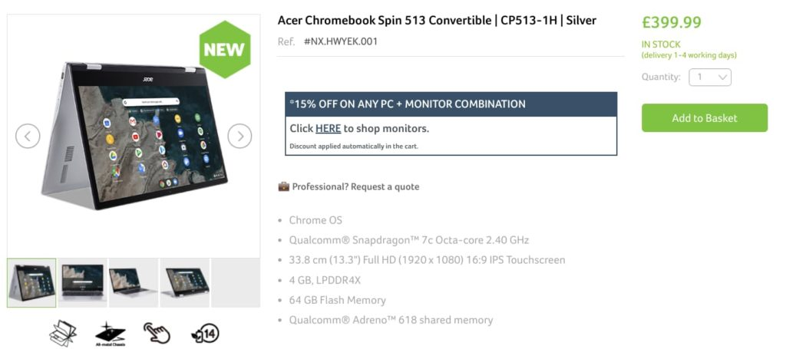

Ever since I got [an early look at the Acer Chromebook Spin 513](https://www.aboutchromebooks.com/news/hello-acer-chromebook-spin-513-the-first-with-a-qualcomm-snapdragon-7c/ "Hello Acer Chromebook Spin 513: The first with a Qualcomm Snapdragon 7c"), I've been waiting for pricing information and availability in the U.S. Looks like I'm still waiting. Folks in the UK, however, can purchase this Qualcomm Snapdragon 7c-powered convertible Chromebook now for £399.99.

The [UK Acer store shows the availability of 1-4 working days](https://store.acer.com/en-gb/acer-chromebook-spin-513-convertible-cp513-1h-silver) if you want to order this Chromebook.

Being the first with Qualcomm's Snapdragon 7c platform, I'd be a little cautious though. This chipset launched in late 2019 and isn't yet proven to provide a solid Chrome OS experience.

That doesn't mean you shouldn't buy it. Just know that without any history of performance, you really can't know what to expect. When I had an early model of this device back in October I wasn't allowed to run performance tests, so I can't offer any insights.

Note too that this is the base model, which we expect to cost $399 in the U.S.

So you're getting 4 GB of memory unlike the 8 GB of RAM I had in my pre-production unit. Also, there's no LTE support option with the base configuration. That should help with battery life, which Acer claims up to 14-hours.

Obviously, I couldn't test that with a pre-production model either since the final hardware and software would be different.

Strangely, a few [early buyers of this device](https://www.reddit.com/r/chromeos/comments/lybrvr/acer_spin_513_runs_32bit_chrome_os/ "https://www.reddit.com/r/chromeos/comments/lybrvr/acer_spin_513_runs_32bit_chrome_os/") are reporting that the version of Chrome OS on the Acer Chromebook Spin 513 is 32-bit. That's not necessarily a problem but it suggests to me that Google still hasn't fully optimized Chrome OS for this chip.

[Qualcomm has clearly stated 64-bit architecture support for the Snapdragon 7c](https://www.qualcomm.com/products/snapdragon-7c-compute-platform "https://www.qualcomm.com/products/snapdragon-7c-compute-platform"), so the hardware is capable. Seemingly, the software isn't. Or Google has simply decided to have this version run a 32-bit userland space since the memory is limited to 4 GB and wouldn't benefit from 64-bit support.

Either way, if you want to take the chance and you live in the UK, or want to have a device shipped elsewhere, now's your chance.
