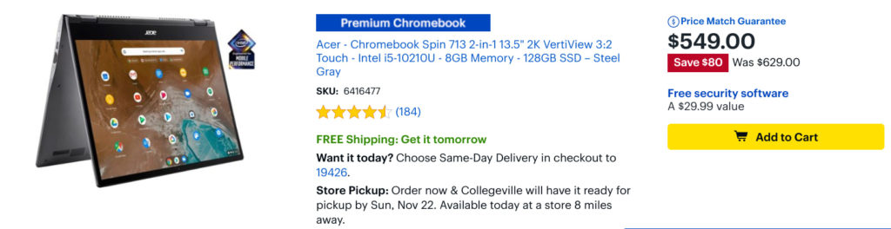

When [I reviewed the Acer Chromebook Spin 713](https://www.aboutchromebooks.com/news/acer-chromebook-spin-713-review/), I said it was in the running for my "Chromebook of the year" pick. For $629, you get a high-end convertible with 10th-gen Intel Core i5 paired with 8 GB of memory, which is more than enough horsepower for most people. I think it's a great value at that price but it's [on sale at Best Buy now for $549](https://www.bestbuy.com/site/acer-chromebook-spin-713-2-in-1-13-5-2k-vertiview-32-touch-intel-i5-10210u-8gb-memory-128gb-ssd-steel-gray/6416477.p?skuId=6416477).

From my review:

The price to value ratio for the Acer Chromebook Spin 713 is super high. It can easily handle the workload of a student who’s learning remotely. It’s ideal as an all-day browser and online productivity machine for anyone who needs more horsepower than an entry-level Chromebook. Even developers could be happy with this package based on my usage of Visual Studio Code in Linux. For Android Studio folks, you’ll probably want a Chromebook with more memory though.

Keep in mind that the Spin 713 is the successor to my daily driver purchased last year, the Acer Chromebook Spin 13. Not only is [the Spin 713 improved in many ways](https://www.aboutchromebooks.com/news/acer-chromebook-spin-713-vs-13-hands-on/), even at its suggested retail price is about $200 lower than the comparably equipped prior year model.

<iframe style="width:120px;height:240px;" marginwidth="0" marginheight="0" scrolling="no" align="right" frameborder="0" src="//ws-na.amazon-adsystem.com/widgets/q?ServiceVersion=20070822&amp;OneJS=1&amp;Operation=GetAdHtml&amp;MarketPlace=US&amp;source=ss&amp;ref=as_ss_li_til&amp;ad_type=product_link&amp;tracking_id=aboutchromebo-20&amp;language=en_US&amp;marketplace=amazon&amp;region=US&amp;placement=B08GCW1C9N&amp;asins=B08GCW1C9N&amp;linkId=71fadf2659d038da9bc99a06c2ab9f7b&amp;show_border=true&amp;link_opens_in_new_window=true"></iframe>

To be clear, you have to want a touchscreen with 3:2 aspect ratio if you're considering the Spin 713. I find the speakers to be lacking in quality as well, so that's something to consider dealing with or preparing to use headphones for audio content. There's also no integrated stylus like the Spin 13 has but truth be told: I didn't buy that model for the digital pen. Unless having one is important to you, it's an easy feature to do away with.

Aside from the very capable Core i5 CPU, there's another nice hardware upgrade in the newer Spin 713 as well: NVMe storage [which is much faster than the eMMC storage used in most other Chromebooks](https://www.aboutchromebooks.com/news/first-chromebook-buyers-guide-for-every-budget-2020/). There are exceptions such as the Asus Chromebook Flip C436 and Samsung Galaxy Chromebook. They use faster NVMe storage but cost $799 and $999, respectively. Acer has somehow found a way to get high-end Chromebook components in the Spin 713 while keeping the cost much lower than its competitors.

Simply put, you're getting a lot of Chromebook for the money here. Unless your budget is still in the sub-$500 range or you only need an entry-level device, the Acer Chromebook Spin 713 at this price is a great deal. Here's a rundown of the specs to give you an idea why I think that:

<table class=""><tbody><tr><td>CPU</td><td>Intel Core i5-10210U Processor</td></tr><tr><td>GPU</td><td>Intel UHD 620 Graphics</td></tr><tr><td>Display</td><td>13.5-inch 3:2 2256 x 1504 touchscreen, USI stylus support</td></tr><tr><td>Memory</td><td>8 GB DDR4</td></tr><tr><td>Storage</td><td>128GB PCIe NVMe SSD, microSD card for expansion</td></tr><tr><td>Connectivity</td><td>Dual-band WiFi6 (802.11ax), Bluetooth 5.0</td></tr><tr><td>Input</td><td>Backlit keyboard, multitouch trackpad, dual microphones, 720p webcam</td></tr><tr><td>Ports</td><td>2 USB Type-C (3.2), 1 USB Type-A, combination microphone / headphone jack, HDMI out</td></tr><tr><td>Battery</td><td>48 WHr, claimed run-time of 10 hours</td></tr><tr><td>Weight</td><td>3.02 pounds</td></tr><tr><td>Software</td><td>Chrome OS automatic update expiration date: June 2028</td></tr></tbody></table>

_Update: This post was originally published on November 16. As of today, the deal is back._
