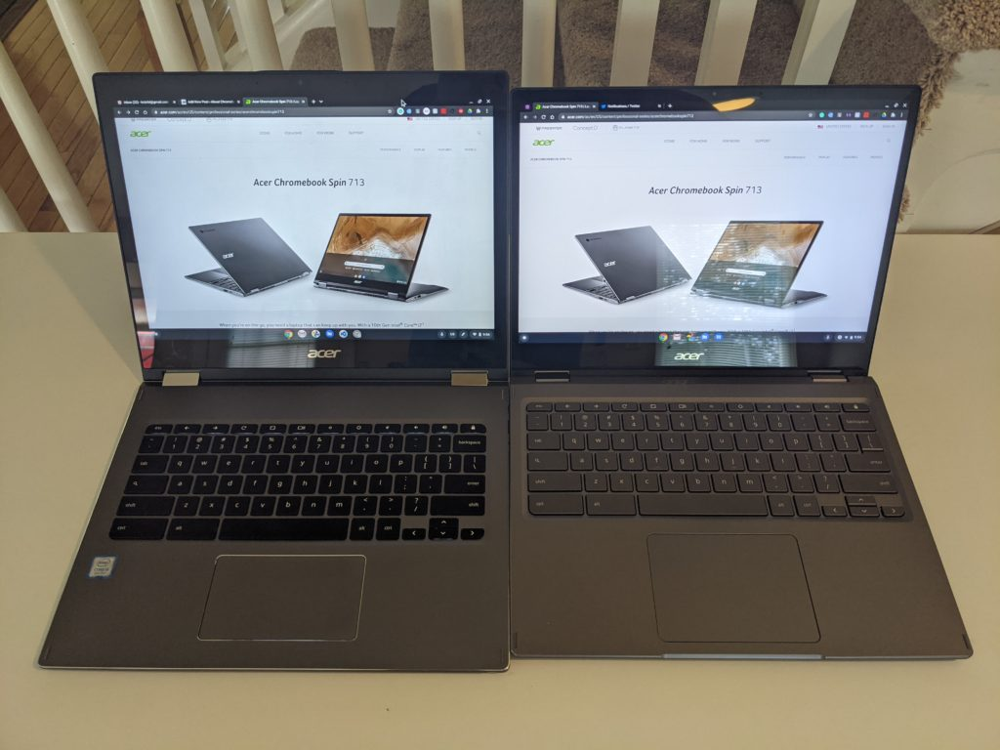

For most of the last few weeks, I've been using an [Acer Chromebook Spin 713](https://www.acer.com/ac/en/US/content/series/acerchromebookspin713) review unit. [I was impressed by this convertible Chromebook just from the first impressions](https://www.aboutchromebooks.com/news/acer-chromebook-spin-713-vs-13-hands-on/). And now? Everyday usage has confirmed my initial experience: I don't think you can buy a better Chrome OS laptop for $629.

To help explain why, let me share a little perspective.

My daily driver is the predecessor to this laptop, [Acer's Chromebook Spin 13](https://www.aboutchromebooks.com/reviews/acer-chromebook-spin-13-review-vs-pixelbook/). Most of the updates and upgrades to the Spin 713 are either cosmetic (more on that later) or newer generation components. And yet, a similar configuration of the older Spin 13 when it launched was priced in the $800 to $900 range. So as an "upgrade", you're getting more for less.

Additionally, when similarly configured to the Spin 713, Google's own [Pixelbook Go costs $849](https://www.aboutchromebooks.com/news/pixelbook-go-review-2020/). With it, you're getting a smaller and lighter Chromebook with a more modern design. Is that worth paying $229 more instead of looking at the Acer Chromebook Spin 713? For some, it might be, but you'll be giving up some features and _quite_ a bit of performance.

## Power-packed with performance

Here's what I mean about performance in general, based on benchmark runs between the three Chromebooks I've mentioned. All tests were run using the current Stable Channel of Chrome OS 85 in guest mode and with no experimental flags enabled.

<table><tbody><tr><td><strong>Test</strong></td><td class="has-text-align-center" data-align="center"><strong>Spin 713</strong></td><td class="has-text-align-center" data-align="center"><strong>Spin 13</strong></td><td class="has-text-align-center" data-align="center"><strong>Pixelbook Go</strong></td></tr><tr><td>Octane 2.0</td><td class="has-text-align-center" data-align="center">44778</td><td class="has-text-align-center" data-align="center">30450</td><td class="has-text-align-center" data-align="center">26822</td></tr><tr><td>JetStream 2</td><td class="has-text-align-center" data-align="center">120.461</td><td class="has-text-align-center" data-align="center">85.937</td><td class="has-text-align-center" data-align="center">74.619</td></tr><tr><td>Speedometer</td><td class="has-text-align-center" data-align="center">209</td><td class="has-text-align-center" data-align="center">144</td><td class="has-text-align-center" data-align="center">132</td></tr><tr><td>Speedometer 2.0</td><td class="has-text-align-center" data-align="center">119</td><td class="has-text-align-center" data-align="center">82</td><td class="has-text-align-center" data-align="center">78.7</td></tr><tr><td>BrowserMark</td><td class="has-text-align-center" data-align="center">796.04</td><td class="has-text-align-center" data-align="center">555.35</td><td class="has-text-align-center" data-align="center">505.31</td></tr></tbody></table>

Note: Higher scores are better in all tests

I wouldn't call any of these Chromebooks slow, particularly when compared to entry-level or sub-$400 options. And benchmarks are really just general performance predictors more than anything.

However, everything from boot up to browsing, along with Android apps and Linux usage, happens faster on the Acer Chromebook Spin 713. It's the fastest Chromebook I've used yet although I should note that there are higher priced Chromebooks with more powerful processors on the market.

## It's what's inside that makes the difference

Obviously, with a newer 10th-generation Core i5 processor, I'd expect the Spin 713 to be faster than older devices. The Spin 13 and Pixelbook Go both use 8th-generation Core i5 chipsets. And the main reason the Pixelbook Go benchmarks slower than the Spin 13 is because its Core i5 is a lower powered Y-Series chip. With the U-Series processor, the Spin 13 can simply outperform the Go. But it can't outperform the newer U-Series processor in the Acer Chromebook Spin 713.

There's another nice hardware upgrade in the newer Spin 713 as well: NVMe storage which is [much faster than the eMMC storage used in most other Chromebooks](https://www.aboutchromebooks.com/news/upgraded-lenovo-ideapad-flex-5-chromebook-emmc-vs-nvme-ssd/). There are exceptions such as the Asus Chromebook Flip C436 and Samsung Galaxy Chromebook. They use faster NVMe storage but cost $799 and $999, respectively. Acer has somehow found a way to get high-end Chromebook components in the Spin 713 while keeping the cost much lower than its competitors.

Lenovo does have a $479 model of its Chromebook Flex 5 with NVME storage. However, you're only getting half the memory found in the Acer Chromebook Spin 713, a lower resolution display, and a 10th-generation Intel Core i3 processor inside.

As far as the rest of the package, here are the specs of the Acer Chromebook Spin 713 review unit I've been testing:

<table class=""><tbody><tr><td>CPU</td><td>Intel Core i5-10210U Processor</td></tr><tr><td>GPU</td><td>Intel UHD 620 Graphics</td></tr><tr><td>Display</td><td>13.5-inch 3:2 2256 x 1504 touchscreen, USI stylus support</td></tr><tr><td>Memory</td><td>8 GB DDR4</td></tr><tr><td>Storage</td><td>128GB PCIe NVMe SSD, microSD card for expansion</td></tr><tr><td>Connectivity</td><td>Dual-band WiFi6 (802.11ax), Bluetooth 5.0</td></tr><tr><td>Input</td><td>Backlit keyboard, multitouch trackpad, dual microphones, 720p webcam</td></tr><tr><td>Ports</td><td>2 USB Type-C (3.2), 1 USB Type-A, combination microphone / headphone jack, HDMI out</td></tr><tr><td>Battery</td><td>48 WHr, claimed run-time of 10 hours</td></tr><tr><td>Weight</td><td>3.02 pounds</td></tr><tr><td>Software</td><td>Chrome OS automatic update expiration date: June 2028</td></tr></tbody></table>

I haven't quite seen the 10 hours of claimed run-time in my daily usage, which is comprised of a few dozen browser tabs open as well as a Linux app or two also running concurrently. However, I've never seen less than 8 active hours and I average around 9.

I suspect a battery test of looping video might hit or exceed the 10-hour mark. Acer's internal testing of video playback suggests between 11.5 and 14 hours on a single charge, so this might be good for movies on a long flight. Well, when we can fly again, that is.

Speaking of videos, they look great on this display. I think the panel is a slight upgrade from the older model because colors have a little more "pop" and the screen seems to have a bit more brightness. Video calls look great as well and none of my contacts have had any complaints with output from the built-in webcam. Whether on a video call or watching movies, you may want to use headphones, however. I can't hear any improvements to the downward-facing, under chassis dual speaker system over last year's model.

Game streaming with either Stadia or GeForce Now looks fantastic too. I've put in at least 10 hours on Red Dead Redemption 2 (shown above) without feeling I'm missing anything from a visual experience.

## Design improvements on the outside too

As I noted in my first impressions, Acer has slimmed down display bezels, boosted the size of the trackpad, and made the chassis more svelte towards the front. These small changes add up to big improvements I mentioned prior: The left, right and top display bezels are about half of what they are on my Spin 13. They’re not quite at Dell XPS levels if you’ve ever seen those laptops, but they’re getting closer.

Spin 13 on the left, Spin 713 on the right

Aside from offering a more immersive display experience, this bezel reduction makes the screen around 0.75-inches shorter on the Spin 713 as compared to the Spin 13. And it saves nearly a half-inch on the length of the chassis as well. So while these two devices look very similar, the Spin 713 is slightly smaller. The Spin 713 also shaves 0.3 pounds from the older model as a result.

While the design of the Chromebook Spin 713 isn't glitzy or glamorous -- I find it fairly generic -- it's certainly not offensive. And I appreciate the design changes. One in particular might not sound like it's worth a mention but it is. Acer put both a USB Type-C and full-sized HDMI port between the power button and the volume rocker. On the old model, these two buttons are right next to each other. I've lost track of how many times I put my older Spin 13 to sleep by hitting the power button when I wanted to change the volume.

I find the island-style keyboard comfortable to type on and the much larger trackpad is fantastic. Acer opted not to include a fingerprint reader; something typically found in comparable devices. It would be nice to have but I can live without it. And there's no included stylus like last year's model has. There appear to be [some configurations of the Spin 713 that support a USI stylus](https://community.acer.com/en/discussion/606413/spin-713-stylus) but I don't believe the model I'm reviewing does.

## Who should buy the Acer Chromebook Spin 713?

If you have the budget to spend $629 or more, I think the Spin 713 deserves a long hard look.

Yes, you can get new Chromebooks with a 10th-generation Core i7 processor or with a 4K display but that will cost you. Provided that you have to have one or both of those features and you've got the budget, then go for one of those options.

Not in that camp though? The price to value ratio for the Acer Chromebook Spin 713 is super high. It can easily handle the workload of a student who's learning remotely. It's ideal as an all-day browser and online productivity machine for anyone who needs more horsepower than an entry-level Chromebook. Even developers could be happy with this package based on my usage of Visual Studio Code in Linux. For Android Studio folks, you'll probably want a Chromebook with more memory though.

If I haven't made it clear, I'm simply amazed at what you get for the price here. The Acer Chromebook Spin 713 is already high on my short list for Chromebook of the year, although I'll make that final determination at the end of 2020.

Simply put, the Acer Chromebook Spin 713 is improved in nearly every way from its predecessor, rivaling more expensive, other Project Athena devices from Asus, HP, and Samsung. How Acer does this for $629, I don't know, but unless you're a heavy duty developer, you can't go wrong with this convertible Chromebook.

I'll wait another week before returning the review unit, so if you have any specific questions, leave me a comment. I'll do my best to answer them.
