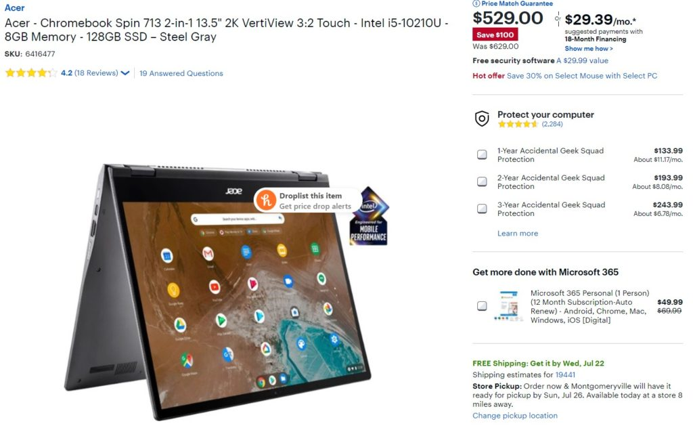
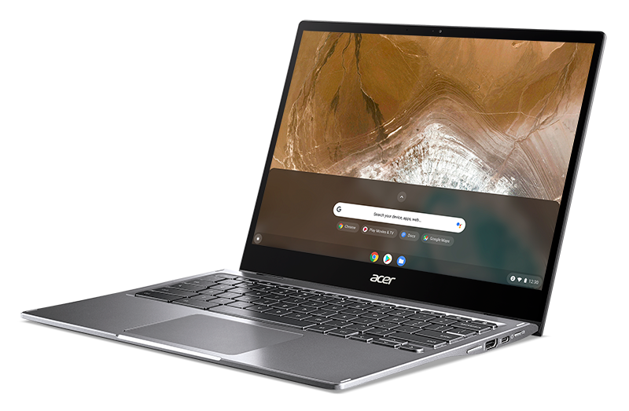
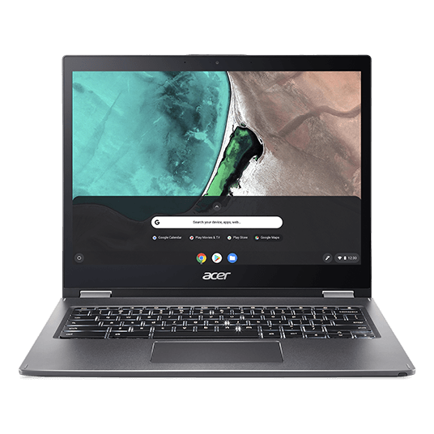

Wow, I already thought the [Acer Chromebook Spin 713 was a solid deal at $629](https://www.aboutchromebooks.com/news/acer-chromebook-spin-713-is-a-project-athena-refresh-of-my-daily-driver-the-chromebook-spin-13/) and I see today that [Best Buy is discounting this 2-in-1 by $100](https://www.bestbuy.com/site/acer-chromebook-spin-713-2-in-1-13-5-2k-vertiview-32-touch-intel-i5-10210u-8gb-memory-128gb-ssd-steel-gray/6416477.p?skuId=6416477).

I don't know how long the sale will run but you can purchase this high-end Chromebook at a mid-range price of $529 right now.

[Get the Acer Chromebook Spin 713](https://www.bestbuy.com/site/acer-chromebook-spin-713-2-in-1-13-5-2k-vertiview-32-touch-intel-i5-10210u-8gb-memory-128gb-ssd-steel-gray/6416477.p?skuId=6416477 "Get the Acer Chromebook Spin 713")

I recently pointed this device out in my [Chromebook buyers guide for every budget](https://www.aboutchromebooks.com/news/first-chromebook-buyers-guide-for-every-budget-2020/); this was a contender in the $600 and up range. And although I haven't used this particular Chromebook -- my review unit is on the way -- I have used its predecessor, the Acer Chromebook Spin 13.

In fact, I still use it every day because it's a fantastic device. [My Spin 13 has 16 GB of memory](https://www.aboutchromebooks.com/news/acer-chromebook-spin-13-with-16-gb-ram-should-you-buy-one/) while the discounted 713 has half that.

However, [everything that's good about the Spin 13 is there on the Acer Chromebook 713](https://www.aboutchromebooks.com/news/acer-chromebook-spin-713-is-a-project-athena-refresh-of-my-daily-driver-the-chromebook-spin-13/) and what's changed has made it better: A newer, 10th-gen Intel Core i5-10210U processor and 128 GB of NVMe storage.

Ironically, I just wrote about some [computer tests between eMMC/SSD and NVMe; you can check the results here but rest assured](https://www.aboutchromebooks.com/news/upgraded-lenovo-ideapad-flex-5-chromebook-emmc-vs-nvme-ssd/), everything will be faster on a Chromebook with NVMe storage save for any activities that are solely cloud-based.

Acer Chromebook Spin 13 with 3:2 aspect ratio

You'll also get an antimicrobial 13.5-inch Corning Gorilla glass display with 2256 x 1504 resolution and 3:2 aspect ratio, two USB 3.1 Type-C and one Type-A ports, a full-sized HDMI out and microSD card reader. Wireless upgrades include the newest Wi-Fi6 radios and Bluetooth 5.0 as well.

Essentially, you're getting a lot of hardware for the cost here and the device will get Chrome OS software updates through June of 2028, so almost eight years of support.

Again, I thought this was a great value at $629 for what you're getting. At $529, it's even better as long as you don't mind that 3:2 display ratio (I actually like it for productivity) and have a budget that can afford it.

[Get the Acer Chromebook Spin 713](https://www.bestbuy.com/site/acer-chromebook-spin-713-2-in-1-13-5-2k-vertiview-32-touch-intel-i5-10210u-8gb-memory-128gb-ssd-steel-gray/6416477.p?skuId=6416477 "Get the Acer Chromebook Spin 713")

_Update: This post was originally published on November, 15, 2020. The deal is currently available again)_
