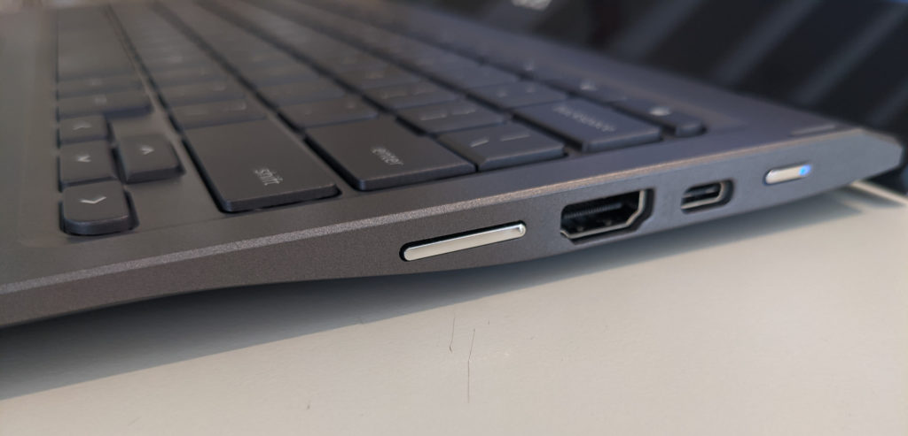
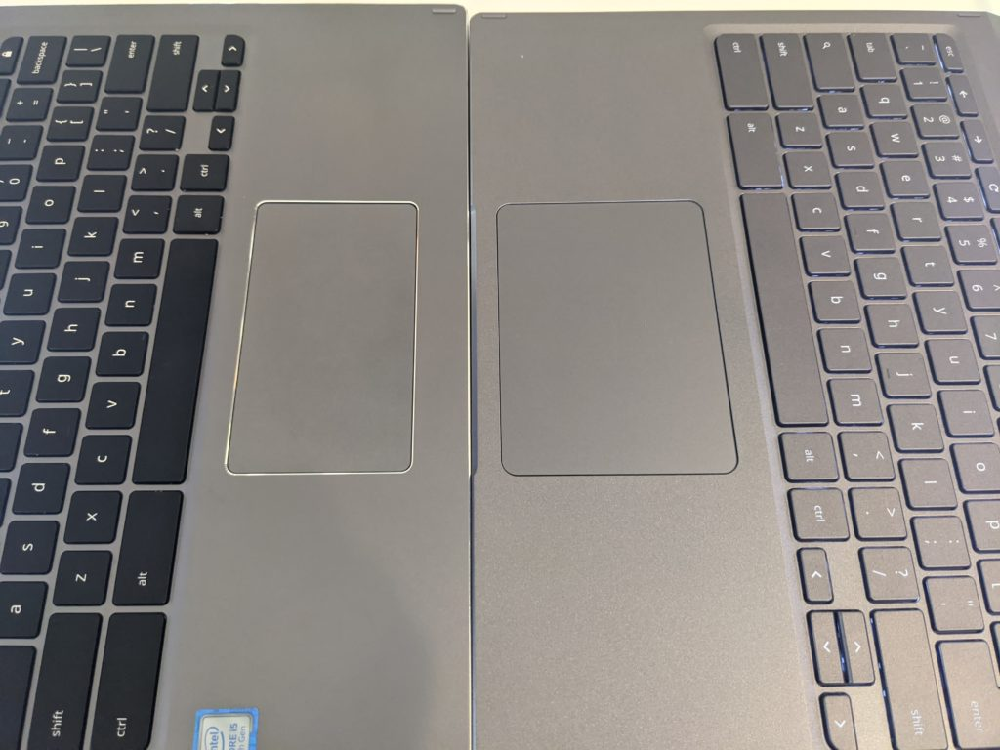
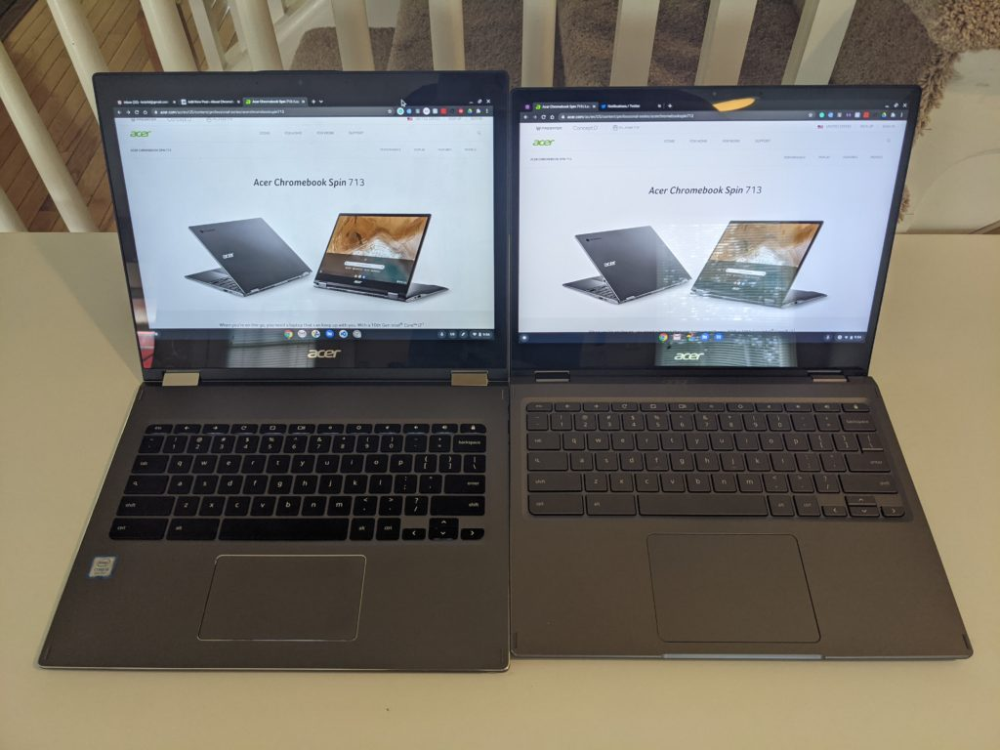

You know Chromebook inventory is low when even reviewers have to wait for a device! That's what happened to me: I've been waiting for at least a month to get [a Project Athena designed Acer Chromebook Spin 713](https://www.aboutchromebooks.com/news/acer-chromebook-spin-713-is-a-project-athena-refresh-of-my-daily-driver-the-chromebook-spin-13/) review unit from the company. It finally arrived and in my very limited experience so far, I'm super impressed by this device. It appears to be very worthy successor to my daily driver, the Acer Chromebook Spin 13.

Since I've only used the convertible Acer Chromebook Spin 713 for a few hours, I can only share initial impressions at this time.

## Key specifications and updates

Just to level-set the experience, I was loaned the base model, which retails for $629. That configuration runs on a 10th generation Intel Core i5-10210U processor, which is fan-cooled. It has 8 GB of memory and 128 GB of [NVMe storage, which is faster than the eMMC storage](https://www.aboutchromebooks.com/news/upgraded-lenovo-ideapad-flex-5-chromebook-emmc-vs-nvme-ssd/) found in most Chromebooks today.

Like my Chromebook Spin 13, this newer model has a 2256 x 1504 resolution touchscreen with 3:2 ratio, backlit keyboard, two USB 3.1 Type-C ports, one USB Type-A jack, and a microSD card reader. However, the Acer Chromebook Spin 713 adds a full-sized HDMI port, which is handy; I currently use a USB-C hub with HDMI out with the Spin 13.

While the displays are the same on paper, the Spin 713 appears slightly brighter and warmer in color to my eyes. Connectivity is upgraded as well, with Wi-Fi 6 and Bluetooth 5.0 on board. Unlike the Spin 13, there is no included stylus. And so far, the speakers of the Spin 713 don't sound any different to me; they're not very powerful and still downward firing.

The [full specs are available on Acer's product page](https://www.acer.com/ac/en/US/content/professional-models/laptops/acerchromebookspin713).

## More performance potential

Obviously, the biggest change here is in the internals. I'll share benchmarks for those who want them in my full review, but I'll tease you with this: I've never seen higher benchmark scores on a Chromebook that I've reviewed.

There is a caveat to that though: I haven't received other Project Athena review units such as the [Samsung Galaxy Chromebook](https://www.aboutchromebooks.com/tag/samsung-galaxy-chromebook/) or the [Asus Chromebook Flip C436](https://www.aboutchromebooks.com/tag/asus-chromebook-flip-c436/). As a result, I can't compare the numbers to those. Regardless, I can say that I doubt any other $629 Chromebook can beat these scores.

In my limited usage so far, I can't say I've noticed a huge performance difference yet between the Spin 713 and my Spin 13, although [the latter has double the memory](https://www.aboutchromebooks.com/news/acer-chromebook-spin-13-with-16-gb-ram-should-you-buy-one/). Still, this is a fast device. And the fan doesn't seem to run any more often, even with that speedier chipset.

Since I don't have a WiFi 6 router, I'm not seeing any faster data transfers on my home network. However, it is a bit "future proofed" by supporting the newer wireless standard when it comes time for a router upgrade.

## Fewer external changes but they're improvements

There are also some minor tweaks made to the outside of the Acer Chromebook Spin 713 from its predecessor.

The chassis itself seems more rigid to me, for example. The chiclet keyboard appears to be the same as before, but it's moved up closer to the display, which provides more space for your wrists and, more importantly, room for a much larger trackpad. This is one of the largest external improvements when it comes to usability so far.

Spin 13 on the left, Spin 713 on the right

On the flipside, I'm surprised that the keyboard doesn't have a fingerprint sensor like the other Project Athena Chromebooks do.

The chassis itself is slightly thinner in the front half: Acer tapered the design from the input ports forward for a more pleasing look. The overall thickness of this Chromebook is about the same but looks more aesthetically modern.

There is one more big improvement too. The left, right and top display bezels are about half of what they are on my Spin 13. They're not quite at Dell XPS levels, if you've ever seen those laptops, but they're getting closer.

Smaller display bezels on the Acer Chromebook Spin 713

Aside from offering a more immersive display experience, this bezel reduction makes the screen around 0.75-inches shorter on the Spin 713 as compared to the Spin 13. And it saves nearly a half-inch on the length of the chassis as well. So while these two devices look very similar, the Spin 713 is slightly smaller. The Spin 713 also shaves 0.3 pounds from the older model as a result.

## Stay tuned

I can't speak the battery life of the Acer Chromebook Spin 713 yet so I'll hit that in my full review. At that time, I'll share the benchmarks, long term usability thoughts and overall opinions.

Having said that though, this Chromebook has made a **_great_** first impression on me both from the internal and exterior changes. And given the $629 price tag, this would have to have some major issues for me not to recommend as a high-end convertible choice.

Heck, depending on how well the Acer Chromebook Spin 713 works for my daily usage during the review period, I may even end up replacing my Chromebook Spin 13 with one!
